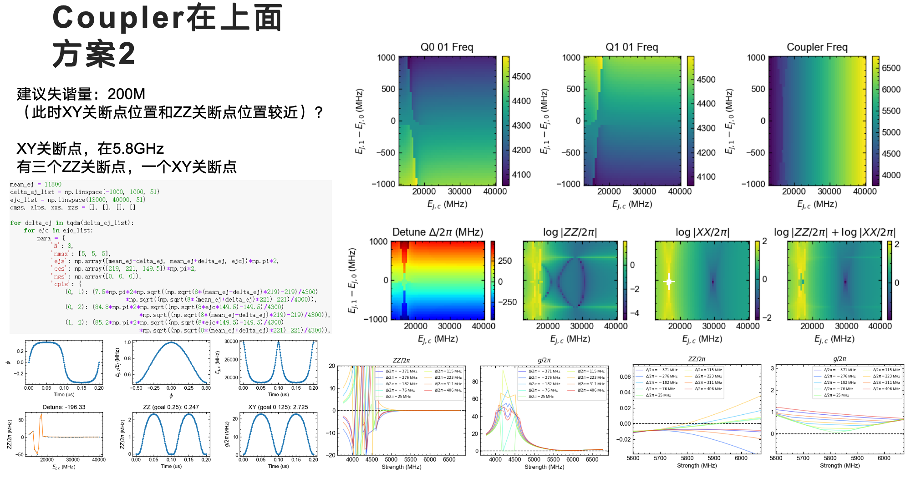
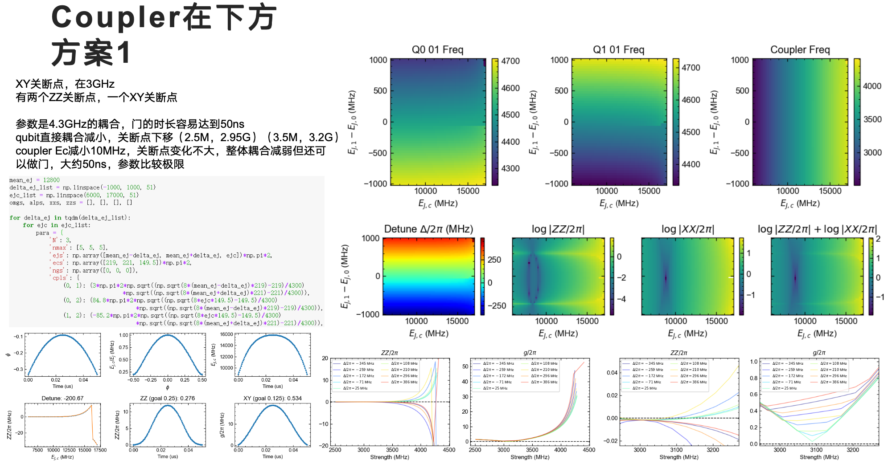
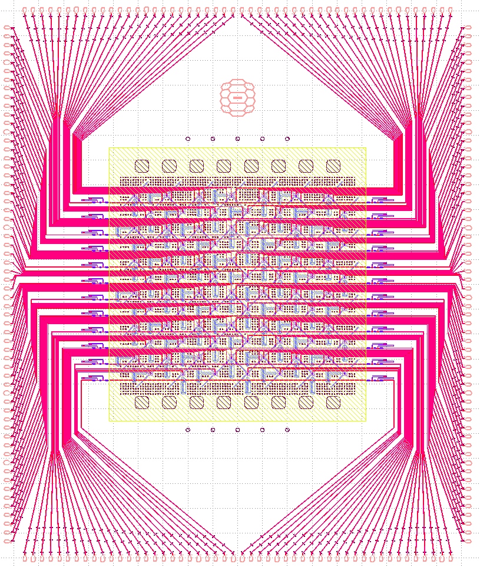
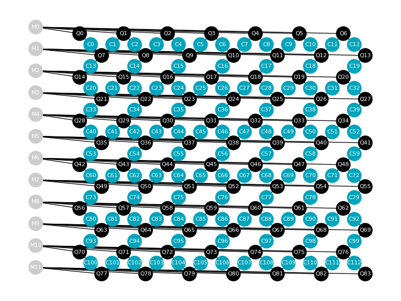
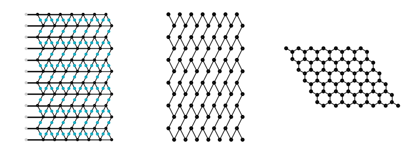
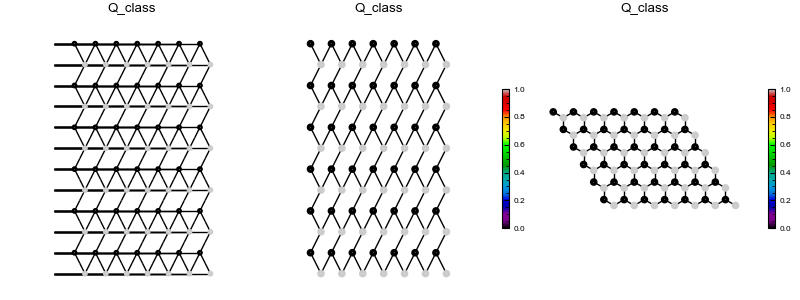
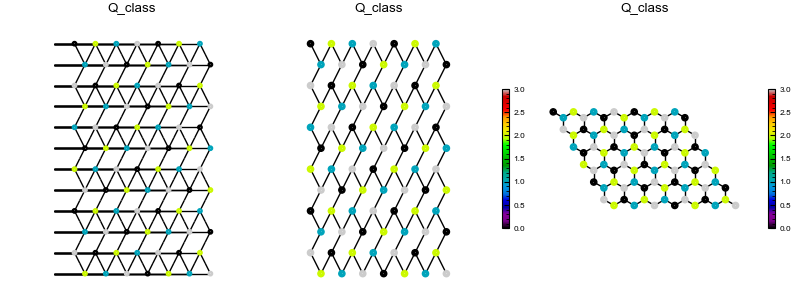
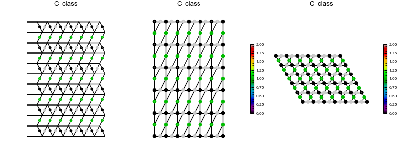
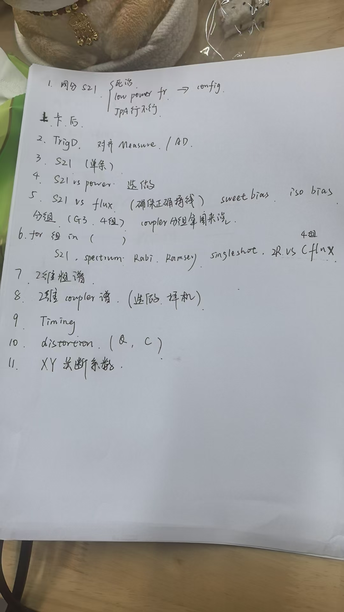
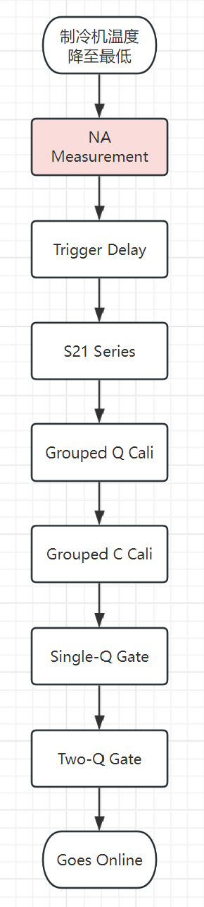

# V5设计和校准构想

[toc]

## 云芯片架构设计的演化

|代号|拓扑|Qubit设计|Coupler设计|门实现方案|优点|缺陷|代表样品|
|:-:|:-:|:-:|:-:|:-:|:-:|:-:|:-:|
|`V3`|重六角|固定频率, 空中耦合, 比特失谐在一个非谐之内|固定耦合, 电容和传输线bus|CR / AMCZ (ac-Stark induced)|结构简单, 链路简单, 微波串扰超低|在fab上, 对Q频率分布有要求; 无法克服比特TLS; 较难实现残余ZZ关断|梅花 (ZZ关断较好); 百旺 (ZZ关断较差, but...)|
|`V4`|重六角|固定频率, 比特失谐在一个非谐之外|可调 (transmon), 频率在Q之上|调coupler打开ZZ,绝热CZ|比特coherence相对可观; 门保真度较高|需要失真校准; 无法克服比特TLS; 未实现残余ZZ关断|百花|
|`V3.5`|六角|固定频率, 比特失谐在一个非谐之内, 考虑fab中频率涨落|同`V3`|同`V3`|同`V3`, 较小的残余ZZ|同`V3`, 且此时微波串扰极大|测试版|
|`V5`|六角|弱可调, 调节范围几百兆赫兹|可调 (transmon), 频率在Q之下|待定, 预计绝热CZ (?), 备选: 非绝热CZ, 参量CZ, iSWAP|理论上可以避免TLS, 残余耦合关断; 两比特门时长较短; 失真影响削弱|结构复杂, 校准复杂; 低频下的热噪声影响未知; 发热影响未知|迭代中|

### 耦合架构选择

当前主线版本: `V5`
版本特性: Qubit可调, 且Coupler可调, 且Coupler频率在Qubit之下
特性更新必要性:
 - 引入Qubit可调: 降低fab端样品制备压力 (比特频率分布上, 且于老板对可调Qubit的coherence有信心); 提供一种避开TLS的方法; 但引入了更多Z线和失真校准复杂度;
 - Coupler可调放置于Qubit之下: Coupler频率位于Qubit之上时, Coupler和Qubit耦合不能过大 (~80MHz), 否则Coupler的关断频率相当高 (~6.5GHz), 目前的平衡版本是 (lwy/hjx) 为代表的G3版本, 绝热CZ门的速度大约在百纳秒量级 (Coupler打开时耦合减弱). Coupler频率位于Qubit之下时, 关断频率尚可(~3.1GHz), 耦合强度尚可(80-100MHz), CZ门速度可达几十纳秒量级 (Coupler打开时耦合反而加强), 先前版本参照 (lxg/zsk) 的G3版本.
  
仿真数据对比:

### 拓扑结构的选择

前置知识: 图论的基本知识

> **图** (graph, $G$), 由**点** (vertex, node, point, $i\in V$) 的集合和**边** (edge, $(i,j)\in E$)的集合组成. 如果边是有顺序的, 即$(i,j)\neq(j,i)$, 称图为**有向图** (directed graph). 一般情况下Qubit和Coupler构成的图中都是**无向图** (undirected graph), 即$(i,j)=(j,i)$. 如果点和边可以画在一个二维平面上且没有两边相交, 那么这个图是**平面图**.

> 在芯片的拓扑中, 芯片上的器件, 例如Qubit, Coupler, Transmission line等, 视为一个点. 如果两个器件存在连接/耦合, 则存在对应的一条边. 单个芯片上的拓扑是**平面图**

> P.S. 平面图的欧拉公式, $|V|-|E|+|F|=|C|+1$, $|V|$是**点数**, $|E|$是**边数**, $|F|$是**面数**, $|C|$是**连通块数**.

以`84V5`的结构设计为例,

只考虑连接关系, 抽象成为拓扑结构图,

进一步考虑当前Qubit的拓扑关系, 

这是六角格子. 在六角格子里对点进行分类,
- 分类方案1:

  
- 分类方案2:

- and so on.
  
> 在一个图$G=(V,E)$中, 与某个节点$v\in V$的关联的边的数目$|\{(v,v')|\forall v'\in V,(v,v')\in E\}|$称为节点$v$的**度数**.

> 六角格子中, 每一个节点的度数都是3, 整个图的**平均度数**是3. 避开近邻的最小染色数是2, 避开次近邻的最小染色数是4.

进一步考虑当前Coupler的拓扑关系，

> P.S. Coupler构成的图和Qubit构成的图有很多有趣的性质和结论. 检索关键词: **边图**, **平面图的对偶图**, **最小割**

对比分析`G3`和`V4`的连通性:
- `G3`四方格子: 连通度最高, 平均连通度4;
- `V5`六角格子: 连通度适中, 平均联通度3;
- `V4`重六角格子: 连通度较低, 平均连通度2.5;

> P.S. 平面图中边数$|E|$和点数$|V|$满足$|E|\le3|V|-6$, 意味着平均度数上限是6.

## 校准流程

### 校准流程总览

