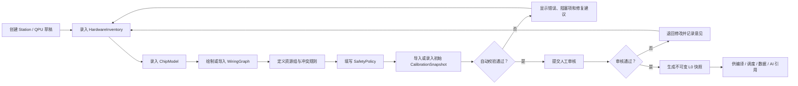
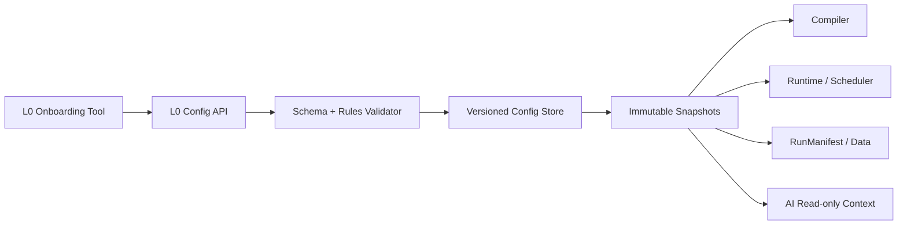

# QXtrl L0 信息录入与审核工具需求

**版本**: v0.2（工作草案）  
**日期**: 2026-05-31  
**定位**: 定义一套辅助测控人员完成 L0 Core Contracts / 核心契约层信息录入、校验、审核、发布和交接的交互工具需求。  
**关联文档**: [QXtrl L0 契约层命名与编码规则](QXtrl_L0契约层命名与编码规则.md)

## 0. 背景

L0 契约层包含硬件库存、芯片模型、线路映射、安全策略、资源组和初始校准快照。它是每台量子计算机进入测试、表征、校准前的准入清单。

如果这些信息依靠手写 YAML / JSON 维护，会有几个问题：

1. 测控人员容易填错 ID、单位、线路方向或资源组。
2. 审核人员很难知道哪些字段来自厂商、哪些来自实测、哪些只是占位。
3. 编译器和调度器无法判断一份配置是否已批准用于实机。
4. 新人交接时难以理解某台设备当前到底能不能运行。
5. AI 或自动化工具可能误用未审核配置。

因此需要一套面向现场人员的 L0 Onboarding 交互工具。

## 1. 工具定位

工具名称暂定：

```text
QXtrl Station Onboarding Console
```

它不是完整 Web 控制台，也不是实验运行界面，而是专门服务于 L0 治理的配置录入和审核工具。

核心目标：

1. 帮助测控人员按 rules 录入 L0 信息。
2. 实时校验命名、单位、引用、缺失字段和安全边界。
3. 支持多人协作审核，形成可追溯批准记录。
4. 生成不可变快照，供编译、调度、执行、数据和 AI 模块引用。
5. 导出交接包，让新人或客户支持人员快速理解站点状态。

## 2. 用户角色

| 角色 | 主要任务 | 权限边界 |
| --- | --- | --- |
| 测控工程师 | 录入设备、通道、线路、资源组和初始校准信息 | 可创建草稿，不可直接发布安全策略 |
| 芯片/工艺工程师 | 录入芯片元素、拓扑、设计元数据 | 可维护 ChipModel 草稿 |
| 设备工程师 | 维护 HardwareInventory、固件版本、设备能力 | 可批准设备能力声明 |
| 安全/站点管理员 | 审核 SafetyPolicy、权限、禁止动作 | 可发布或撤销实机准入 |
| 校准负责人 | 审核初始 CalibrationSnapshot | 可批准基础校准快照 |
| 产品/交付人员 | 查看状态、导出交接包、生成验收材料 | 只读或导出权限 |
| AI / 自动化工具 | 读取已发布快照和能力描述 | 只读，不允许修改或审批 |

## 3. 核心工作流



## 4. 功能需求

### 4.1 Station / QPU 项目管理

| 编号 | 需求 | 验收方式 |
| --- | --- | --- |
| L0TOOL-001 | 支持创建 Station / QPU Onboarding 项目 | 可创建草稿项目并生成唯一 `station_id`、`chip_id` |
| L0TOOL-002 | 支持项目状态流转：草稿、待审核、已批准、已撤销、已归档 | 状态变更有操作者、时间和原因 |
| L0TOOL-003 | 支持从已有站点复制为新草稿 | 复制后必须生成新快照和差异报告 |
| L0TOOL-004 | 支持多角色权限 | 非管理员不能发布 SafetyPolicy |

### 4.2 HardwareInventory 录入

| 编号 | 需求 | 验收方式 |
| --- | --- | --- |
| L0TOOL-010 | 提供设备录入表单，覆盖设备类型、厂商、型号、序列号、固件、驱动插件 | 必填字段缺失时不能提交审核 |
| L0TOOL-011 | 支持设备通道批量生成 | 可按 AWG/ADC/DC/LO 通道数量批量生成 canonical channel ID |
| L0TOOL-012 | 支持导入厂商清单或表格 | 导入后生成待确认草稿，不直接批准 |
| L0TOOL-013 | 支持设备能力声明 | 每个通道可声明采样率、幅度范围、时序分辨率、支持动作 |
| L0TOOL-014 | 标记敏感连接信息 | IP、密钥、token 不进入普通导出配置 |
| L0TOOL-015 | 区分物理资产和站点安装位 | 更换物理设备时更新 `asset_id`，并生成能力、安全、校准影响分析 |
| L0TOOL-016 | 支持站点时钟和触发基准录入 | 可记录参考时钟、锁定状态、触发链路和采样率基准 |

### 4.3 ChipModel 录入

| 编号 | 需求 | 验收方式 |
| --- | --- | --- |
| L0TOOL-020 | 支持 qubit、readout resonator、coupler、bus 等元素批量生成 | 可生成 `q000`、`rr_q000`、`tc_q000_q001` |
| L0TOOL-021 | 支持拓扑可视化编辑 | 可以在图上添加/删除 coupler，并自动检查 ID 顺序 |
| L0TOOL-022 | 支持导入版图/芯片设计元数据 | 导入信息保留来源和置信度 |
| L0TOOL-023 | 支持厂商编号与内部编号映射 | `vendor_label` 与 `element_id` 分离显示 |
| L0TOOL-024 | 支持未知字段显式标注 | 未知频率、未知 T1 等字段不得静默为空 |

### 4.4 WiringGraph 编辑

| 编号 | 需求 | 验收方式 |
| --- | --- | --- |
| L0TOOL-030 | 支持逻辑线路创建 | 可创建 `line.xy.q003`、`line.ro.rr_q003`、`line.z.tc_q003_q004` |
| L0TOOL-031 | 支持线路到硬件通道映射 | 可选择 AWG I/Q、LO、ADC、trigger、marker 等通道 |
| L0TOOL-032 | 支持线路完整性校验 | 每条实机可用线路必须映射到必要硬件资源 |
| L0TOOL-033 | 支持线路状态管理 | 草稿线路不能被实机编译器使用 |
| L0TOOL-034 | 支持图形化查看芯片元素到硬件通道路径 | 可从 `q003` 追踪到 AWG/LO/ADC/触发资源 |

### 4.5 ResourceGroup 与冲突规则

| 编号 | 需求 | 验收方式 |
| --- | --- | --- |
| L0TOOL-040 | 支持创建 LO、ADC、AWG、readout mux、trigger、crosstalk zone 等资源组 | 资源组可被调度器读取 |
| L0TOOL-041 | 支持配置冲突策略 | 可定义互斥、共享但有约束、最大并发数 |
| L0TOOL-042 | 自动发现可能遗漏的资源组 | 同一个 LO 被多条线路引用时提示建立资源组 |
| L0TOOL-043 | 缺少资源组时阻止自动并行 | 自动校验给出阻塞原因 |

### 4.6 SafetyPolicy 编辑与审批

| 编号 | 需求 | 验收方式 |
| --- | --- | --- |
| L0TOOL-050 | 支持按通道、线路、设备、操作类型设置安全边界 | 可设置幅度、频率、功率、偏置、时长、占空比等限制 |
| L0TOOL-051 | 支持禁止动作清单 | 固件升级、设备重启、高风险偏置扫描默认需要管理员审批 |
| L0TOOL-052 | 支持缺失边界自动拒绝 | 任何实机可用线路缺少 SafetyPolicy 时不能发布快照 |
| L0TOOL-053 | 支持审批流程 | SafetyPolicy 发布必须有审核人和审批记录 |
| L0TOOL-054 | 支持策略差异对比 | 修改安全边界时展示变更前后差异 |
| L0TOOL-055 | 支持三层边界合并预览 | 对同一参数展示设备能力上限、安全上限和校准有效范围，并标出实际运行边界 |

### 4.7 CalibrationSnapshot 导入与审核

| 编号 | 需求 | 验收方式 |
| --- | --- | --- |
| L0TOOL-060 | 支持导入已有校准参数 | 导入后进入候选状态，不直接激活 |
| L0TOOL-061 | 支持参数 key 校验 | `q003.xy.pi_amp`、`rr_q003.ro.freq` 等必须符合规则 |
| L0TOOL-062 | 支持单位与有效期校验 | 缺单位或过期参数不能进入 active snapshot |
| L0TOOL-063 | 支持参数来源追溯 | 每个参数记录来源 run、人工录入或厂商数据 |
| L0TOOL-064 | 支持基础校准快照审批 | 审批通过后生成不可变 `calibration_snapshot` |

### 4.8 自动校验与阻塞项

| 编号 | 需求 | 验收方式 |
| --- | --- | --- |
| L0TOOL-070 | 提供全局校验面板 | 展示错误、警告、建议和可忽略项 |
| L0TOOL-071 | 区分阻塞实机的问题和非阻塞提醒 | 阻塞项未清零时不能发布实机快照 |
| L0TOOL-072 | 校验 ID 格式、引用完整性、重复 ID、缺失安全边界 | 构造错误样例能被准确拦截 |
| L0TOOL-073 | 校验资源冲突和并行风险 | 缺少资源组时禁止自动并行 |
| L0TOOL-074 | 校验数据来源和审批状态 | `source_kind: placeholder` 的对象不能用于控制 |
| L0TOOL-075 | 校验 schema 版本兼容性 | 互不兼容的 L0 快照不能共同发布 |
| L0TOOL-076 | 校验数据治理配置 | 未设置运行数据、校准数据、日志和诊断包存放规则时不能进入实机准入 |

### 4.9 快照发布与导出

| 编号 | 需求 | 验收方式 |
| --- | --- | --- |
| L0TOOL-080 | 审核通过后生成不可变 L0 快照 | 快照包含内容哈希、时间、审批人、适用范围 |
| L0TOOL-081 | 支持导出机器可读包 | 导出 YAML/JSON/JSON Schema 兼容数据 |
| L0TOOL-082 | 支持导出人类可读交接包 | 生成 HTML/PDF/Markdown 摘要 |
| L0TOOL-083 | 支持快照差异比较 | 可比较两版 WiringGraph、SafetyPolicy、CalibrationSnapshot |
| L0TOOL-084 | 支持撤销快照 | 撤销不删除历史，只改变可用状态 |

## 5. UI 页面草案

| 页面 | 目的 | 关键组件 |
| --- | --- | --- |
| Onboarding Dashboard | 查看所有站点/QPU 的 L0 状态 | 状态卡片、阻塞项、待审核事项 |
| Hardware Inventory | 录入设备和通道 | 设备表、通道批量生成器、能力表单 |
| Chip Model | 录入芯片元素与拓扑 | qubit/coupler 表、拓扑图、厂商编号映射 |
| Wiring Graph | 建立逻辑线路到硬件通道映射 | 图视图、表格视图、路径追踪 |
| Resource Groups | 配置共享资源和冲突 | 资源组编辑器、并行风险提示 |
| Safety Policy | 配置安全边界 | 通道限制表、禁止动作、审批记录 |
| Calibration Snapshot | 导入和审核初始参数 | 参数表、单位校验、有效期、来源 |
| Validation Center | 全局校验 | 阻塞项、警告、修复建议 |
| Review & Publish | 审核发布 | 差异视图、审批意见、快照生成 |
| Handoff Package | 交接输出 | 人类可读摘要、机器可读导出 |

## 6. 最小可行版本

MVP 不需要一开始做完整 Web 产品。建议先做一个轻量工具：

1. 本地 Web 或桌面应用。
2. 支持手工录入和表格导入。
3. 支持 ID / 引用 / 缺失字段 / 安全边界校验。
4. 支持生成不可变 YAML/JSON 快照。
5. 支持导出 Markdown 交接报告。

MVP 必须覆盖：

| 模块 | MVP 要求 |
| --- | --- |
| HardwareInventory | 设备、通道、能力声明 |
| ChipModel | qubit、readout、coupler、拓扑 |
| WiringGraph | 逻辑线路到硬件通道映射 |
| SafetyPolicy | 通道安全边界和禁止动作 |
| Validation Center | 发布前阻塞项校验 |
| Snapshot Export | 机器可读快照与人类可读交接包 |

## 7. 与核心系统的关系

工具不应绕过 QXtrl 核心契约层，而应调用同一套 schema 与 validator：



这意味着：

1. UI 不是规则的唯一实现，规则必须在后端 validator 中。
2. CLI、API、导入脚本和 Web UI 都使用同一套校验。
3. 发布快照后，运行时只能读取快照，不能读取草稿。
4. AI 只能读取已发布的只读上下文。

## 8. 需要尽早确认的问题

1. 首版工具做 Web、桌面，还是 CLI + Web 表单？
2. 配置数据存储用 Git 管理文件，还是数据库管理版本？
3. 站点现场是否允许浏览器访问工具？
4. 是否需要支持离线客户环境？
5. 审批流程是否需要电子签名或双人审批？
6. 厂商 Excel / CSV / JSON 清单的导入格式优先支持哪些？
7. 交接包需要面向内部研发，还是也面向客户交付？
