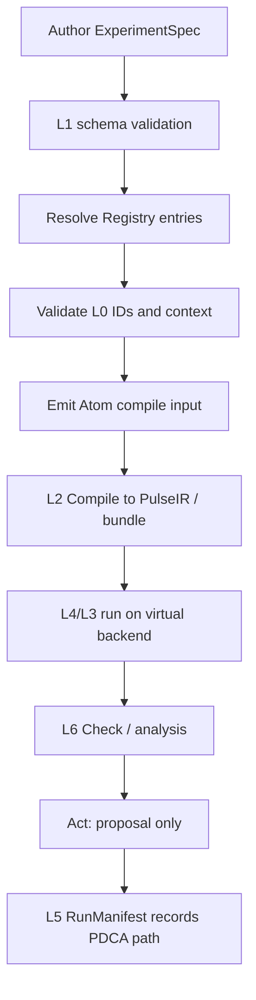

# QXtrl L1 Experiment Language 设计

**版本**: v0.1  
**日期**: 2026-06-22  
**状态**: 设计草案，供 L1 MVP 实现与 L2/L6 对齐审查  
**层级命名**: L1 / EL / Experiment Language (短码 EL，包 `qxtrl/el`)  
**关联文档**:
- [QXtrl量子测控软件开发需求.md](QXtrl量子测控软件开发需求.md)
- [QXtrl_MVP最薄垂直切片定义.md](QXtrl_MVP最薄垂直切片定义.md)
- [QXtrl模块拆解与接口责任矩阵.md](QXtrl模块拆解与接口责任矩阵.md)
- [QXtrl L0 Core Contracts API 参考](../L0_API.md)（当前实现参考；L0 实现包为 `qxtrl.cc`）
- [docs/L0_API.md](../L0_API.md)（L0 实现已迁移至 `qxtrl/cc` 包，对应短码 CC）（规划区详细说明；若与实现参考冲突，以当前代码和 `../L0_API.md` 为准）
- [QXtrl_schema_contract_patch_list.md](QXtrl_schema_contract_patch_list.md)
- [QXtrl_第一次讨论会决策清单.md](QXtrl_第一次讨论会决策清单.md)

## 0. 文档目的与范围

本文档定义 QXtrl L1 Experiment Language 的设计边界、核心对象、MVP schema、递归 PDCA 表达方式、与 L0/L2/L6 的接口关系和验收标准。

L1 的目标不是写实验脚本，而是把实验意图变成可验证、可编译、可审计、可递归组合的结构化规格。

本文档重点覆盖 MVP 必需部分：

1. `ExperimentSpec` 外层 envelope。
2. `AtomSpec` 叶子实验规格。
3. Rabi Atom 的最小 schema。
4. `PlanSpec` / `DoSpec` / `CheckSpec` / `ActSpec` 的 MVP 字段。
5. `PDCAPath` 与 RunManifest 记录约定。
6. 最小 Registry 设计。
7. SCP-001 Node typed edge 的最小落地方式。

明确不纳入 MVP：

1. 完整 `TaskSpec` 编排器。
2. 完整 `SessionSpec` 芯片级维护流程。
3. 黑板、局部回滚、checkpoint、全局失败策略。
4. AI 自动决策和自动写回。
5. 真实硬件调度、PulseIR、最终 waveform ndarray。

## 1. 背景与当前问题

目前 QXtrl 已完成 L0 Core Contracts 的首轮实现与复审，具备稳定 ID、单位、schema version、硬件/芯片/连线/安全策略、`DataQuality` 审批/撤销 gate 等基础能力。

L1 是 L0 之上的第一个业务语义层。若 L1 schema 不够明确，L2 Compiler、L4 Runtime、L6 Calibration 和 L9 SDK 会基于各自假设开发，后续返工成本高。

L1 当前需要解决的问题：

1. 用结构化 schema 表达实验意图，而不是继续依赖脚本隐式约定。
2. 明确 `ExperimentSpec -> PulseIR` 的输入契约，让 L2 可直接编译。
3. 明确 Atom/Task/Session 的递归关系，但 MVP 只实现 Atom。
4. 明确 PDCA path 如何记录到运行记录。
5. 明确实验节点的输入、输出、依赖和失效关系，响应 SCP-001 / D-013。
6. 明确 L1 如何消费 L0，而不是重复定义 ID、单位、审批规则。

## 2. 所属架构层与边界

### 2.1 层级定位

| 项 | 内容 |
| --- | --- |
| 层号 | L1 |
| 短码 | EL |
| 稳定英文名 | Experiment Language |
| 中文名 | 实验语言 |
| 上游依赖 | L0 Core Contracts |
| 下游消费者 | L2 Compiler / Pulse IR, L4 Runtime & Scheduler, L5 Data & State, L6 Calibration & Optimization, L9 Operator Interfaces |

### 2.2 L1 负责什么

L1 负责定义实验意图的结构化 contract：

1. `ExperimentSpec` 的版本、身份、节点类型、PDCA 结构和路径。
2. `AtomSpec` 的目标、扫描、shots、分析与候选动作。
3. `TaskSpec` / `SessionSpec` 的递归结构规范，但 MVP 不实现执行器。
4. Registry 中实验模板、分析器模板、优化器模板的最小发现机制。
5. Node typed edge：声明节点 consumes / produces / invalidates / depends_on。
6. 合法性验证：ID、单位、必填字段、禁止最终 waveform、L0 引用 gate。

### 2.3 L1 不负责什么

| 不负责事项 | 归属 |
| --- | --- |
| 生成最终 waveform ndarray | L2 Compiler / Pulse renderer |
| 设备上传、arm/run/acquire | L3 Execution Backend |
| 排队、取消、重试、资源锁 | L4 Runtime & Scheduler |
| 保存原始数据、RunManifest、ResultStore | L5 Data & State |
| 拟合算法具体实现 | L6 Analysis / Calibration |
| 自动晋升参数到 active config | L5/L6/L9 审批链 |
| UI 表单和交互 | L9 Operator Interfaces |

## 3. 设计原则

1. **结构化意图**：所有实验必须用 `ExperimentSpec` 描述，不允许把关键语义藏在脚本闭包或自由 dict 中。
2. **延迟绑定**：L1 可引用 target、line、parameter、template，但不携带最终 waveform ndarray。
3. **Atom 唯一触达后端**：只有 Atom 是可被编译执行的叶子节点；Task/Session 只是递归编排。
4. **策略与机制分离**：Plan/Check/Act 描述意图和门槛，不直接执行设备动作或写配置。
5. **L0 契约复用**：ID、单位、审批 gate、错误模型优先复用 L0。
6. **missing => deny**：字段缺失时默认不能进入 physical/control path。
7. **MVP 最薄切片**：先完成 Rabi Atom，不提前实现完整 Task/Session。
8. **AI 就绪但不自动执行**：L1 可以表达候选动作和 evidence，但 AI 不直接发设备命令。
9. **短码 schema_version**：代码包和 schema version 使用层级短码，例如 L0/Core Contracts 使用 `qxtrl.cc.*`，L1/Experiment Language 使用 `qxtrl.el.*`。跨层数据 `kind` 可以保留层语义前缀，例如 `l0_snapshot`，它表示“L0 层快照语义”，不是 Python 包名。

## 4. 输入、输出、状态与错误模型

### 4.1 输入

L1 输入来自用户、SDK、模板库、校准系统或 UI：

| 输入 | 说明 |
| --- | --- |
| `ExperimentSpec` | 用户提交或模板实例化后的实验规格 |
| L0 snapshots | `ChipModel`, `WiringGraph`, `HardwareInventory`, `SafetyPolicy` 的快照引用或已加载对象 |
| Registry entries | Atom 模板、分析器、优化器、后端能力等注册项 |
| 默认参数 | 来自 ConfigStore 的候选默认值，MVP 可由调用方显式传入 |

### 4.2 输出

L1 输出是已验证的实验意图，不是执行结果：

| 输出 | 消费者 | 说明 |
| --- | --- | --- |
| `ValidatedExperimentSpec` | L2/L4/L6 | 通过 schema 和 L0 gate 的规格 |
| `AtomCompileInput` | L2 | 从 AtomSpec 抽出的编译输入视图 |
| `NodeIOContract` | L4/L5/L6 | consumes / produces / invalidates / depends_on |
| `PDCAPath` | L5 RunManifest | 运行记录路径 |
| diagnostics | L9/UI | 人可读和机器可读错误 |

### 4.3 状态影响

L1 本身不写配置、不保存结果、不触达设备。L1 validation 可以拒绝规格，也可以产生 diagnostics，但不改变 `ConfigStore`、`ResultStore` 或硬件状态。

### 4.4 错误模型

MVP 阶段可复用 L0 的 `QXtrlValidationError`，并在 `details.rule` 中使用 `L1-*` 规则号。后续实现可增加：

| 错误类型 | 用途 |
| --- | --- |
| `ExperimentSpecValidationError` | schema、字段、递归、PDCA path 错误 |
| `RegistryResolutionError` | Atom/check/optimizer 模板不存在或版本不兼容 |
| `L0BindingError` | target/line/snapshot 无法在 L0 中解析 |
| `ExperimentCapabilityError` | spec 需要的能力与 backend/L0 capability 不兼容 |

## 5. 核心对象总览

### 5.1 MVP 核心对象

| 对象 | 是否 MVP 必需 | 目的 |
| --- | --- | --- |
| `ExperimentSpec` | 是 | 实验语言顶层 envelope |
| `AtomSpec` | 是 | 可编译执行的叶子实验 |
| `PDCAPathItem` | 是 | RunManifest 中记录递归路径 |
| `L0ContextRef` | 是 | 绑定所需 L0 快照或对象引用 |
| `PlanSpec` | 是 | 目标、扫描、shots、运行约束 |
| `DoSpec` | 是 | Atom 模板引用、参数、编译 hints |
| `CheckSpec` | 是 | 分析器引用、指标、验收门槛 |
| `ActSpec` | 是 | 候选动作，不直接写 active config |
| `NodeIOContract` | 是 | SCP-001 consumes/produces/invalidates/depends_on |
| `RegistryEntry` | 是，最小版 | Atom/check 模板发现 |

### 5.2 后置对象

| 对象 | 阶段 | 说明 |
| --- | --- | --- |
| `TaskSpec` | P1 | 多 Atom 局部校准/诊断任务 |
| `SessionSpec` | P1/P2 | 多 Task 芯片级或站点级会话 |
| `OptimizerSpec` | P1 | 搜索策略和迭代控制 |
| `BlackboardRef` | P1 | 校准黑板引用 |
| `CheckpointSpec` | P1/P2 | Task/Session checkpoint |
| `RollbackPolicySpec` | P1/P2 | 局部或全局失败策略 |

## 6. Schema 设计

### 6.1 `ExperimentSpec`

**目的**: 所有 L1 实验规格的顶层 envelope。

建议字段：

| 字段 | 类型 | 必填 | 说明 |
| --- | --- | --- | --- |
| `schema_version` | `str` | 是 | `qxtrl.el.ExperimentSpec/v0.1` |
| `spec_id` | `str` | 是 | 稳定规格 ID，建议 `exp.<kind>.<target>.<name>` |
| `display_name` | `str` | 否 | 人可读名称 |
| `node_kind` | `atom | task | session` | 是 | MVP 只允许 `atom` |
| `atom` | `AtomSpec | None` | MVP 是 | Atom 规格 |
| `children` | `list[ExperimentSpec]` | 否 | Task/Session 递归子规格；MVP 必须为空 |
| `pdca_path` | `list[PDCAPathItem]` | 是 | 当前节点在递归 PDCA 树中的路径 |
| `l0_context` | `L0ContextRef` | 是 | L0 快照引用 |
| `plan` | `PlanSpec` | 是 | Plan 阶段 |
| `do` | `DoSpec` | 是 | Do 阶段 |
| `check` | `CheckSpec` | 是 | Check 阶段 |
| `act` | `ActSpec` | 是 | Act 阶段 |
| `io` | `NodeIOContract` | 是 | SCP-001 节点输入输出契约 |
| `metadata` | `dict` | 否 | 标签、owner、备注 |

MVP 限制：

1. `node_kind == "atom"`。
2. `children == []` 或缺省。
3. `atom` 必填。
4. `do` 不允许携带最终 waveform ndarray。
5. 所有 target/line/parameter 引用必须显式字段化。

MVP 实现建议：

1. 保留单一 `ExperimentSpec` envelope，避免过早分裂 Task/Session 类型。
2. validator 必须强制 `node_kind == "atom"`、`atom is not None`、`children == []`。
3. 若使用体验需要更干净的 Atom 构造入口，可以提供 `AtomExperimentSpec` 工厂或薄 wrapper，但底层序列化 contract 仍落到 `ExperimentSpec`。

Pydantic 递归结构注意事项：

```python
from __future__ import annotations

from pydantic import BaseModel, Field


class ExperimentSpec(BaseModel):
    schema_version: str = "qxtrl.el.ExperimentSpec/v0.1"
    children: list["ExperimentSpec"] = Field(default_factory=list)


ExperimentSpec.model_rebuild()
```

即使 MVP 阶段 `children` 必须为空，也建议按递归结构实现，避免后续 Task/Session 扩展时破坏 schema 形状。

### 6.2 `AtomSpec`

**目的**: 描述一次可编译执行的叶子实验。Atom 是 L1 中唯一能触达 L2/L3 执行链的节点。

建议字段：

| 字段 | 类型 | 必填 | 说明 |
| --- | --- | --- | --- |
| `atom_id` | `str` | 是 | Atom 节点 ID |
| `atom_kind` | `str` | 是 | 如 `rabi.amplitude` |
| `atom_version` | `str` | 是 | Atom 模板版本，如 `v0.1` |
| `target` | `TargetSpec` | 是 | qubit/line/readout target |
| `scan` | `ScanSpec` | 是 | 扫描轴 |
| `acquisition` | `AcquisitionSpec` | 是 | shots、平均、采集模式 |
| `capability_requirements` | `list[str]` | 否 | 后端能力需求 |

Atom 不做：

1. Task/Session 级决策。
2. 参数晋升。
3. 结果持久化。
4. 直接设备 I/O。

### 6.3 `TargetSpec`

**目的**: 明确实验目标与 L0 元素/line 之间的引用。

建议字段：

| 字段 | 类型 | 必填 | L0 校验 |
| --- | --- | --- | --- |
| `element_id` | `str` | 是 | `validate_element_id` |
| `drive_line_id` | `str | None` | Rabi 是 | `validate_line_id` |
| `readout_line_id` | `str | None` | Rabi 是 | `validate_line_id` |
| `coupler_id` | `str | None` | 否 | `validate_element_id` |
| `logical_role` | `str` | 否 | 例如 `control_target` |

Rabi MVP 要求：

1. `element_id` 是 qubit，例如 `q000`。
2. `drive_line_id` 指向 `line.xy.q000`。
3. `readout_line_id` 指向 `line.ro.rr_q000`。

### 6.4 `ScanSpec` 与 `ScanAxisSpec`

**目的**: 描述扫描，不生成波形数组。

`ScanSpec` 字段：

| 字段 | 类型 | 必填 | 说明 |
| --- | --- | --- | --- |
| `axes` | `list[ScanAxisSpec]` | 是 | MVP Rabi 只需要 1 个 axis |
| `order` | `cartesian | zipped` | 否 | 多轴扫描顺序，MVP 可固定 `cartesian` |
| `randomization` | `none | shuffled` | 否 | MVP 默认 `none` |

`ScanAxisSpec` 字段：

| 字段 | 类型 | 必填 | 说明 |
| --- | --- | --- | --- |
| `axis_id` | `str` | 是 | 例如 `amp` |
| `parameter_ref` | `str` | 是 | 被扫描参数的语义引用 |
| `unit` | `str` | 是 | 必须属于 L0 `KNOWN_UNITS` |
| `values` | `list[float]` | 是 | 扫描点，有限实数 |
| `description` | `str` | 否 | 说明 |

Rabi MVP 示例：

```yaml
scan:
  axes:
    - axis_id: amp
      parameter_ref: pulse.drive.amplitude
      unit: a.u.
      values: [0.0, 0.05, 0.10, 0.15, 0.20]
```

MVP `parameter_ref` 解析约定：

1. `parameter_ref` 是点分隔语义路径，不是 Python 属性路径，也不是设备厂商通道地址。
2. `pulse.*` 表示当前 Atom 内部的编译期脉冲参数，默认相对当前 `target` 解析。例如 `pulse.drive.amplitude` 表示当前 `target.element_id` 通过 `target.drive_line_id` 施加的 drive pulse amplitude。
3. `calibration.<element_id>.<logical_channel>.<parameter>` 表示校准/配置参数引用，必须包含显式元素 ID。例如 `calibration.q000.xy.pi_amp`、`calibration.q000.xy.frequency`。
4. Rabi MVP 至少支持：
   - `pulse.drive.amplitude`
   - `pulse.drive.duration`
   - `pulse.drive.frequency`
   - `calibration.q000.xy.pi_amp`
   - `calibration.q000.xy.frequency`
5. L1 validator 负责校验 path 语法、`element_id` 与当前 target 是否一致、unit 是否与扫描轴声明兼容；实际取值、绑定默认值和写回候选由 L2/L5/L6 处理。
6. 完整跨层 path 语法后置到 L5 ConfigStore / L6 Calibration 设计中统一拍板。

### 6.5 `AcquisitionSpec`

**目的**: 描述采集意图。

字段：

| 字段 | 类型 | 必填 | 说明 |
| --- | --- | --- | --- |
| `shots` | `int` | 是 | shots 数，必须为正整数 |
| `result_level` | `iq | classified | counts` | 否 | MVP Rabi 可用 `iq` 或 `classified` |
| `averaging` | `single_shot | average` | 否 | 平均策略 |

### 6.6 `L0ContextRef`

**目的**: 显式记录 L1 依赖的 L0 上下文。

建议字段：

| 字段 | 类型 | 必填 | 说明 |
| --- | --- | --- | --- |
| `chip_model_ref` | `L0SnapshotRef | str` | 是 | 芯片模型快照 |
| `wiring_graph_ref` | `L0SnapshotRef | str` | 是 | 连线图快照 |
| `hardware_inventory_ref` | `L0SnapshotRef | str` | 是 | 硬件清单快照 |
| `safety_policy_ref` | `L0SnapshotRef | str` | 是 | 安全策略快照 |
| `calibration_ref` | `L0SnapshotRef | str | None` | 否 | 当前校准快照 |

实现建议：

1. MVP Python 实现可以先接受 `str` 或已加载 L0 对象，便于本地 demo。
2. 进入 RunManifest 时必须落成不可变 `L0SnapshotRef`。
3. Physical/control path 下，所有非 null 的 L0 引用必须先解析为对象或已发布快照；已加载对象必须调用 `require_usable_for_control()`，其内部以 `DataQuality.is_approved_for_control()` 作为最终 gate。
4. Simulation path 可以接受未批准对象，但必须显式标记为 `simulation`，不得混入 physical run。

### 6.7 `PlanSpec`

**目的**: 描述为什么做、目标是什么、扫描边界是什么。

字段：

| 字段 | 类型 | 必填 | 说明 |
| --- | --- | --- | --- |
| `objective` | `str` | 是 | 例如 `estimate_pi_amp` |
| `target` | `TargetSpec` | 是 | 目标 qubit/line |
| `scan` | `ScanSpec` | 是 | 扫描定义 |
| `acquisition` | `AcquisitionSpec` | 是 | 采集定义 |
| `constraints` | `dict` | 否 | 安全/资源/时间约束 |

### 6.8 `DoSpec`

**目的**: 描述执行体，但不携带最终 waveform。

字段：

| 字段 | 类型 | 必填 | 说明 |
| --- | --- | --- | --- |
| `atom_ref` | `str` | 是 | Registry 中的 Atom 模板引用 |
| `pulse_template_ref` | `str | None` | 是 | 脉冲模板引用，不是 waveform ndarray |
| `parameters` | `dict` | 否 | 语义参数，值应带单位或引用 |
| `compile_hints` | `dict` | 否 | 给 L2 的 hint，不得包含最终数组 |

禁止字段：

```text
waveform
waveforms
ndarray
samples
raw_iq_array
device_opcode
```

### 6.9 `CheckSpec`

**目的**: 描述如何分析结果和判定质量，不实现分析算法。

字段：

| 字段 | 类型 | 必填 | 说明 |
| --- | --- | --- | --- |
| `analyzer_ref` | `str` | 是 | Registry 中的分析器引用 |
| `expected_observation` | `str` | 是 | 例如 `rabi_curve` |
| `metrics` | `list[str]` | 是 | 例如 `pi_amp`, `fit_quality` |
| `acceptance` | `dict` | 是 | 质量门槛 |

Rabi 示例：

```yaml
check:
  analyzer_ref: qxtrl.check.rabi_fit/v0.1
  expected_observation: rabi_curve
  metrics: [pi_amp, contrast, fit_quality]
  acceptance:
    min_fit_quality: 0.95
    min_contrast: 0.1
```

### 6.10 `ActSpec`

**目的**: 描述实验完成后可能产生什么候选动作。

字段：

| 字段 | 类型 | 必填 | 说明 |
| --- | --- | --- | --- |
| `mode` | `none | propose_patch | request_review` | 是 | MVP Rabi 用 `propose_patch` |
| `proposal_targets` | `list[ParameterProposalTarget]` | 否 | 候选参数目标 |
| `requires_review` | `bool` | 否 | 是否需要人工 review |

L1 `ActSpec` 只能生成候选动作意图。真正的 `ParameterPatchProposal`、`CalibrationRecord` 和 ConfigStore 写回由 L5/L6/L9 负责。

### 6.11 `NodeIOContract`

**目的**: 响应 SCP-001 / D-013，让每个节点显式声明信息流和影响范围。

字段：

| 字段 | 类型 | 说明 |
| --- | --- | --- |
| `consumes` | `list[TypedRef]` | 本节点读取的输入、快照、配置、参数 |
| `produces` | `list[TypedRef]` | 本节点输出的 observation、候选参数、诊断 |
| `invalidates` | `list[TypedRef]` | 本节点可能使哪些旧事实失效 |
| `depends_on` | `list[TypedRef]` | 本节点运行前必须成立的依赖 |

`TypedRef` 建议字段：

| 字段 | 类型 | 说明 |
| --- | --- | --- |
| `kind` | `str` | `l0_snapshot`, `parameter`, `observation`, `proposal`, `line`, `qubit` 等 |
| `ref` | `str` | 稳定引用路径 |
| `optional` | `bool` | 是否可选 |
| `unit` | `str | None` | 若是物理量，使用 L0 unit |

说明：`kind: l0_snapshot` 中的 `l0_` 是层语义标识，表示该引用指向 L0/Core Contracts 层的快照；它不表示 Python 包名。当前 L0 实现包名和 schema 前缀为 `qxtrl.cc`。

Rabi Atom 最小 IO 示例：

```yaml
io:
  consumes:
    - {kind: qubit, ref: q000}
    - {kind: line, ref: line.xy.q000}
    - {kind: line, ref: line.ro.rr_q000}
    - {kind: l0_snapshot, ref: chip_model}
    - {kind: l0_snapshot, ref: wiring_graph}
  produces:
    - {kind: observation, ref: observation.rabi_curve}
    - {kind: proposal, ref: proposal.pi_amp}
  invalidates: []
  depends_on:
    - {kind: parameter, ref: calibration.q000.xy.frequency, optional: true, unit: Hz}
```

## 7. PDCA 递归表达

### 7.1 `PDCAPathItem`

**目的**: 让 RunManifest 能追踪递归执行路径。

字段：

| 字段 | 类型 | 必填 | 说明 |
| --- | --- | --- | --- |
| `node_id` | `str` | 是 | 当前节点 ID |
| `node_kind` | `atom | task | session` | 是 | 节点类型 |
| `pdca_phase` | `plan | do | check | act` | 是 | 所在阶段 |
| `iteration` | `int | None` | 否 | 优化/循环迭代编号 |
| `parent_node_id` | `str | None` | 否 | 父节点 |

MVP Rabi Atom path：

```yaml
pdca_path:
  - node_id: atom.rabi.q000
    node_kind: atom
    pdca_phase: do
    iteration: 0
    parent_node_id: null
```

### 7.2 递归结构约定

未来完整结构：

```text
SessionSpec
  TaskSpec
    AtomSpec
    AtomSpec
  TaskSpec
    AtomSpec
```

递归规则：

1. `ExperimentSpec.node_kind="atom"` 时，不允许有 children。
2. `TaskSpec` 可以包含 Atom 或子 Task，但 MVP 不实现。
3. `SessionSpec` 可以包含 Task，但 MVP 不实现。
4. 每个子节点都必须继承或显式覆盖 `l0_context`。
5. RunManifest 必须记录完整 `pdca_path`，不能只记录叶子 Atom 名称。

## 8. Registry 最小设计

### 8.1 目标

Registry 的目标是避免执行内核中硬编码所有实验类型和分析器分支。

MVP Registry 只需要支持：

1. Atom 模板注册。
2. Analyzer 模板注册。
3. 根据 `atom_ref` / `analyzer_ref` 解析模板。
4. 基本版本兼容检查。

### 8.2 `RegistryEntry`

字段：

| 字段 | 类型 | 必填 | 说明 |
| --- | --- | --- | --- |
| `entry_id` | `str` | 是 | 例如 `qxtrl.atom.rabi_amplitude` |
| `entry_kind` | `atom | analyzer | optimizer | backend | storage` | 是 | 注册项类型 |
| `version` | `str` | 是 | 例如 `v0.1` |
| `display_name` | `str` | 否 | 人可读名称 |
| `input_schema` | `str` | 是 | 输入 schema 引用 |
| `output_schema` | `str` | 是 | 输出 schema 引用 |
| `capabilities` | `list[str]` | 否 | 能力声明 |
| `compatible_l1_versions` | `list[str]` | 是 | 兼容的 L1 schema |
| `io_contract_template` | `NodeIOContract` | 否 | 节点 IO 模板 |

MVP 示例：

```yaml
entry_id: qxtrl.atom.rabi_amplitude
entry_kind: atom
version: v0.1
input_schema: qxtrl.el.AtomSpec.rabi_amplitude/v0.1
output_schema: qxtrl.cpir.PulseIR.rabi_amplitude_input/v0.1
capabilities: [drive_iq, readout_adc, amplitude_scan]
compatible_l1_versions: [qxtrl.el.ExperimentSpec/v0.1]
```

`output_schema` 在 MVP 文档中只表达“L1 Atom 将被 L2 Compiler / Pulse IR 消费”的接口意图。实际字段名和版本号以 L2/CPIR 落地后的权威 schema 为准，L1 Registry 不应提前冻结 L2 内部结构。

### 8.3 能力对齐

Registry capability 不替代 L0/L3 能力检查。它只是声明模板需要什么能力。

最终运行前必须同时满足：

1. L1 spec 的 capability requirements。
2. L0 `HardwareInventory` / `WiringGraph` 声明。
3. L3 backend runtime capabilities。
4. `SafetyPolicy` 允许该操作类别。

## 9. L0 集成规则

L1 不重新定义 L0 已经定义的规则。

| L1 字段 | L0 依赖 |
| --- | --- |
| qubit / resonator / coupler ID | `validate_element_id` |
| line ID | `validate_line_id` |
| units | `KNOWN_UNITS`, `Quantity` |
| L0 快照 | `L0SnapshotRef` |
| control gate | `require_usable_for_control()`, `is_usable_for_control()` |
| 错误结构 | `QXtrlValidationError` 或其 L1 子类 |

MVP 实现应从 `qxtrl.cc` 复用 L0/CC API：

```python
from qxtrl.cc import (
    KNOWN_UNITS,
    L0SnapshotRef,
    QXtrlValidationError,
    Quantity,
    validate_element_id,
    validate_line_id,
)
```

Physical/control path 必须执行：

```python
chip.require_usable_for_control(context="l1.validate")
wiring.require_usable_for_control(context="l1.validate")
hardware.require_usable_for_control(context="l1.validate")
safety.require_usable_for_control(context="l1.validate")
```

Simulation path 可以允许部分对象 `usable_for_control=False`，但必须显式标记运行模式为 `simulation`，且不得伪装成 physical run。

## 10. Rabi Atom MVP 示例

以下示例为建议 YAML/JSON 形状，不要求直接作为最终代码格式，但 L1 实现应能表达等价结构。

```yaml
schema_version: qxtrl.el.ExperimentSpec/v0.1
spec_id: exp.rabi.q000.amp_scan_001
display_name: Rabi amplitude scan on q000
node_kind: atom

l0_context:
  chip_model_ref: chip.demo_rabi_001
  wiring_graph_ref: wiring.chip.demo_rabi_001
  hardware_inventory_ref: hw.station.demo01
  safety_policy_ref: safety.station.demo01
  calibration_ref: null

pdca_path:
  - node_id: atom.rabi.q000
    node_kind: atom
    pdca_phase: do
    iteration: 0
    parent_node_id: null

atom:
  atom_id: atom.rabi.q000
  atom_kind: rabi.amplitude
  atom_version: v0.1
  target:
    element_id: q000
    drive_line_id: line.xy.q000
    readout_line_id: line.ro.rr_q000
  scan:
    axes:
      - axis_id: amp
        parameter_ref: pulse.drive.amplitude
        unit: a.u.
        values: [0.0, 0.05, 0.10, 0.15, 0.20]
    order: cartesian
    randomization: none
  acquisition:
    shots: 1024
    result_level: iq
    averaging: average
  capability_requirements:
    - drive_iq
    - readout_adc

plan:
  objective: estimate_pi_amp
  target:
    element_id: q000
    drive_line_id: line.xy.q000
    readout_line_id: line.ro.rr_q000
  scan:
    axes:
      - axis_id: amp
        parameter_ref: pulse.drive.amplitude
        unit: a.u.
        values: [0.0, 0.05, 0.10, 0.15, 0.20]
  acquisition:
    shots: 1024

do:
  atom_ref: qxtrl.atom.rabi_amplitude/v0.1
  pulse_template_ref: qxtrl.pulse.rabi_gaussian/v0.1
  parameters:
    pulse_duration: {value: 40, unit: ns}
  compile_hints:
    frame_policy: use_l0_defaults

check:
  analyzer_ref: qxtrl.check.rabi_fit/v0.1
  expected_observation: rabi_curve
  metrics: [pi_amp, contrast, fit_quality]
  acceptance:
    min_fit_quality: 0.95
    min_contrast: 0.1

act:
  mode: propose_patch
  requires_review: true
  proposal_targets:
    - parameter_ref: calibration.q000.xy.pi_amp
      source_metric: pi_amp

io:
  consumes:
    - {kind: qubit, ref: q000}
    - {kind: line, ref: line.xy.q000}
    - {kind: line, ref: line.ro.rr_q000}
  produces:
    - {kind: observation, ref: observation.rabi_curve}
    - {kind: proposal, ref: proposal.pi_amp}
  invalidates: []
  depends_on:
    - {kind: l0_snapshot, ref: chip_model}
    - {kind: l0_snapshot, ref: wiring_graph}
    - {kind: l0_snapshot, ref: safety_policy}

metadata:
  owner: mvp
  tags: [mvp, rabi, virtual]
```

## 11. Validation 规则

### 11.1 必须拒绝

L1 MVP validator 必须拒绝：

1. `schema_version` 格式错误或名称不匹配。
2. `node_kind != "atom"`，除非实现 Task/Session。
3. `node_kind == "atom"` 但 `children` 非空。
4. Atom 缺少 `target`、`scan`、`acquisition`。
5. target ID 不符合 L0 validator。
6. scan unit 不在 L0 `KNOWN_UNITS`。
7. scan values 含 `NaN`、`Inf`、bool、空列表。
8. `parameter_ref` 不符合 MVP path 语法，或显式 element_id 与 target 不一致。
9. `shots <= 0`。
10. `DoSpec` 出现最终 waveform ndarray、samples 或 raw device opcode。
11. `CheckSpec` 缺少 analyzer 或 acceptance。
12. `ActSpec.mode="propose_patch"` 但缺少 proposal target。
13. `io` 缺少 consumes/produces 基本声明。
14. physical/control path 下任一非 null L0 context 未通过 `require_usable_for_control()` / `is_approved_for_control()`。

### 11.2 可以暂缓

以下规则可以后置，但必须在实现中标记为 TODO / deferred：

1. Task/Session 递归深度与循环检测。
2. optimizer 多轮迭代 schema。
3. L0ContextRef 的强制不可变 snapshot hash。
4. Registry entry 签名和权限。
5. `parameter_ref` 的完整跨层 path 语法。
6. analyzer output schema 的严格类型化。

## 12. 生命周期与执行流程

MVP 流程：



关键约束：

1. L1 到 L2 的边界只传语义和参数，不传最终波形。
2. L1 不生成 RunManifest，但必须提供 `pdca_path`、`io` 和 l0 refs 供 L5 记录。
3. L6 读取 Check/Act 意图，输出 Observation / ParameterPatchProposal。
4. Act 只生成候选，不能直接写 active ConfigStore。

## 13. 安全、权限、IP、数据治理约束

1. L1 schema 不得包含历史单位私有路径或前单位特有实现细节。
2. 不得保存凭据、私有服务地址或真实客户/芯片敏感信息。
3. L1 不得绕过 L0 `DataQuality` gate。
4. L1 不得隐藏硬件危险动作；所有 physical 相关动作必须通过 SafetyPolicy 和后端能力检查。
5. L1 不得让 AI 直接生成设备命令；AI 只能提出 `ActSpec` 或候选 proposal。
6. 所有运行记录必须能追溯到 `ExperimentSpec.schema_version`、PDCA path 和 L0 snapshot refs。

## 14. 测试与验收标准

### 14.1 MVP contract tests

建议首批测试：

| 测试名建议 | 目标 |
| --- | --- |
| `test_rabi_atom_spec_validates` | 最小 Rabi Atom 合法 |
| `test_experiment_spec_rejects_waveform_array` | L1 禁止最终 waveform |
| `test_experiment_spec_rejects_bad_target_id` | target ID 复用 L0 validator |
| `test_scan_axis_rejects_bad_unit_nan_inf_bool` | 扫描单位和值合法性 |
| `test_physical_context_requires_approved_l0` | physical path 必须通过 L0 gate |
| `test_safety_missing_operation_denies` | SafetyPolicy 缺项拒绝 |
| `test_pdca_path_required_in_manifest_view` | spec 能输出完整 PDCA path |
| `test_registry_resolves_rabi_atom_and_analyzer` | Registry 最小发现能力 |
| `test_node_io_contract_requires_consumes_produces` | SCP-001 最小约束 |
| `test_task_session_rejected_in_mvp` | MVP 不接受 Task/Session |
| `test_atom_must_not_have_children` | MVP Atom 节点必须是叶子节点 |
| `test_parameter_ref_mvp_path_rules` | Rabi MVP parameter_ref 语法和 target 一致性 |

### 14.2 完成定义

L1 MVP 完成需要满足：

1. 可用 Python 构造 Rabi `ExperimentSpec`。
2. schema validation 和负向测试通过。
3. 能从 spec 生成 L2 所需 Atom compile input。
4. 不携带最终 waveform ndarray。
5. 能记录 PDCA path 和 NodeIOContract。
6. 与 `minimal_rabi_lab()` L0 示例联调通过。
7. 文档中的 YAML 示例可被等价 Python 模型表达。

## 15. MVP 范围与 OUT 清单

### 15.1 MVP IN

1. `ExperimentSpec` v0.1。
2. `AtomSpec` v0.1。
3. Rabi amplitude Atom。
4. `PlanSpec` / `DoSpec` / `CheckSpec` / `ActSpec` 最小字段。
5. `PDCAPathItem`。
6. `NodeIOContract` 最小 consumes/produces。
7. in-memory Registry 最小实现。
8. L0 validator/gate 集成。

### 15.2 MVP OUT

1. 完整 Task/Session 递归执行。
2. optimizer 多轮搜索。
3. blackboard 与局部回滚。
4. checkpoint 和全局失败策略。
5. Web UI 编排器。
6. 完整 L6 校准 DAG。
7. 真实硬件后端。
8. 自动晋升 active config。

## 16. 待确认问题和决策表

| ID | 决策 | 推荐结论 | 影响 | 状态 |
| --- | --- | --- | --- | --- |
| L1-D-001 | `ExperimentSpec` 是否采用单 envelope + node_kind | 是 | 简化 Task/Session 递归扩展 | 待确认 |
| L1-D-002 | `pdca_path` 用 list[PDCAPathItem] 还是字符串路径 | list[PDCAPathItem] | RunManifest 可机器解析 | 待确认 |
| L1-D-003 | MVP 是否拒绝 Task/Session | 是 | 保持最薄切片 | 待确认 |
| L1-D-004 | Node typed edge 是否 MVP 必填 | 是，最小 consumes/produces 必填 | 支撑 L6 信息穿透 | 待确认 |
| L1-D-005 | L0 refs MVP 是否允许字符串引用 | 允许，但 RunManifest 必须转 snapshot ref | 降低 demo 摩擦 | 待确认 |
| L1-D-006 | Rabi Atom 的 `ActSpec` 是否只输出 proposal target | 是 | 防止直接写 ConfigStore | 待确认 |

| ID | Question | Impact | Proposed Next Step |
| --- | --- | --- | --- |
| L1-Q-001 | `parameter_ref` 是否需要统一 path 语法 | 影响 L5/L6 patch proposal | MVP 已锁定最小语法；完整跨层语法与 L5 ConfigStore / L6 Calibration 设计联动 |
| L1-Q-002 | analyzer output schema 是否属于 L1 还是 L6 | 影响 CheckSpec 严格程度 | L6 设计时拍板 |
| L1-Q-003 | Registry entry 是否需要签名/权限 | 影响商业交付 | MVP 后置 |
| L1-Q-004 | Task/Session 递归是否允许同构嵌套 | 影响循环检测 | P1 设计 |
| L1-Q-005 | Rabi scan values 是否支持 start/stop/num 表达 | 影响 UI 易用性 | MVP 可先 values，后续扩展 |

## 17. 后续升版条件

L1 v0.2 可在以下条件满足后启动：

1. L2 能消费 Rabi `ExperimentSpec` 并生成 PulseIR。
2. VirtualQPU 能返回 Rabi 数据。
3. L6 analyzer 能输出 Observation 和候选 pi_amp。
4. L5 RunManifest 能记录 PDCA path、L0 refs、schema version 和结果引用。
5. MVP Rabi CLI/SDK 跑通。

v0.2 重点：

1. TaskSpec 最小编排。
2. 多 Atom 依赖表达。
3. 更严格的 NodeIOContract。
4. Registry version compatibility。
5. 与 CalibrationRecord / ParameterPatchProposal 对齐。
