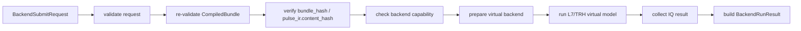

# QXtrl L3 / EB Execution Backend 设计

**版本**: v0.1  
**日期**: 2026-06-22  
**状态**: 当前权威设计草案（供 L3 / EB MVP 开发使用）  
**层级命名**: L3 / EB / Execution Backend（短码 EB，建议包 `qxtrl/eb`）  
**Schema 前缀**: `qxtrl.eb.*`  
**关联文档**:
- [QXtrl_架构层号与文档索引.md](QXtrl_架构层号与文档索引.md)（权威：L3 = Execution Backend）
- [QXtrl_L2_CPIR_Compiler_PulseIR_设计.md](QXtrl_L2_CPIR_Compiler_PulseIR_设计.md)
- [QXtrl_MVP最薄垂直切片定义.md](QXtrl_MVP最薄垂直切片定义.md)
- [QXtrl模块拆解与接口责任矩阵.md](QXtrl模块拆解与接口责任矩阵.md)
- 历史参考：[QXtrl_L2开发框架.md](QXtrl_L2开发框架.md)、[QXtrl_L2后端执行与设备分发层设计.md](QXtrl_L2后端执行与设备分发层设计.md)（历史层号；当前归属 L3 / EB）

## 0. 文档目的与范围

本文定义当前权威 L3 / EB Execution Backend 的边界、核心契约、MVP 目标、测试验收和后续升版条件。

L3 / EB 的核心职责是：

```text
CompiledBundle
  -> ExecutionBackend
  -> BackendRunResult
```

它接收已经由 L2 / CPIR 生成并验证的 `CompiledBundle`，执行统一的 validate / prepare / upload / arm / run / acquire / safe stop / cleanup 生命周期，并返回结构化状态、诊断和采集结果引用。

**MVP 聚焦**：实现 `VirtualExecutionBackend`，用当前 L7 / TRH 的 Rabi virtual model 作为数据源，跑通 Rabi `CompiledBundle -> BackendRunResult`。真实硬件后端、Edge Agent、设备驱动适配暂不进入第一版完成定义。

## 1. 背景与当前问题

当前 demo 链路中，L2 编译后直接调用 L7 virtual：

```text
L1 ExperimentSpec -> L2 PulseIR -> L7 run_rabi_virtual -> L6 analyze -> L5 record
```

这能证明薄切片可运行，但还缺少统一后端边界：

1. L4 Runtime 未来需要提交统一 `BackendSubmitRequest`，而不是直接调用 L7 函数。
2. L5 RunManifest 需要记录后端状态、诊断、耗时和数据引用。
3. L7 Twin / Replay / HIL 与未来真实后端应复用同一执行接口。
4. L2 `CompiledBundle` 需要在进入后端时重新验证和 hash 校验，不能信任任意对象引用。
5. 故障、取消、安全停机必须有一致状态机。

因此，L3 MVP 的价值不是“实现真实硬件控制”，而是建立可替换后端的执行契约。

## 2. 所属架构层与边界

| 项 | 内容 |
| --- | --- |
| 层号 | L3 |
| 短码 | EB |
| 稳定英文名 | Execution Backend |
| 建议代码包 | `qxtrl/eb` |
| 上游 | L2 / CPIR `CompiledBundle`，后续由 L4 / RS 提交 `BackendSubmitRequest` |
| 下游 | L7 / TRH virtual model、真实 driver adapter、replay dataset、HIL 环境 |
| 核心产出 | `BackendRunResult`、`BackendEvent`、`BackendDiagnostic` |
| 不负责 | 实验语义、PulseIR 编译、任务排队、资源锁、数据长期持久化、拟合、参数晋升、AI 决策 |

### 2.1 L3 负责

| 责任 | 说明 |
| --- | --- |
| 后端能力声明 | 报告后端类型、支持的 result level、最大点数、故障注入能力等。 |
| bundle 入口校验 | 重新验证 `CompiledBundle`，检查 schema/hash/资源基础一致性。 |
| 执行状态机 | 统一 validate、prepare、upload、arm、run、acquire、cleanup。 |
| 虚拟后端 | MVP 中包装 L7 `run_rabi_virtual()`，返回统一 `BackendRunResult`。 |
| 失败可见 | 将 schema 错误、能力不匹配、执行异常转成结构化诊断。 |
| 取消和 safe stop | MVP 可先占位，但状态和诊断必须可见。 |

### 2.2 L3 不负责

| 不负责 | 归属 |
| --- | --- |
| 生成 `PulseIR` / `CompiledBundle` | L2 / CPIR |
| 解释 Rabi/Ramsey/S21 科学语义 | L1 / EL、L6 / CO |
| 编排队列和资源锁 | L4 / RS |
| 保存长期数据事实源 | L5 / DS |
| 物理响应建模 | L7 / TRH |
| 参数 patch 晋升 | L6 / CO + L5 / DS |
| AI 建议执行策略 | L8 / ADG |

## 3. 输入信任模型

L3 只能把 `CompiledBundle` 当作可验证输入，不能把 Python 对象引用当作天然可信对象。

MVP 必须执行：

```python
bundle = CompiledBundle.model_validate(bundle.model_dump(mode="python"))
```

如果输入是 dict：

```python
bundle = CompiledBundle.model_validate(raw_bundle)
```

L3 入口还必须：

1. 拒绝 raw `ExperimentSpec`。
2. 拒绝 raw `PulseIR` 直接提交。
3. 拒绝 schema version 不匹配。
4. 校验 `pulse_ir.content_hash`。
5. 校验 `bundle.bundle_hash`。
6. 拒绝 `diagnostics` 中存在 severity=`error` 的 bundle。
7. 检查 `l0_refs` 非空（MVP 至少要求 4 个 refs：chip/wiring/hardware/safety）。

> 说明：当前 L2 已提供 `validated_copy()` 路径并关闭主要构造期绕过，但裸 `model_copy(update=...)` 和内部 dict mutation 仍是 Pydantic 的低层绕过风险。因此 L3 必须在边界重新 validate + verify hash。

## 4. 核心对象

### 4.1 BackendSubmitRequest

`BackendSubmitRequest` 是 L3 提交入口。MVP 可以先作为 Pydantic model 实现。

```python
class BackendSubmitRequest(BaseModel):
    schema_version: Literal["qxtrl.eb.BackendSubmitRequest/v0.1"]
    request_id: str
    run_id: str
    backend_id: str
    bundle: CompiledBundle
    mode: Literal["dry_run", "virtual", "replay", "hardware"] = "virtual"
    timeout_s: float = 60.0
    options: dict[str, object] = {}
```

MVP 规则：

1. `mode` 只支持 `virtual` 和 `dry_run`。
2. `backend_id` 建议使用 `backend.virtual.rabi_mvp`。
3. `bundle` 必须由 L3 入口重新验证。
4. `options` 不得包含 Python callable、路径句柄或不可序列化对象。

### 4.2 BackendCapability

```python
class BackendCapability(BaseModel):
    schema_version: Literal["qxtrl.eb.BackendCapability/v0.1"]
    backend_id: str
    backend_kind: Literal["virtual", "real_hardware", "replay", "hil"]
    supported_bundle_versions: tuple[str, ...]
    supported_result_levels: tuple[str, ...]
    max_points: int | None = None
    supports_cancel: bool = False
    supports_fault_injection: bool = False
```

MVP `VirtualExecutionBackend` 至少声明：

```yaml
backend_id: backend.virtual.rabi_mvp
backend_kind: virtual
supported_bundle_versions:
  - qxtrl.cpir.CompiledBundle/v0.1
supported_result_levels:
  - integrated_iq
supports_cancel: false
supports_fault_injection: true
```

### 4.3 BackendDiagnostic

```python
class BackendDiagnostic(BaseModel):
    schema_version: Literal["qxtrl.eb.BackendDiagnostic/v0.1"]
    severity: Literal["info", "warning", "error"]
    code: str
    message: str
    stage: str | None = None
    path: str | None = None
    hint: str | None = None
```

建议错误码：

| code | 含义 |
| --- | --- |
| `EB-BUNDLE-SCHEMA` | bundle schema 不合法 |
| `EB-BUNDLE-HASH` | bundle 或 pulse_ir hash 不匹配 |
| `EB-BUNDLE-DIAGNOSTIC-ERROR` | bundle 中已有 error diagnostic |
| `EB-UNSUPPORTED-BACKEND` | backend_id 或 mode 不支持 |
| `EB-UNSUPPORTED-RESULT-LEVEL` | 后端不支持请求的采集 result level |
| `EB-VIRTUAL-RUN-FAILED` | 虚拟执行异常 |
| `EB-CANCEL-UNSUPPORTED` | MVP 后端不支持取消 |
| `EB-SAFE-STOP` | safe stop 执行或占位记录 |

### 4.4 BackendEvent

```python
class BackendEvent(BaseModel):
    schema_version: Literal["qxtrl.eb.BackendEvent/v0.1"]
    event_id: str
    run_id: str
    backend_id: str
    stage: Literal[
        "created", "validating", "preparing", "uploading",
        "arming", "running", "acquiring", "completed",
        "failed", "cancelled", "cleanup"
    ]
    state: Literal["started", "succeeded", "failed", "skipped"]
    t_rel_ms: float
    details: dict[str, object] = {}
```

MVP 可以先把 events 放入 `BackendRunResult.events`，后续 L4 接入时再改为 event stream。

### 4.5 BackendRunResult

```python
class BackendRunResult(BaseModel):
    schema_version: Literal["qxtrl.eb.BackendRunResult/v0.1"]
    run_id: str
    backend_id: str
    final_state: Literal["succeeded", "failed", "cancelled", "rejected"]
    bundle_id: str
    bundle_hash: str
    pulse_ir_hash: str
    result_level: str
    data: dict[str, object] = {}
    data_refs: tuple[str, ...] = ()
    events: tuple[BackendEvent, ...] = ()
    diagnostics: tuple[BackendDiagnostic, ...] = ()
    metrics: dict[str, float] = {}
```

MVP 允许 `data` 内联保存 virtual Rabi IQ 点，后续进入 L5 / ResultStore 时应改为 `data_refs`。

### 4.6 ExecutionBackend

```python
class ExecutionBackend(Protocol):
    backend_id: str

    def describe_capability(self) -> BackendCapability:
        ...

    def validate_bundle(self, bundle: CompiledBundle | dict) -> ValidationReport:
        ...

    def submit(self, request: BackendSubmitRequest | dict) -> BackendRunResult:
        ...

    def cancel(self, run_id: str, reason: str) -> BackendRunResult:
        ...

    def safe_stop(self, reason: str) -> BackendDiagnostic:
        ...
```

MVP 可以使用同步接口。后续接入真实设备时再引入 async、event stream 和 cancellation token。

## 5. MVP 执行流程



对应状态：

| stage | MVP 行为 |
| --- | --- |
| validating | schema、hash、diagnostics、l0_refs、capability 检查 |
| preparing | 初始化 virtual backend 配置、seed、noise |
| uploading | virtual 模式可标记 skipped 或 succeeded；真实后端才上传 |
| arming | virtual 模式可标记 skipped 或 succeeded |
| running | 调用 L7/TRH virtual model |
| acquiring | 收集 integrated IQ 数据 |
| completed | 构造 `BackendRunResult(final_state="succeeded")` |
| failed/rejected | 构造结构化 diagnostic，不抛裸异常给上层 |

## 6. 与 L2 / CPIR 的接口

L3 消费 L2 的正式输出 `CompiledBundle`。MVP 不直接消费 `PulseIR`，除非通过 bundle 包装。

L3 需要的 L2 字段：

| 字段 | 用途 |
| --- | --- |
| `bundle_id` | run result 谱系 |
| `bundle_hash` | 防篡改和缓存 key |
| `pulse_ir.content_hash` | 防止 IR 被修改 |
| `pulse_ir.sweep` | virtual 执行扫描点 |
| `pulse_ir.moments` | 验证 drive/acquire 结构 |
| `pulse_ir.frames` | 验证 coherent moment frame |
| `pulse_ir.acquisition_windows` | result level 和采集窗口 |
| `pulse_ir.resources` | 点数、shots、line ids |
| `l0_refs` | L0 谱系和控制前置条件 |
| `diagnostics` | 如果存在 error，L3 默认拒绝 |

L3 不应重新解释 L1 的 Rabi 语义；Rabi 响应模型属于 L7/TRH，L3 只负责执行包装。

## 7. 与 L7 / TRH 的接口

MVP `VirtualExecutionBackend` 可委托当前函数：

```python
from qxtrl.trh import run_rabi_virtual

result = run_rabi_virtual(bundle.pulse_ir, noise=..., seed=...)
```

但 L3 输出必须转换为 `BackendRunResult`，不能直接把 L7 的 dict 作为最终后端结果。

L7/TRH 负责：

1. 根据 `PulseIR.sweep` 生成虚拟响应。
2. 支持 seed/noise/fault scenario。
3. 后续支持更高保真 twin。

L3/EB 负责：

1. 校验输入 bundle。
2. 记录执行状态和诊断。
3. 标准化结果对象。
4. 不让上层依赖 L7 私有返回字段。

## 8. 与 L4 / L5 / L6 的关系

| 层 | 关系 |
| --- | --- |
| L4 / RS | 后续创建 run、排队、资源锁、取消策略，然后调用 L3 `submit()`。MVP 可由 demo 直接调用。 |
| L5 / DS | 后续接收 `BackendRunResult` 并生成 data refs / RunManifest。MVP 可暂时内联 data。 |
| L6 / CO | 消费后端结果中的 IQ 数据或 L5 refs，生成 Observation / Proposal。L3 不做拟合。 |

## 9. 安全、权限、IP、数据治理

1. L3 不接受任意 Python callable 或脚本作为执行载荷。
2. L3 不直接读写 active `ConfigStore`。
3. L3 不将最终 waveform arrays 写回 `CompiledBundle`。
4. 真实硬件后端必须在触达设备前做 capability/safety 二次检查。
5. 所有失败必须进入 `BackendDiagnostic`，不能只靠异常文本。
6. `BackendRunResult` 不应包含私有驱动对象、连接句柄、token 或内部 endpoint。
7. Virtual backend 可以内联小型 demo data；真实后端必须返回 L5 data refs。

## 10. MVP 范围与 OUT 清单

### IN

1. `qxtrl/eb/` 包骨架。
2. `BackendSubmitRequest`、`BackendCapability`、`BackendDiagnostic`、`BackendEvent`、`BackendRunResult`。
3. `ExecutionBackend` Protocol / base class。
4. `VirtualExecutionBackend`。
5. `verify_compiled_bundle(bundle)` 工具。
6. Rabi bundle 执行：`compile_to_bundle(spec) -> backend.submit(...) -> BackendRunResult`。
7. 负向测试：hash mismatch、raw `ExperimentSpec`、raw `PulseIR`、bundle diagnostic error、unsupported backend。

### OUT

1. 真实硬件驱动。
2. Edge Agent。
3. Waveform upload cache。
4. Replay dataset 管理。
5. HIL。
6. async event stream。
7. 完整 cancel token。
8. Ramsey / multi-pulse frame update。
9. 多后端插件发现系统。

## 11. 测试与验收标准

### 11.1 Contract Tests

| 测试 | 目的 |
| --- | --- |
| `test_virtual_backend_accepts_valid_rabi_bundle` | 合法 Rabi bundle 能执行成功 |
| `test_backend_rejects_experiment_spec_input` | L3 不直接消费 L1 |
| `test_backend_rejects_raw_pulseir_input` | L3 不绕过 bundle |
| `test_backend_revalidates_mutated_bundle` | 入口重新 validate |
| `test_backend_rejects_bundle_hash_mismatch` | hash 防篡改 |
| `test_backend_rejects_pulse_ir_hash_mismatch` | IR hash 防篡改 |
| `test_backend_rejects_bundle_with_error_diagnostic` | 编译错误不能执行 |
| `test_backend_result_has_events_and_diagnostics` | 结果可审计 |
| `test_backend_failure_returns_failed_result_not_raw_exception` | 失败可见 |

### 11.2 MVP Acceptance

| 编号 | 验收项 | 通过标准 |
| --- | --- | --- |
| L3-AC-001 | Rabi bundle 提交到 virtual backend | 返回 `BackendRunResult(final_state="succeeded")` |
| L3-AC-002 | result 可供 L6 Rabi analyzer 消费 | IQ 点数与 sweep 点数一致 |
| L3-AC-003 | hash mismatch 被拒绝 | `final_state="rejected"` 且 diagnostic code=`EB-BUNDLE-HASH` |
| L3-AC-004 | 非 bundle 输入被拒绝 | raw L1/L2 输入不会进入执行 |
| L3-AC-005 | event timeline 存在 | 至少包含 validating/running/acquiring/completed |
| L3-AC-006 | demo 链路升级 | demo 可从直接 L7 调用改为 L3 backend 调用 |

## 12. 建议开发顺序

1. 新建 `qxtrl/eb/` 包。
2. 定义 models：request/capability/diagnostic/event/result。
3. 实现 `verify_compiled_bundle(bundle)`：
   - revalidate
   - verify `pulse_ir.content_hash`
   - verify `bundle.bundle_hash`
   - reject error diagnostics
   - require l0_refs
4. 实现 `VirtualExecutionBackend.submit()`。
5. 将 `qxtrl/demo_rabi_l1.py` 改为 `compile_to_bundle()` + `VirtualExecutionBackend`。
6. 更新 L5 `record_run()`，让它能记录 `BackendRunResult`。
7. 补 contract tests。

## 13. 待确认问题和决策表

| ID | 问题 | 建议 | 状态 |
| --- | --- | --- | --- |
| L3-D-001 | MVP L3 接口同步还是 async？ | 先同步，真实后端前再 async | 建议采纳 |
| L3-D-002 | L3 是否允许 raw `PulseIR`？ | 不允许，必须 bundle | 建议采纳 |
| L3-D-003 | VirtualExecutionBackend 属于 L3 还是 L7？ | L3 暴露后端接口，L7 提供响应模型 | 建议采纳 |
| L3-D-004 | Result data 内联还是 ref？ | MVP 内联，L5 接入后改 refs | 建议采纳 |
| L3-D-005 | 是否现在做真实硬件 adapter？ | 不做，等 L3 MVP contract 稳定后再进入 | 建议采纳 |

## 14. 后续升版条件

满足以下任一条件时启动 v0.2：

1. L4 Runtime 开始调用 L3。
2. L5 ResultStore 支持 data refs。
3. 需要 ReplayBackend。
4. 需要真实设备 smoke test。
5. 第二个 Atom 进入后端执行。
6. L2 引入更完整 `FrameDefinition / FrameUpdate / FrameState`。

## 15. 结论

当前 L2 / CPIR 已足够支撑 L3 / EB 的 Rabi MVP 开发。L3 第一版应建立统一后端契约，而不是提前进入真实硬件复杂度。

推荐下一步直接实现 `qxtrl/eb/VirtualExecutionBackend` 和 `verify_compiled_bundle()`，把当前 demo 从“直接调用 L7”升级为“通过 L3 后端执行”。这样可以在不引入真实硬件风险的前提下，把 L2、L3、L5、L6 的接口边界真正跑通。
