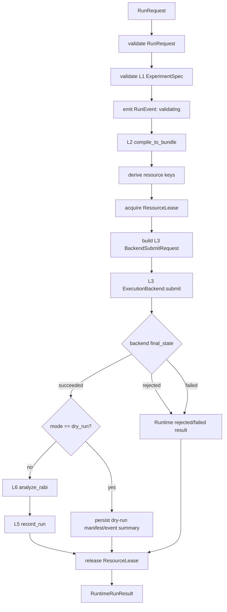

# QXtrl L4 / RS Runtime & Scheduler 设计

**版本**: v0.1  
**日期**: 2026-06-22  
**状态**: 当前权威开发草案，供 L4 / RS MVP 实现和评审使用  
**层级命名**: L4 / RS / Runtime & Scheduler（短码 RS，建议包 `qxtrl/rs`）  
**Schema 前缀**: `qxtrl.rs.*`  
**关联文档**:
- [QXtrl_架构层号与文档索引.md](QXtrl_架构层号与文档索引.md)
- [QXtrl模块拆解与接口责任矩阵.md](QXtrl模块拆解与接口责任矩阵.md)
- [QXtrl_MVP最薄垂直切片定义.md](QXtrl_MVP最薄垂直切片定义.md)
- [QXtrl_L1_API说明.md](QXtrl_L1_API说明.md)
- [QXtrl_L2_API说明.md](QXtrl_L2_API说明.md)
- [QXtrl_L3_EB_ExecutionBackend_设计.md](QXtrl_L3_EB_ExecutionBackend_设计.md)
- [QXtrl_L3实现审查意见-jed.md](QXtrl_L3实现审查意见-jed.md)
- [QXtrl_L3实现审查意见_答复.md](QXtrl_L3实现审查意见_答复.md)

## 0. 文档目的与范围

本文定义 QXtrl L4 / RS Runtime & Scheduler 的开发边界、核心契约、MVP 实现方案、测试验收和需讨论决策项。

L4 的核心职责是把一次可运行实验从“规格/请求”推进到“有状态、可取消、可审计的运行记录”：

```text
RunRequest
  -> Runtime validation
  -> L2 compile_to_bundle()
  -> Resource lease
  -> L3 BackendSubmitRequest
  -> BackendRunResult
  -> L6 analysis orchestration
  -> L5 RunManifest / ResultStore / DataSink
  -> RuntimeRunResult
```

L4 不负责实验科学语义、脉冲编译细节、真实设备通信、拟合算法、参数晋升和 UI 展示。它负责运行生命周期、队列、资源锁、取消、重试、事件流和分段计时。

**MVP 聚焦**：实现单进程、同步 `run_once()`，跑通 Rabi virtual backend 的完整生命周期。多队列、分布式调度、自动并行图着色、真实硬件资源锁和 Run Factory 完整产线化均不进入 v0.1 完成定义。

## 1. 背景与当前问题

当前 demo 已能走通：

```text
L1 ExperimentSpec
  -> L2 CompiledBundle
  -> L3 VirtualExecutionBackend
  -> L6 analyze_rabi()
  -> L5 record_run()
```

但该链路仍是脚本式编排，缺少正式 Runtime 边界：

1. 没有统一 `RunRequest`，L9 SDK/CLI、L6 校准计划和测试代码会各自拼调用链。
2. 没有统一 `RunState` / `RunEvent`，失败、取消、分段计时和 UI 实时状态无法稳定消费。
3. 没有资源锁语义，未来真实硬件或并行运行容易发生共享 line / instrument 冲突。
4. 没有 Runtime 级错误模型，上游很难区分 schema 错误、编译错误、后端拒绝、执行失败、分析失败和持久化失败。
5. L5 `RunManifest` 需要由 Runtime 提供完整谱系和阶段耗时，而不是从 demo 脚本隐式生成。
6. 任务执行“工厂化模型”需要可复用的 station / buffer / event 命名，否则后续改造会返工。

因此，L4 v0.1 的目标不是做复杂调度器，而是建立可测试的 run lifecycle 契约。

## 2. 所属架构层与边界

| 项 | 内容 |
| --- | --- |
| 层号 | L4 |
| 短码 | RS |
| 稳定英文名 | Runtime & Scheduler |
| 建议代码包 | `qxtrl/rs` |
| 上游 | L9 SDK/CLI、L6 CalibrationPlan、测试入口 |
| 主要输入 | L1 `ExperimentSpec` 或其 dict；MVP 不开放 raw `CompiledBundle` 公共入口 |
| 下游 | L2 / CPIR compiler，L3 / EB backend，L5 / DS，L6 / CO |
| 核心产出 | `RunReceipt`、`RunState`、`RunEvent`、`RuntimeRunResult`、阶段耗时 |
| 不负责 | 实验语义、PulseIR 生成、设备上传、拟合实现、数据长期存储引擎、参数晋升 |

### 2.1 L4 负责

| 责任 | 说明 |
| --- | --- |
| run lifecycle | 创建 run、状态推进、最终状态收敛。 |
| queue / scheduler | MVP 为单队列 FIFO；后续支持优先级、多队列、并行调度。 |
| resource lock | MVP 使用全局锁或 line_id 锁；后续接 L0 ResourceGroup / ConflictGroup。 |
| compilation orchestration | 调用 L2 `compile_to_bundle()`，记录编译耗时和诊断。 |
| backend orchestration | 构造 L3 `BackendSubmitRequest`，调用 `ExecutionBackend.submit()`。 |
| cancellation | 提供 `cancel(run_id)`；MVP 支持 queued / before backend submit 的取消，执行中取消占位。 |
| retry policy | 默认不自动重试硬件执行；MVP 只记录策略和失败原因。 |
| event stream | 产生 `RunEvent`，供 L5 DataSink / L9 UI / 测试消费。 |
| timing trace | 记录 validate / compile / lock / execute / analyze / persist 等阶段耗时。 |

### 2.2 L4 不负责

| 不负责 | 归属 |
| --- | --- |
| 定义 `ExperimentSpec` 语义 | L1 / EL |
| 生成 `PulseIR` / `CompiledBundle` 内部内容 | L2 / CPIR |
| 真实设备控制、上传、采集 | L3 / EB |
| 数据事实源、文件路径、长期持久化 | L5 / DS |
| Rabi 拟合、候选参数生成 | L6 / CO |
| 参数晋升 / 回滚 | L6 / CO + L5 / DS + 审批 |
| Web UI / CLI 展示 | L9 / OI |
| AI 动作建议 | L8 / ADG |

## 3. MVP 输入信任模型

L4 是用户侧运行入口，不能把上游传入对象当作已可信对象。

MVP 入口必须执行：

1. `RunRequest.model_validate(raw_request)`。
2. 对 `experiment_spec` 执行 `ExperimentSpec.model_validate(spec.model_dump(mode="python"))` 或 dict validation。
3. 拒绝 `ExperimentSpec` 中的高层 waveform / samples，依赖 L1 validator。
4. 调用 L2 `compile_to_bundle()`，不手写编译逻辑。
5. 调用 L3 `BackendSubmitRequest` + `backend.submit()`，不直接调用 L7。
6. 所有异常必须转成 `RunEvent` + `RuntimeDiagnostic` + 最终 `RuntimeRunResult`，不得让公共 API 对普通运行错误抛裸异常。

MVP 公共入口不建议接受 raw `CompiledBundle`。若为了测试或 replay 需要预编译输入，应使用显式 `input_kind="compiled_bundle"` 的内部入口，并在 L4 入口调用 L2/L3 verify，不得绕过 L3。

## 4. 核心对象

### 4.1 `RunRequest`

`RunRequest` 是 L4 对 L9 / L6 暴露的运行请求。

```python
class RunRequest(BaseModel):
    schema_version: Literal["qxtrl.rs.RunRequest/v0.1"]
    request_id: str
    run_id: str | None = None
    submitted_by: str | None = None
    experiment_spec: ExperimentSpec | dict
    backend_id: str = "backend.virtual.rabi_mvp"
    mode: Literal["dry_run", "virtual", "replay", "hardware"] = "virtual"
    priority: int = 100
    timeout_s: float = 300.0
    idempotency_key: str | None = None
    tags: dict[str, str] = {}
    options: dict[str, object] = {}
    retry_policy: RetryPolicy | None = None
```

MVP 规则：

1. `mode` 只允许 `dry_run` 和 `virtual`，`hardware` 必须由 Runtime 拒绝并给出 `RS-UNSUPPORTED-MODE`。
2. `run_id` 若为空，由 L4 生成，格式建议 `run.<date>.<short_id>` 或 MVP 简化为 `run.<spec_id>.<short_hash>`。
3. `experiment_spec` 必须重新 validate。
4. `priority` MVP 只记录，不改变 FIFO 行为。
5. `options` 必须 JSON-like，不允许 callable、文件句柄、连接对象。
6. `idempotency_key` 在 MVP 可记录但不做跨进程去重；后续接 L5 状态索引。

### 4.2 `RunReceipt`

`RunReceipt` 是 `submit()` 的即时返回值，用于未来异步队列。MVP 可以在 `run_once()` 内部生成。

```python
class RunReceipt(BaseModel):
    schema_version: Literal["qxtrl.rs.RunReceipt/v0.1"]
    request_id: str
    run_id: str
    accepted: bool
    state: Literal["accepted", "rejected"]
    submitted_at_ns: int
    diagnostics: tuple[RuntimeDiagnostic, ...] = ()
```

MVP 若请求 schema 不合法，推荐返回 `accepted=False` 的 receipt 或直接返回 `RuntimeRunResult(final_state="rejected")`。为保持失败可见，不建议让普通输入错误抛裸异常。

### 4.3 `RunState`

`RunState` 是当前运行状态快照。

```python
class RunState(BaseModel):
    schema_version: Literal["qxtrl.rs.RunState/v0.1"]
    run_id: str
    request_id: str
    lifecycle_state: Literal[
        "created", "accepted", "queued", "validating", "compiling",
        "waiting_for_resources", "submitting", "running", "analyzing",
        "persisting", "succeeded", "failed", "cancelled", "rejected"
    ]
    backend_id: str | None = None
    mode: str
    current_stage: str | None = None
    progress: float | None = None
    last_event_id: str | None = None
    diagnostics: tuple[RuntimeDiagnostic, ...] = ()
```

状态原则：

1. 终态只能是 `succeeded`、`failed`、`cancelled`、`rejected`。
2. `rejected` 表示未进入后端执行，通常由 schema / policy / capability / resource admission 导致。
3. `failed` 表示已进入运行流程但某阶段失败。
4. `cancelled` 表示用户或上层策略取消，必须记录取消来源和阶段。

### 4.4 `RunEvent`

`RunEvent` 是 Runtime 对外可订阅的事件。L5 DataSink / L9 UI / 测试都应消费这个对象，而不是解析日志文本。

```python
class RunEvent(BaseModel):
    schema_version: Literal["qxtrl.rs.RunEvent/v0.1"]
    event_id: str
    run_id: str
    request_id: str
    parent_run_id: str | None = None
    source_layer: Literal["rs", "cpir", "eb", "ds", "co"]
    stage: Literal[
        "created", "admission", "queued", "validating", "compiling",
        "waiting_for_resources", "resources_acquired", "backend_submit",
        "backend_running", "backend_completed", "analyzing",
        "persisting", "completed", "failed", "cancelled", "cleanup"
    ]
    state: Literal["started", "succeeded", "failed", "skipped", "info"]
    severity: Literal["debug", "info", "warning", "error"] = "info"
    code: str
    message: str
    t_rel_ms: float
    payload: dict[str, object] = {}
```

要求：

1. `t_rel_ms` 必须非负且单个 run 内总体单调。
2. payload 不得包含 ndarray、driver object、token、连接句柄。
3. 所有 public failure 必须至少产生一个 severity=`error` 的 `RunEvent`。
4. L3 `BackendEvent` 不直接等同于 L4 `RunEvent`，但 L4 应把关键 backend event 转译或嵌入 payload。

### 4.5 `RuntimeDiagnostic`

```python
class RuntimeDiagnostic(BaseModel):
    schema_version: Literal["qxtrl.rs.RuntimeDiagnostic/v0.1"]
    severity: Literal["info", "warning", "error"]
    code: str
    message: str
    stage: str | None = None
    source_layer: str | None = None
    path: str | None = None
    hint: str | None = None
```

建议错误码：

| code | 含义 |
| --- | --- |
| `RS-REQUEST-SCHEMA` | `RunRequest` 或 L1 spec 不合法 |
| `RS-UNSUPPORTED-MODE` | Runtime 当前不允许该 mode |
| `RS-COMPILE-FAILED` | L2 编译失败 |
| `RS-COMPILE-DIAGNOSTIC-ERROR` | L2 bundle diagnostic 中存在 error |
| `RS-RESOURCE-BUSY` | 资源锁获取失败或超时 |
| `RS-BACKEND-REJECTED` | L3 返回 rejected |
| `RS-BACKEND-FAILED` | L3 返回 failed |
| `RS-ANALYSIS-FAILED` | L6 分析失败 |
| `RS-PERSIST-FAILED` | L5 记录失败 |
| `RS-CANCELLED` | 运行被取消 |
| `RS-TIMEOUT` | Runtime 超时 |

### 4.6 `StageTiming`

SCP-010 要求分段性能计时。L4 应作为计时主入口。

```python
class StageTiming(BaseModel):
    schema_version: Literal["qxtrl.rs.StageTiming/v0.1"]
    run_id: str
    stage: str
    started_at_ns: int
    ended_at_ns: int | None = None
    duration_ms: float | None = None
    status: Literal["succeeded", "failed", "skipped", "cancelled"]
    details: dict[str, object] = {}
```

MVP 至少记录：

1. `validate_request`
2. `validate_l1`
3. `compile_l2`
4. `acquire_resources`
5. `submit_l3`
6. `execute_backend`
7. `analyze_l6`
8. `persist_l5`
9. `total`

### 4.7 `ResourceLease`

MVP 可用单进程内存资源锁。

```python
class ResourceLease(BaseModel):
    schema_version: Literal["qxtrl.rs.ResourceLease/v0.1"]
    lease_id: str
    run_id: str
    resource_keys: tuple[str, ...]
    acquired: bool
    acquired_at_ns: int | None = None
    expires_at_ns: int | None = None
    release_state: Literal["held", "released", "expired", "failed"] = "held"
```

MVP 资源键来源：

1. 默认：全局独占键 `resource.global.default`，确保串行。
2. 可选：从 `CompiledBundle.pulse_ir.resources.line_ids` 生成 `line:<line_id>`。
3. 后续：接 L0 `ResourceGroup` / `ConflictGroup` / `CrosstalkGroup`。

### 4.8 `RetryPolicy`

```python
class RetryPolicy(BaseModel):
    schema_version: Literal["qxtrl.rs.RetryPolicy/v0.1"]
    max_attempts: int = 1
    retry_on: tuple[str, ...] = ()
    backoff_ms: float = 0.0
```

MVP 建议 `max_attempts=1`，不自动重试。真实硬件阶段默认也不应自动重试执行动作，除非明确证明该动作幂等且 safe stop 已完成。

### 4.9 `RuntimeRunResult`

`RuntimeRunResult` 是 `run_once()` 的最终返回对象。

```python
class RuntimeRunResult(BaseModel):
    schema_version: Literal["qxtrl.rs.RuntimeRunResult/v0.1"]
    run_id: str
    request_id: str
    final_state: Literal["succeeded", "failed", "cancelled", "rejected"]
    l1_spec_id: str | None = None
    bundle_id: str | None = None
    backend_id: str | None = None
    backend_result: BackendRunResult | None = None
    analysis_result: dict[str, object] | None = None
    manifest_ref: str | None = None
    events: tuple[RunEvent, ...] = ()
    diagnostics: tuple[RuntimeDiagnostic, ...] = ()
    timings: tuple[StageTiming, ...] = ()
    metrics: dict[str, float] = {}
```

要求：

1. `succeeded` 必须有 backend_result、analysis_result 或明确 dry_run 标记、timings。
2. `rejected` / `failed` 必须有 error diagnostic。
3. `events` 是 Runtime 事实链，不应为空。
4. 若 L5 持久化成功，`manifest_ref` 应指向 RunManifest id/path；MVP 可先填 run id。

## 5. Runtime API

### 5.1 `RuntimeService`

MVP 建议同步实现，但保留未来异步 API 形态。

```python
class RuntimeService:
    def submit(self, request: RunRequest | dict) -> RunReceipt:
        ...

    def run_once(self, request: RunRequest | dict) -> RuntimeRunResult:
        ...

    def cancel(self, run_id: str, reason: str, requested_by: str | None = None) -> RuntimeRunResult:
        ...

    def get_state(self, run_id: str) -> RunState:
        ...

    def list_events(self, run_id: str) -> tuple[RunEvent, ...]:
        ...
```

MVP 可以只完整实现 `run_once()`，并让 `submit()` 返回 accepted/rejected receipt。不要先做复杂后台 worker。

### 5.2 `RuntimeContext`

```python
class RuntimeContext(BaseModel):
    schema_version: Literal["qxtrl.rs.RuntimeContext/v0.1"]
    runtime_id: str = "runtime.local.mvp"
    default_backend_id: str = "backend.virtual.rabi_mvp"
    allowed_modes: tuple[str, ...] = ("dry_run", "virtual")
```

实际实现中 `RuntimeContext` 还需要注入：

1. L2 compiler function：默认 `compile_to_bundle`。
2. backend registry：MVP 静态 dict `{backend_id: VirtualExecutionBackend()}`。
3. analyzer registry：MVP 针对 Rabi 调用 `analyze_rabi()`。
4. L5 record function：MVP 调用当前 `record_run()`。
5. lock manager：MVP in-memory。
6. clock / id generator：便于确定性测试。

## 6. MVP 执行流程



### 6.1 状态推进

| 阶段 | L4 行为 | 失败状态 |
| --- | --- | --- |
| admission | 校验 request、mode、operator/tag/options | `rejected` |
| validating | L1 spec round-trip validate | `rejected` |
| compiling | 调用 L2 compile，收集 diagnostics/hash | `failed` 或 `rejected` |
| waiting_for_resources | 获取资源锁 | `rejected` 或 `cancelled` |
| backend_submit | 构造 L3 request 并提交 | 按 L3 result 映射 |
| backend_running | 记录 L3 events/result | `failed` / `rejected` |
| analyzing | 调用 L6 analyzer | `failed` |
| persisting | 调用 L5 record/result store | `failed`，但 backend_result 不丢 |
| cleanup | 释放锁，记录 final event | 若 cleanup 失败，至少 warning event |

### 6.2 L3 result 映射

| `BackendRunResult.final_state` | L4 final_state | 说明 |
| --- | --- | --- |
| `succeeded` | `succeeded` 或分析/持久化后 `failed` | 后端成功不等于完整 run 成功。 |
| `rejected` | `rejected` | 通常是 bundle/capability/policy 问题。 |
| `failed` | `failed` | 后端执行期失败。 |
| `cancelled` | `cancelled` | 后端确认取消。 |

## 7. 资源锁与调度策略

### 7.1 MVP 策略

MVP 默认串行，推荐先实现全局锁：

```text
resource.global.default capacity=1
```

这样能先把取消、失败恢复和事件链路做扎实，避免过早进入自动并行图着色。

### 7.2 P1 扩展

P1 再引入：

1. 从 `CompiledBundle.pulse_ir.resources.line_ids` 自动生成 line 级资源键。
2. L0 `ResourceGroup` / `ConflictGroup` / `CrosstalkGroup`。
3. 人工声明安全并行组。
4. 多 run 的 FIFO / priority queue。
5. 可观测 lock wait time。

### 7.3 并行调度原则

自动并行必须满足：

1. 没有资源冲突。
2. 没有 L0/L6 依赖冲突。
3. 没有 crosstalk group 的人工 review 阻断。
4. 对真实硬件，默认串行；并行必须显式放行。

## 8. 取消、超时与 safe stop

MVP 取消语义：

| 阶段 | 行为 |
| --- | --- |
| queued / waiting_for_resources | 直接标记 `cancelled`，不进入 L2/L3。 |
| compiling | 当前 Python 同步编译不可中断；编译后检查 cancel flag。 |
| before backend_submit | 释放锁并返回 `cancelled`。 |
| backend_running | 调用 L3 `cancel()` 或 `safe_stop()`；若 L3 不支持，记录 `RS-CANCELLED` + warning，最终按 L3 result 收敛。 |
| analyzing / persisting | 不建议强杀；记录 cancel requested，阶段完成后终态可为 `cancelled` 或 `succeeded_with_cancel_request`。MVP 不引入该复合状态。 |

超时语义：

1. `RunRequest.timeout_s` 覆盖整个 Runtime run。
2. L3 `BackendSubmitRequest.timeout_s` 可继承剩余时间。
3. 超时后必须尝试释放资源锁。
4. 实机阶段必须触发 safe stop；MVP virtual 可记录占位。

## 9. 与相邻层接口

### 9.1 与 L1 / EL

L4 只消费已经结构化的 `ExperimentSpec`，不从脚本中推断实验语义。

要求：

1. 入口 round-trip validate。
2. 记录 `spec_id`、`schema_version`、`pdca_path`。
3. Task/Session 尚未进入 MVP；若传入非 Atom，L4 应拒绝或明确标记未支持。

### 9.2 与 L2 / CPIR

L4 调用 `compile_to_bundle(spec)`，并记录：

1. `bundle_id`
2. `bundle_hash`
3. `pulse_ir.content_hash`
4. `source_spec_hash`
5. `CompileDiagnostic`
6. compile timing

L4 不应修改 `PulseIR` 或 `CompiledBundle` 内容。

### 9.3 与 L3 / EB

L4 构造：

```python
BackendSubmitRequest(
    request_id=run_request.request_id,
    run_id=run_id,
    backend_id=run_request.backend_id,
    bundle=bundle,
    mode=run_request.mode,
    timeout_s=remaining_timeout_s,
    options=backend_options,
)
```

L4 必须把 L3 result 转换为 Runtime state 和 events，但不解析 L7 私有结果字段。

### 9.4 与 L5 / DS

L4 是 RunManifest 的主要谱系提供者，但 L5 是持久化事实源。

MVP 需要传给 L5：

1. L1 spec / refs。
2. `BackendRunResult`。
3. L6 analysis result。
4. L4 `RunEvent`。
5. `StageTiming`。
6. resource lease summary。
7. final_state / diagnostics。

当前 `qxtrl/ds/record_run()` 仍偏 demo，需要后续扩展以接收 L4 events/timings。L4 文档先定义需求，L5 实现可后续补。

### 9.5 与 L6 / CO

L4 可以编排 L6 analyzer，但不实现拟合逻辑。

MVP Rabi 路径：

```python
analysis = analyze_rabi({"result": backend_result.data["iq"], ...})
```

后续应通过 L1 Registry 或 L6 analyzer registry 根据 `ExperimentSpec.check.analyzer_ref` 发现分析器。

### 9.6 与 L9 / OI

L9 应只调用 L4 Runtime API，不直接调用 L2/L3/L5 内部链路。

MVP CLI/SDK 推荐：

```python
runtime = RuntimeService.local_mvp()
result = runtime.run_once(RunRequest(experiment_spec=spec, mode="virtual"))
```

## 10. 安全、权限、IP、数据治理

1. L4 不接受任意 Python callable 作为运行 payload。
2. L4 不直接写 active `ConfigStore`。
3. L4 不允许 UI 或 notebook 绕过 Runtime 直接触发硬件后端。
4. L4 必须记录 operator / submitted_by，占位也要保留字段。
5. L4 不在 `RunEvent.payload` 中保存 token、endpoint、driver object 或大数组。
6. `hardware` mode 在 MVP 必须拒绝，直到 L3 真实后端、L0 safety、L5 manifest 全部通过验收。
7. L4 失败路径必须释放资源锁。
8. 运行记录必须能追溯到 L1 spec、L2 bundle、L3 backend result、L6 analysis 和 L5 manifest。

## 11. MVP 范围与 OUT 清单

### IN

1. `qxtrl/rs/` 包骨架。
2. Pydantic models：`RunRequest`、`RunReceipt`、`RunState`、`RunEvent`、`RuntimeDiagnostic`、`StageTiming`、`RuntimeRunResult`。
3. `RuntimeService.run_once()`。
4. 静态 backend registry，默认 `VirtualExecutionBackend`。
5. Rabi virtual path：`ExperimentSpec -> compile_to_bundle -> backend.submit -> analyze_rabi -> record_run`。
6. 单进程 in-memory event store。
7. 单进程 global resource lock。
8. 分段计时。
9. 失败可见：L1/L2/L3/L6/L5 任一阶段失败均进入 `RunEvent` / `RuntimeDiagnostic`。
10. Contract tests。

### OUT

1. 分布式 worker。
2. 多队列和复杂优先级调度。
3. 自动并行图着色。
4. 真实硬件运行。
5. 完整 Run Factory 工作站/仓库实现。
6. WebSocket/SSE 正式服务。
7. 持久化任务队列。
8. Task/Session 递归运行。
9. 多 analyzer registry 完整实现。
10. 参数晋升/回滚。

## 12. 测试与验收标准

### 12.1 Contract Tests

| 测试 | 目的 |
| --- | --- |
| `test_runtime_run_once_valid_rabi_virtual_succeeds` | 合法 Rabi spec 完整跑通。 |
| `test_runtime_rejects_invalid_run_request_schema` | 请求 schema 错误失败可见。 |
| `test_runtime_revalidates_l1_spec` | L4 边界重新 validate L1。 |
| `test_runtime_rejects_hardware_mode_in_mvp` | MVP 不允许实机运行。 |
| `test_runtime_compile_failure_returns_failed_result` | L2 编译失败进入 diagnostics/events。 |
| `test_runtime_backend_rejected_maps_to_rejected` | L3 rejected 正确映射。 |
| `test_runtime_backend_failed_maps_to_failed` | L3 failed 正确映射。 |
| `test_runtime_analysis_failure_returns_failed_result` | L6 异常不吞错。 |
| `test_runtime_persist_failure_returns_failed_but_keeps_backend_result` | L5 失败不丢执行结果。 |
| `test_runtime_records_stage_timings` | 必需阶段耗时存在且非负。 |
| `test_runtime_releases_resource_lock_on_failure` | 失败后锁释放。 |
| `test_runtime_cancel_before_backend_submit` | 后端提交前取消成功。 |
| `test_runtime_dry_run_has_no_iq_data` | dry_run 不产生实验数据。 |

### 12.2 MVP Acceptance

| 编号 | 验收项 | 通过标准 |
| --- | --- | --- |
| L4-AC-001 | 一键 Rabi virtual run | `RuntimeRunResult(final_state="succeeded")`，含 backend result、analysis、manifest ref。 |
| L4-AC-002 | 失败可见 | 注入 L2/L3/L6/L5 异常均返回结构化 failed/rejected result。 |
| L4-AC-003 | 分段计时 | 至少 8 个关键阶段有 timing。 |
| L4-AC-004 | 资源锁 | 同一 runtime 内并发 run 不会同时获得全局锁。 |
| L4-AC-005 | dry_run | 完成 validate/compile/backend dry-run，不调用 L7，不生成 IQ。 |
| L4-AC-006 | 事件链 | `RunEvent` 覆盖 created/validating/compiling/backend/analyzing/persisting/completed 或 failed。 |
| L4-AC-007 | L5 可追溯 | manifest 或 manifest_ref 能关联 run_id、spec_id、bundle_id、backend_id。 |

## 13. 需讨论或决策的问题

以下问题建议在 L4 实现前或实现首轮中明确拍板。

| ID | 决策项 | 推荐结论 | 影响 | 状态 |
| --- | --- | --- | --- | --- |
| L4-D-001 | L4 v0.1 API 是同步还是异步 | 先实现同步 `run_once()`，保留 `submit()` / `RunReceipt` 形态 | 避免过早引入 worker，同时不堵未来队列 | 待确认 |
| L4-D-002 | `run_id` 由谁生成 | L4 生成，L5 记录，不由 L3 或 L9 生成 | 保证运行谱系入口唯一 | 待确认 |
| L4-D-003 | 公共入口是否允许 raw `CompiledBundle` | 不允许；只允许 L1 `ExperimentSpec`，预编译输入作为测试/内部入口 | 防止绕过 L1/L2/L0 gate | 待确认 |
| L4-D-004 | MVP 资源锁粒度 | 默认全局锁；可选 line_id 锁 | 保守避免并发风险 | 待确认 |
| L4-D-005 | L0 是否需要立即补 ResourceGroup / ConflictGroup | MVP 不阻塞；P1 必须补 | 决定并行调度可落地性 | 待确认 |
| L4-D-006 | 自动 retry 默认策略 | 默认不自动重试，`max_attempts=1` | 避免硬件副作用重复执行 | 待确认 |
| L4-D-007 | 取消语义最小范围 | MVP 支持 queued / before backend submit；running 阶段调用 L3 cancel/safe_stop 占位 | 决定测试边界 | 待确认 |
| L4-D-008 | Runtime 是否编排 L6 analysis | MVP 编排 Rabi analyzer，但 L4 不实现拟合 | 支撑一键 run 和 manifest | 待确认 |
| L4-D-009 | Event sink 首版实现 | in-memory event list + L5 DataSink 接口预留 | 降低 MVP 复杂度 | 待确认 |
| L4-D-010 | Run Factory 是否进入 L4 v0.1 | 不进入，仅固化 station/stage 命名 | 避免过厚，但保留演进路径 | 待确认 |
| L4-D-011 | 硬件模式是否允许在 L4 v0.1 暴露 | 不允许，返回 `RS-UNSUPPORTED-MODE` | 避免误触发真实设备 | 待确认 |
| L4-D-012 | `submitted_by` 是否必填 | MVP 可选，商业/多人环境必填 | 影响审计和权限 | 待确认 |

## 14. 工厂化执行模型预留

用户此前提出的“任务执行工厂化模型”适合归入 L4 的 P2 演进方向。L4 v0.1 不实现完整工厂，但应采用可演进的 stage 命名。

建议未来抽象：

```text
WorkOrder
  -> Station(validate)
  -> Buffer(validated_specs)
  -> Station(compile)
  -> Buffer(compiled_bundles)
  -> Station(resource_admission)
  -> Buffer(admitted_runs)
  -> Station(execute_backend)
  -> Buffer(backend_results)
  -> Station(analyze)
  -> Buffer(observations)
  -> Station(persist)
  -> ResultStore / DataSink
```

v0.1 只需保证：

1. `RunEvent.stage` 名称能映射到未来 station。
2. 每个 stage 有 timing。
3. 每个 stage 的输入输出对象明确。
4. 失败不会静默跨站传播。

## 15. 建议开发顺序

1. 新建 `qxtrl/rs/` 包和 `models.py`。
2. 实现 `RunRequest`、`RunEvent`、`RuntimeDiagnostic`、`StageTiming`、`RuntimeRunResult`。
3. 实现 `InMemoryEventStore` 和 `InMemoryResourceLockManager`。
4. 实现 `RuntimeService.run_once()`，先只支持 Rabi virtual。
5. 接入 L2 `compile_to_bundle()`。
6. 接入 L3 `VirtualExecutionBackend`。
7. 接入 L6 `analyze_rabi()`。
8. 接入 L5 `record_run()`，即使 L5 先只返回 dataclass manifest。
9. 补 contract tests 和 failure-visible tests。
10. 更新 demo，让 `demo_rabi_l1.py` 或新增 demo 走 `RuntimeService.run_once()`。

## 16. 第一版实现注意事项

1. 不要在 L4 内部重新写 Rabi 规则，Rabi 语义属于 L1/L2/L6。
2. 不要直接调用 `run_rabi_virtual()`，必须通过 L3 backend。
3. 不要让 L4 修改 `CompiledBundle`。
4. 不要把 `RunEvent` 当作唯一持久化事实源，L5 manifest 仍是事实归档。
5. 不要为了未来异步 worker 引入线程池、数据库队列或网络服务。
6. 公共 API 的普通运行错误必须返回结构化 result，不要抛裸异常。
7. 每个失败测试都要断言 final_state、diagnostic code 和至少一个 error event。

## 17. 后续升版条件

满足以下任一条件时启动 v0.2：

1. L5 ResultStore / DataSink 正式化，Runtime 需要持久化 event stream。
2. 第二个 Atom 进入 Runtime。
3. Task/Session 递归运行进入范围。
4. L0 ResourceGroup / ConflictGroup / CrosstalkGroup 可用。
5. 需要多 run 排队或并行调度。
6. 真实硬件后端通过 L3 contract tests。
7. L9 Web/SDK 需要订阅实时 events。
8. Run Factory 工作站/仓库模型进入实现。

## 18. 结论

L4 / RS 的第一版应把当前脚本式 demo 收敛成正式 Runtime API。实现重点不是复杂调度，而是稳定 run lifecycle、失败可见、资源释放、阶段计时和相邻层边界。

只要 v0.1 能可靠完成 `RunRequest -> RuntimeRunResult`，并把 L1/L2/L3/L6/L5 的成功和失败都纳入统一事件链，就可以支撑后续 L9 CLI/SDK、L5 数据归档和 L6 校准任务编排继续开发。

