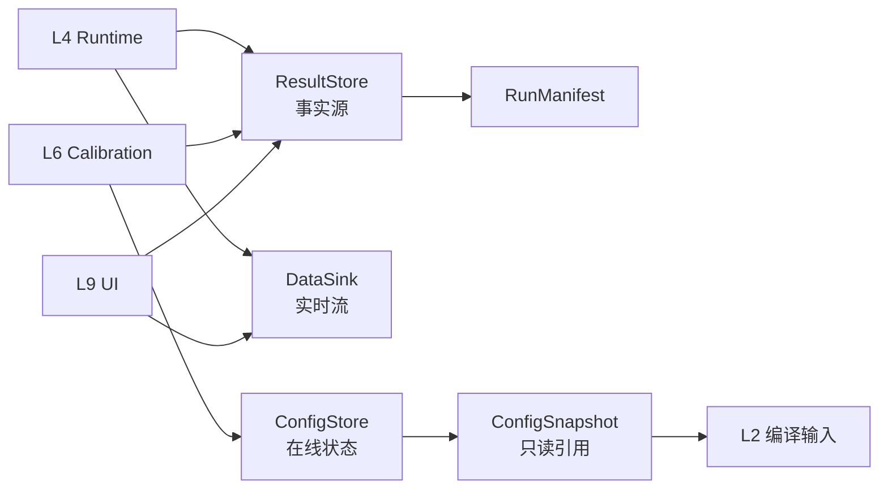
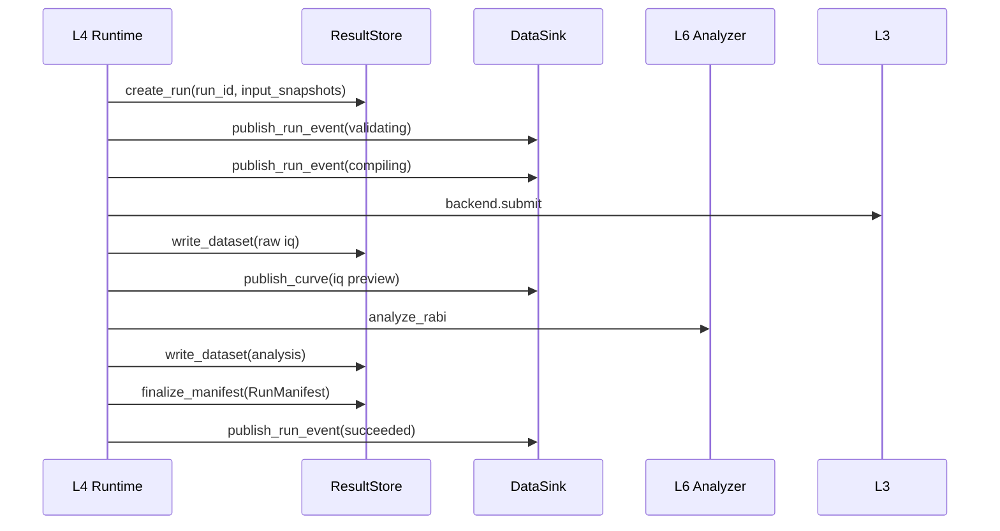

# QXtrl L5 / DS 数据与状态设计

**版本**: v0.2  
**日期**: 2026-06-22  
**状态**: 当前权威开发草案，供 L5 / DS MVP 实现和评审使用；v0.2 在 cursor v0.1 基础上补强 L4 对齐、失败 manifest、API 边界和验收细则  
**层级命名**: L5 / DS / Data & State（短码 DS，包 `qxtrl/ds`）  
**Schema 前缀**: `qxtrl.ds.*`  
**关联文档**:
- [QXtrl_架构层号与文档索引.md](QXtrl_架构层号与文档索引.md)
- [QXtrl模块拆解与接口责任矩阵.md](QXtrl模块拆解与接口责任矩阵.md)
- [QXtrl_MVP最薄垂直切片定义.md](QXtrl_MVP最薄垂直切片定义.md)
- [QXtrl_L0数据与信息存放规则.md](QXtrl_L0数据与信息存放规则.md)
- [QXtrl_L4_RS_RuntimeScheduler_设计.md](QXtrl_L4_RS_RuntimeScheduler_设计.md)
- [QXtrl_schema_contract_patch_list.md](QXtrl_schema_contract_patch_list.md)（SCP-008/009/010）

## 0. 文档目的与范围

L5 / DS 负责 QXtrl 的**三类数据边界**：在线配置状态、不可变运行事实、实时展示流。

```text
ConfigStore   — 当前可运行配置与校准 active 状态（可变、版本化、可快照）
ResultStore   — 运行谱系与实验数据事实源（不可变、可回放）
DataSink      — 实时状态与曲线流（可丢、可重连、非事实源）
```

L5 的核心职责：

1. 持久化每次 run 的数据引用和 `RunManifest`；在线运行的 `run_id` 由 L4 分配，L5 负责唯一性检查、索引和引用生成。
2. 实现 L0 数据治理规则（路径、权限、保留、脱敏）的**存储引擎适配**。
3. 强制 `ConfigStore` / `ResultStore` / `DataSink` 职责分离，并通过契约测试验证。
4. 为 L6 校准晋升、L7 回放、L8 AI 只读上下文提供稳定查询接口。

L5 **不负责**：实验语义、编译、设备执行、拟合算法、参数晋升决策、UI 渲染、L0 schema 定义本身、在线运行调度和资源锁。

**MVP 聚焦**：文件 + 内存混合的最小实现，跑通 Rabi virtual 闭环的 manifest、结果持久化与 DataSink 边界测试。正式数据库、分布式存储、完整 RBAC 和对象存储适配不进入 MVP 完成定义。

### 0.1 v0.2 补强摘要

相比 cursor v0.1，本版补强以下可落地细节：

1. 明确 `run_id` 归属：L4 在线运行分配，L5 不二次生成；离线导入才可由 L5 分配。
2. 增加 `RuntimeRunResult -> RunManifest` 字段映射，直接对齐当前 L4 / RS 输出。
3. 增加失败 run / partial run 的 manifest 语义，要求失败也可审计、可查询。
4. 增加 `DatasetRef` / `DatasetMetadata` 的不可变、hash、路径封装规则。
5. 增加 DS 结构化错误对象、DataSink overload 处理和 ResultStore 原子 finalize 规则。
6. 扩展 MVP contract tests，覆盖 L4 early failure、DataSink 断连、raw 不可覆盖、draft snapshot 拒绝和校准隔离。

## 1. 背景与当前问题

当前 `qxtrl/ds/manifest.py` 仅有 demo 级 `record_run()`：内存对象、字段不完整、未区分三类 store、无 DataSink、无分段计时与谱系 refs。

遗留 QuarkStudio / 会议习惯带来的反模式：

| 反模式 | 风险 | L5 对策 |
| --- | --- | --- |
| Redis / 热状态当唯一事实源 | 重启丢数据、无法审计 | ResultStore 为事实源；Redis 仅可作 DataSink 后端 |
| Config 与结果混在同一 JSON | 无法回滚、无法重放 | ConfigStore 与 ResultStore 物理/逻辑分区 |
| 脚本硬编码数据路径 | 不可迁移、不可交付 | 由 L5 分配 ref，上层只持 ref |
| UI 断开影响执行 | 绘图阻塞主链路 | DataSink 与持久化解耦（SCP-008） |
| 无 manifest 最小字段 | 回放成口头承诺 | SCP-009 硬门 |
| L4/L5 重复分配 run_id | 查询、取消、追踪和 manifest 脱节 | L4 分配在线 run_id，L5 只校验唯一性 |
| 失败 run 不落 manifest | 失败不可审计，无法训练诊断/AI | terminal run 均应有 manifest 或 DS failure diagnostic |

因此 L5 v0.2 的目标不是做完整数据平台，而是建立**可测试的三类 store 契约**、**可回放的 RunManifest**和**失败可见的数据事实源**。

## 2. 所属架构层与边界

| 项 | 内容 |
| --- | --- |
| 层号 | L5 |
| 短码 | DS |
| 稳定英文名 | Data & State |
| 建议代码包 | `qxtrl/ds` |
| 上游 | L4 Runtime（谱系与 timing）、L3 Backend（data refs）、L6 Analysis（Observation） |
| 下游 | L6 Calibration、L7 Replay、L8 AI、L9 UI |
| 核心产出 | `ConfigSnapshot`、`RunManifest`、`DatasetRef`、`Observation` 持久化、`RunEventStream` |
| 治理依据 | L0 [数据与信息存放规则](QXtrl_L0数据与信息存放规则.md) |

### 2.1 L5 负责

| 责任 | 说明 |
| --- | --- |
| ConfigStore | 站点/芯片/仪器在线状态；快照发布与只读引用；受控写回入口 |
| ResultStore | 创建 run、写入 raw/processed/analysis、生成 manifest、维护谱系 |
| DataSink | 推送 RunEvent、实时曲线；订阅/重连；不持久化唯一事实 |
| RunManifest | 绑定输入快照、编译产物 hash、后端结果、分析版本、timing |
| Dataset 元数据 | shape、单位、坐标、hash、parent refs（对齐 L0 §9） |
| 校准记录存储 | `CalibrationRecord` 内容不可变；active 状态变更写审计事件 |
| 查询 API | 按 run_id、chip、时间、参数 key 检索（MVP 最小子集） |
| run_id 唯一性 | 校验 L4 分配的 `run_id` 未被使用；离线导入场景可分配新 run_id |

### 2.2 L5 不负责

| 不负责 | 归属 |
| --- | --- |
| 定义 L0 对象 schema | L0 / CC |
| 决定参数是否晋升 | L6 / CO + 审批 |
| 拟合与 Observation 生成 | L6 / CO |
| 运行排队与资源锁 | L4 / RS |
| 在线 run_id 分配 | L4 / RS |
| 设备采集与上传 | L3 / EB |
| Web 绘图实现 | L9 / OI |
| Onboarding 表单 UI | L9 / OI（调用 L0 validator） |

## 3. 三类 Store 强制分离

这是 L5 的首要 invariant（SCP-008）：



| Store | 可变性 | MVP 后端 | 禁止事项 |
| --- | --- | --- | --- |
| ConfigStore | 可变（经晋升/审批） | 文件 + 内存索引 | 存 raw trace；搜索期直接写 active |
| ResultStore | 追加/不可覆盖 raw | 本地目录 `runs/` | 作 dashboard 唯一来源；从 DataSink 读必填字段 |
| DataSink | 热数据、可过期 | 内存 pub-sub（可选 Redis 适配） | 拟合、写 Config、生成 manifest |

### 3.1 强制 invariants

| ID | Invariant | 必须如何验证 |
| --- | --- | --- |
| DS-INV-001 | `RunManifest` 只能由 ResultStore finalize，不得由 DataSink 生成 | 关闭 DataSink consumer 后仍可 finalize |
| DS-INV-002 | raw dataset 一旦写入不可原地覆盖 | 第二次同名写入拒绝或显式生成新 version/ref |
| DS-INV-003 | `ConfigStore.active` 只能由审批/晋升 API 修改 | 搜索期和 shadow mode 写入 active 必须失败 |
| DS-INV-004 | 上层只持 `DatasetRef` / `RunManifestRef`，不得持久化绝对路径 | schema validator 拒绝 manifest 中出现本机绝对路径 |
| DS-INV-005 | terminal run 必须可查询：`succeeded/failed/cancelled/rejected` 都有 manifest 或结构化 DS failure diagnostic | L4 early-failure、backend-failure、analysis-failure 均测试 |
| DS-INV-006 | DataSink overload 不能改变 run final_state | MemoryDataSink 队列满时 drop + diagnostic，不阻塞 ResultStore |

**契约测试（必须通过）**：

```text
given DataSink consumer disconnected
when Rabi run completes
then ResultStore contains raw/processed data
and RunManifest.status is terminal (succeeded/failed/...)
and no required manifest field is read from DataSink
```

失败可见性要求：

```text
given L4 returns RuntimeRunResult(final_state="failed" or "rejected")
when L5 receives it
then RunManifest.final_state equals L4 final_state
and RunManifest.failure.code/message are populated
and query_runs(final_state=...) can find it
```

## 4. 核心对象

### 4.1 `ConfigStore`

管理**当前**站点/芯片/仪器/实验默认状态。

```yaml
ConfigSnapshot:
  snapshot_id: cfg_demo_001
  schema_version: qxtrl.ds.ConfigSnapshot/v0.1
  station_id: station.st_lab01
  chip_id: chip.chip_001
  content_hash: sha256:...
  created_at: 2026-06-22T08:00:00Z
  approved_by: user.calibration_lead
  l0_bundle_ref: l0_bundle_20260622_001
  calibration_snapshot_ref: cal_snap_20260622_001
  status: published | draft | revoked
```

MVP 规则：

1. L2/L4 编译与执行**只读** `published` 快照。
2. Demo **不实现** active 参数自动晋升；只读 + 候选记录分离。
3. 写回 API 预留：`propose_patch()` / `activate_record()`，MVP 可 stub。

### 4.2 `ResultStore`

不可变运行案例库。

```python
class ResultStore(Protocol):
    def create_run(self, *, run_id: str, station_id: str, chip_id: str,
                   input_snapshots: dict[str, str], operator: str) -> RunHandle: ...

    def write_dataset(self, run_id: str, name: str, data: Any,
                      metadata: DatasetMetadata) -> DatasetRef: ...

    def finalize_manifest(self, manifest: RunManifest) -> RunManifestRef: ...

    def record_runtime_result(self, *, runtime_result: RuntimeRunResult,
                              spec: ExperimentSpec | None = None,
                              bundle: CompiledBundle | None = None) -> RunManifestRef: ...

    def get_manifest(self, run_id: str) -> RunManifest: ...

    def query_runs(self, *, chip_id: str | None = None,
                   since: datetime | None = None, limit: int = 100) -> list[RunManifestRef]: ...
```

逻辑目录（与 L0 一致，实现可映射 DB/对象存储）：

```text
runs/<yyyy>/<mm>/<dd>/<run_id>/
  manifest.yaml          # 人类可读
  manifest.json          # 机器读取与测试用 canonical dump
  manifest.sha256
  raw/
  processed/
  analysis/<analysis_version>/
  events/
  timings/
  diagnostics/
  logs/
```

`finalize_manifest()` 必须近似原子：

1. 先写 `manifest.tmp`。
2. 校验 required fields、hash 和 refs。
3. 原子 rename 为 `manifest.yaml/json`。
4. 写 `manifest.sha256`。
5. run 标记为 terminal；之后再次 finalize 必须返回 `DS-RUN-ALREADY-FINALIZED`。

### 4.3 `DataSink`

实时流，**best-effort** 投递。

```python
class DataSink(Protocol):
    def publish_run_event(self, event: RunEvent) -> None: ...
    def publish_curve(self, run_id: str, channel: str, payload: CurvePayload) -> None: ...
    def subscribe(self, run_id: str) -> Iterator[StreamMessage]: ...
```

规则：

1. 慢消费者不得阻塞 L4 主链路（队列有界 + drop 策略可配置）。
2. 重连后**不**保证补全历史；完整历史从 ResultStore 读。
3. L9 UI 只订阅 DataSink；审计与回放只读 ResultStore。

DataSink 的 publish API 必须是 best-effort，不允许把慢消费者压力传回 L4 主执行路径：

| 情况 | 行为 |
| --- | --- |
| 队列未满 | 正常 publish |
| 队列满 | drop oldest 或 drop current，记录 `DS-SINK-OVERLOAD` warning |
| consumer 断开 | 不影响 ResultStore，不影响 manifest final_state |
| DataSink 后端异常 | 返回 warning diagnostic；除非明确配置为 strict，不改变 run final_state |

### 4.4 `RunManifest`

一次运行的不可变索引（SCP-009 最小字段 + MVP 扩展）：

```yaml
run_manifest:
  schema_version: qxtrl.ds.RunManifest/v0.1
  run_id: run_demo_001
  station_id: station.st_lab01
  chip_id: chip.chip_001
  operator:
    user_id: user.demo
    role: calibration_engineer
  started_at: 2026-06-22T10:00:00Z
  completed_at: 2026-06-22T10:00:05Z
  final_state: succeeded | failed | cancelled | rejected
  experiment:
    spec_id: rabi_q000_demo
    schema_version: qxtrl.el.ExperimentSpec/v0.1
    spec_hash: sha256:...
    pdca_path: []
    atom_type: rabi
  input_snapshots:
    config_snapshot_ref: cfg_demo_001
    safety_policy_ref: safety_demo_001
    calibration_snapshot_ref: cal_snap_demo_001
    hardware_inventory_ref: hw_inv_demo_001
    wiring_graph_ref: wiring_demo_001
    chip_model_ref: chip_demo_001
  compile:
    bundle_id: bundle_001
    bundle_hash: sha256:...
    pulse_ir_hash: sha256:...
  execution:
    backend_id: virtual_qpu.demo
    mode: virtual | replay | physical | hil
    backend_final_state: succeeded
  analysis:
    analyzer_ref: qxtrl.co.analyze_rabi/v0.1
    observation_ref: obs_run_demo_001
  output_refs:
    raw: [ds_run_demo_001_iq]
    processed: []
    logs: [log_run_demo_001]
  calibration:
    proposal_refs: [prop_run_demo_001]
    record_refs: [calrec_candidate_001]
  timing_metrics:
    parse_spec_ms: 0
    bind_parameters_ms: 0
    compile_ir_ms: 0
    render_waveform_ms: 0
    serialize_payload_ms: 0
    submit_backend_ms: 0
    acquire_result_ms: 0
    analyze_ms: 0
    persist_manifest_ms: 0
  software:
    qxtrl_version: 0.1.0
    git_commit: unknown
  failure: null
  diagnostics_refs: []
```

约束：

1. `finalize_manifest()` 后 manifest **不可变**；纠错只能新 run 或新 analysis 版本。
2. 无 manifest 的数据**不得**进入校准晋升或 Twin 训练（L0 D-001）。
3. `timing_metrics` 由 L4 提供，L5 原样持久化（SCP-010）。
4. `final_state` 必须等于 L4 `RuntimeRunResult.final_state`，不得因 DataSink 成功或失败而改写。
5. `failure` 只在 `failed/cancelled/rejected` 时非空；其中至少包含 `code`、`message`、`source_layer`、`stage`。

#### 4.4.1 `RuntimeRunResult -> RunManifest` 映射

L4 是 Runtime 事实的组装者，L5 是持久化事实源。L5 不重新解释实验语义，只做字段映射、完整性校验和存储。

| RunManifest 字段 | 来源 | 规则 |
| --- | --- | --- |
| `run_id` | `RuntimeRunResult.run_id` | 必须与 L4 一致；若重复且已 finalized，拒绝 |
| `final_state` | `RuntimeRunResult.final_state` | 原样持久化 |
| `experiment.spec_id` | `RuntimeRunResult.l1_spec_id` 或 `ExperimentSpec.spec_id` | spec 对象可选；MVP 允许只写 spec_id |
| `compile.bundle_id` | `RuntimeRunResult.bundle_id` 或 `BackendRunResult.bundle_id` | backend 缺失时可为空，但失败原因必须记录 |
| `compile.bundle_hash` | `BackendRunResult.bundle_hash` | 后端未进入时为空；进入后必须非空 |
| `compile.pulse_ir_hash` | `BackendRunResult.pulse_ir_hash` | 同上 |
| `execution.backend_id` | `RuntimeRunResult.backend_id` | 可为空，仅 admission/schema reject 允许 |
| `execution.backend_final_state` | `BackendRunResult.final_state` | 后端未进入时为 `not_submitted` |
| `analysis.observation_ref` | `analysis_result` 或写入的 analysis dataset ref | 分析失败时为空，`failure` 记录错误 |
| `output_refs.raw` | `BackendRunResult.data_refs` 或 L5 写入 inline data 后生成的 `DatasetRef` | 不得把 inline data 直接塞进 manifest |
| `events_ref` | L5 保存 `RuntimeRunResult.events` 后生成 | MVP 可 `events/events.json` |
| `timings_ref` | L5 保存 `RuntimeRunResult.timings` 后生成 | MVP 可 `timings/stage_timings.json` |
| `diagnostics_refs` | L5 保存 `RuntimeRunResult.diagnostics` 后生成 | error diagnostic 必须可查询 |
| `timing_metrics` | `RuntimeRunResult.timings` + `metrics.total_duration_ms` | 缺失时 L5 可降级写 available stages，但必须产生 `DS-TIMING-INCOMPLETE` warning |

当前 L4 复审仍指出 early-return 路径可能缺 `total` timing、terminal event 和 state store 记录。因此 L5 MVP 实现应采用兼容策略：

1. 如果 `RuntimeRunResult.timings` 缺 `total`，L5 不伪造成功 total；写入 `timing_metrics.partial=true`，并追加 `DS-TIMING-INCOMPLETE` warning。
2. 如果缺 terminal event，L5 可在 `events_ref` 中追加 DS 侧 ingest event，但不得伪造 L4 `RS-FAILED`。
3. 如果没有 `backend_result`，manifest 仍可 final_state=`rejected/failed`，但 `execution.backend_final_state=not_submitted`。

#### 4.4.2 失败与 partial manifest 语义

| 场景 | 是否生成 manifest | 必填内容 |
| --- | --- | --- |
| request schema reject | 建议生成 minimal failure manifest | `run_id`、`final_state=rejected`、`failure.code=RS-REQUEST-SCHEMA` |
| unsupported mode | 生成 minimal failure manifest | `mode`、`failure.code=RS-UNSUPPORTED-MODE` |
| L2 compile failed | 生成 failure manifest | `spec_id`、compile failure diagnostic |
| L3 backend rejected/failed | 生成 failure manifest | backend diagnostics、bundle hash（若有） |
| L6 analysis failed | 生成 failure manifest + raw refs | backend data refs、analysis failure diagnostic |
| L5 persist failed | manifest 可能不存在 | L4 必须 surface `RS-PERSIST-FAILED`；L5 尽力留下 partial recovery marker |

`partial` 不等于成功。任何 `partial=true` 的 manifest 不能进入校准晋升或 Twin 训练，只能用于诊断和失败统计。

#### 4.4.3 Pydantic 最小字段建议

```python
class RunManifest(BaseModel):
    schema_version: Literal["qxtrl.ds.RunManifest/v0.1"]
    run_id: str
    final_state: Literal["succeeded", "failed", "cancelled", "rejected"]
    experiment: ExperimentManifestRef
    input_snapshots: dict[str, str] = Field(default_factory=dict)
    compile: CompileManifestRef | None = None
    execution: ExecutionManifestRef | None = None
    output_refs: dict[str, tuple[DatasetRef, ...]] = Field(default_factory=dict)
    events_ref: DatasetRef | None = None
    timings_ref: DatasetRef | None = None
    diagnostics_refs: tuple[DatasetRef, ...] = ()
    timing_metrics: dict[str, float | bool] = Field(default_factory=dict)
    failure: FailureInfo | None = None
    partial: bool = False
```

Validator 要求：

1. `succeeded` 必须有 `compile`、`execution`、至少一个 output 或明确 `dry_run=true`。
2. `failed/rejected/cancelled` 必须有 `failure` 或 error/warning diagnostic refs。
3. `partial=true` 时不得 `final_state=succeeded`。
4. manifest 内不得出现本机绝对路径；只能出现 `DatasetRef`、`RunManifestRef` 或受控 logical URI。

### 4.5 `DatasetMetadata` 与 `DatasetRef`

对齐 L0 §9 最小元数据：

```yaml
dataset_id: ds_run_demo_001_iq
run_id: run_demo_001
kind: raw_iq | raw_trace | processed_curve | analysis_result | log
format: json | numpy | zarr | hdf5
schema_version: qxtrl.ds.Dataset/v0.1
content:
  shape: [101, 2]
  dtype: float64
  dims: [sweep_point, iq_component]
units:
  signal: a.u.
hash:
  algorithm: sha256
  value: sha256:...
lineage:
  parent_datasets: []
  input_snapshots:
    calibration_snapshot_ref: cal_snap_demo_001
```

`DatasetRef` 是对外引用对象，不是文件路径：

```yaml
DatasetRef:
  schema_version: qxtrl.ds.DatasetRef/v0.1
  dataset_id: ds_run_demo_001_iq
  run_id: run_demo_001
  logical_uri: qxtrl://runs/2026/06/22/run_demo_001/raw/iq.json
  content_hash: sha256:...
  metadata_hash: sha256:...
```

约束：

1. `logical_uri` 可映射到本地文件、对象存储或数据库；上层不得假设真实路径。
2. `content_hash` 覆盖 payload，`metadata_hash` 覆盖 metadata canonical dump。
3. `kind=raw_*` 的 dataset 不允许 overwrite；如需重写必须产生新 `dataset_id` 或 version。
4. inline data 只允许作为 `write_dataset()` 输入，不允许长期保留在 manifest。

### 4.6 `CalibrationRecord` 存储（L5 视角）

L6 产生记录；L5 负责持久化与状态索引：

| 状态 | L5 行为 |
| --- | --- |
| candidate | 追加 record，不可变内容 |
| active | 更新 ConfigStore 索引指针 + 审计事件 |
| rejected / retired | 状态变更 + 审计；内容不改 |

搜索期、影子模式、AI 离线评估产生的中间结果**只写 ResultStore/Blackboard**，不写 ConfigStore active 索引。

### 4.7 `DSDiagnostic` / `DSError`

L5 错误需要能被 L4/L9 消费，不能只抛裸异常。

```yaml
DSDiagnostic:
  schema_version: qxtrl.ds.DSDiagnostic/v0.1
  severity: error | warning | info
  code: DS-MANIFEST-INCOMPLETE
  message: missing required field compile.bundle_hash
  stage: finalize_manifest
  run_id: run_demo_001
  path: compile.bundle_hash
  recoverable: false
```

规则：

1. ResultStore / ConfigStore 的失败默认是 hard failure，应返回 error diagnostic 或抛 typed `DSError`。
2. DataSink overload 默认是 warning，不应让 run 失败。
3. `record_runtime_result()` 若无法 finalize manifest，必须返回/抛 `DS-MANIFEST-FINALIZE-FAILED`，并尽力写 partial recovery marker。
4. DS diagnostic 本身可写入 `diagnostics/`，并由 manifest `diagnostics_refs` 引用。

## 5. 建议包结构

```text
qxtrl/ds/
├── __init__.py                 # 公共 facade
├── contracts/
│   ├── config.py               # ConfigSnapshot, ConfigStore protocol
│   ├── result.py               # ResultStore, RunHandle, DatasetRef
│   ├── sink.py                 # DataSink, StreamMessage
│   ├── manifest.py             # RunManifest, TimingMetrics
│   ├── dataset.py              # DatasetMetadata
│   ├── calibration.py          # CalibrationRecord persistence helpers
│   └── errors.py               # DS structured errors
├── config/
│   ├── file_store.py           # MVP 文件 ConfigStore
│   └── snapshot_loader.py
├── result/
│   ├── file_store.py           # MVP 文件 ResultStore
│   ├── manifest_builder.py     # L4 inputs -> RunManifest
│   └── layout.py               # 路径规则（对齐 L0）
├── sink/
│   ├── memory.py               # MVP 内存 DataSink
│   └── bounded_queue.py
├── calibration/
│   └── record_store.py         # candidate/active 索引（MVP stub）
└── tests/
    ├── contract/               # SCP-008 边界测试
    ├── manifest/               # SCP-009 字段测试
    └── integration/            # L4 -> L5 闭环
```

当前已有 `manifest.py` / `record_run()`：v0.1 应迁移为 `manifest_builder` + `FileResultStore.finalize_manifest()`，保留兼容 re-export 一个版本。

迁移规则：

1. `record_run(spec, result, analysis)` 标记为 deprecated，但短期继续服务 demo。
2. 新实现内部应调用 `record_runtime_result()` 或 `manifest_builder.build_from_legacy_demo()`，避免两套 manifest 逻辑分叉。
3. 新 L5 tests 应优先覆盖 `FileResultStore` 和 Pydantic `RunManifest`，不要只覆盖旧 dataclass。
4. `qxtrl/ds/__init__.py` 应公开稳定 facade：`RunManifest`、`DatasetRef`、`FileResultStore`、`MemoryDataSink`、`record_runtime_result`。

## 6. 生命周期与数据流

### 6.1 一次 Rabi virtual run（MVP）



### 6.2 失败路径

| 失败阶段 | ResultStore | DataSink | Manifest |
| --- | --- | --- | --- |
| 编译前拒绝 | 建议写 minimal run | event: rejected | `final_state=rejected`，`execution.backend_final_state=not_submitted` |
| 后端失败 | 保留已有 raw（若有） | event: failed | `failure` 结构化 |
| 分析失败 | 保留 backend 数据 | event: failed | backend 成功但 `final_state=failed` |
| 持久化失败 | 尽力保留 partial | event: failed | L4 必须 surface DS-PERSIST-FAILED |

原则：**后端已成功采集的数据不因分析或 manifest 失败而删除**。

失败路径的 ResultStore 原则：

1. 如果 L4 已产生 `run_id`，L5 应尽量创建 failure manifest；这比 “no run” 更利于诊断统计。
2. 只有 L5 自身无法写入时，才允许 manifest 不存在；此时必须留下 process log 或 partial recovery marker。
3. `rejected` run 可没有 raw data，但必须有 failure code、message、source layer。
4. `failed` run 若已有 backend data，必须保存 raw refs，后续可重新分析。

### 6.3 校准候选写入（Demo）

```text
L6 Observation + ParameterPatchProposal
  -> ResultStore (analysis dataset + proposal ref)
  -> CalibrationRecord (candidate, 内容不可变)
  -> RunManifest.calibration.record_refs
  -> 不写 ConfigStore active
```

## 7. 与相邻层接口

### 7.1 与 L4 / RS

L4 是 RunManifest 谱系的**组装者**；L5 是**持久化事实源**。

L4 调用 L5 的推荐序列：

```python
handle = result_store.create_run(...)
result_store.write_dataset(handle.run_id, "iq", data, metadata)
manifest = manifest_builder.build(
    run_id=handle.run_id,
    spec=spec,
    compile_result=compile_result,
    backend_result=backend_result,
    analysis=analysis,
    events=run_events,
    timing=stage_timing,
)
result_store.finalize_manifest(manifest)
```

L4 同时向 DataSink 推送 events；**不得**从 DataSink 读回 manifest 必填字段。

L4 v0.1 当前仍调用 `record_run(spec, backend_result, analysis_result)`，这是兼容入口；L5 MVP 目标接口应升级为：

```python
manifest_ref = result_store.record_runtime_result(
    runtime_result=runtime_result,
    spec=spec,              # 可选；若提供则记录 spec_hash / pdca_path
    bundle=bundle,          # 可选；若提供则记录 bundle_hash / pulse_ir_hash
)
```

输入字段要求：

| 输入 | 必需性 | 说明 |
| --- | --- | --- |
| `RuntimeRunResult.run_id` | 必需 | L4 分配，L5 校验唯一 |
| `RuntimeRunResult.final_state` | 必需 | 原样进入 manifest |
| `RuntimeRunResult.events` | 强烈建议 | 写入 `events_ref`；缺失时 warning |
| `RuntimeRunResult.timings` | 强烈建议 | 映射 `timing_metrics`；缺 `total` 时 partial warning |
| `RuntimeRunResult.diagnostics` | failed/rejected 必需 | 形成 `failure` 和 `diagnostics_refs` |
| `backend_result` | backend 已进入时必需 | 生成 raw refs、backend hash 和 backend final state |
| `analysis_result` | 分析成功时必需 | 写入 analysis dataset 或 observation ref |

L5 不应从 L4 私有字段、console log 或 DataSink 反推任何 manifest 必填字段。

### 7.2 与 L2 / CPIR

L5 只存储编译产物引用与 hash（`bundle_id`、`bundle_hash`、`pulse_ir_hash`），不解析 PulseIR 语义。

### 7.3 与 L3 / EB

L5 接收 `BackendRunResult.data_refs` 或 inline data；MVP virtual 可 inline JSON，P1 改为 blob + ref。

### 7.4 与 L6 / CO

- 读取：`ConfigSnapshot` / `CalibrationSnapshot`（经 ConfigStore）。
- 写入：`Observation`、候选 `CalibrationRecord` → ResultStore。
- 晋升：经 L6 + 审批调用 ConfigStore `activate_record()`（MVP 外）。

### 7.5 与 L7 / TRH

ReplayBackend 消费 ResultStore 中授权 dataset + manifest；L5 提供 `export_replay_bundle(run_id)`（P1）。

### 7.6 与 L8 / ADG

AI 只读 API：`get_run_context(run_id)` 返回 manifest + observation 摘要，**不**暴露文件系统路径；敏感字段按 L0 脱敏级别过滤。

### 7.7 与 L9 / OI

- 实时：订阅 DataSink。
- 历史：查询 ResultStore。
- 禁止：UI 内拟合写回、直接写 ConfigStore。

### 7.8 最小公开 API（MVP）

```python
class FileResultStore:
    def create_run(self, *, run_id: str, station_id: str = "station.local",
                   chip_id: str = "chip.unknown", input_snapshots: dict[str, str] | None = None,
                   operator: str = "user.unknown") -> RunHandle: ...

    def write_dataset(self, run_id: str, name: str, data: Any,
                      metadata: DatasetMetadata) -> DatasetRef: ...

    def record_runtime_result(self, *, runtime_result: RuntimeRunResult,
                              spec: ExperimentSpec | None = None,
                              bundle: CompiledBundle | None = None) -> RunManifestRef: ...

    def finalize_manifest(self, manifest: RunManifest) -> RunManifestRef: ...
    def get_manifest(self, run_id: str) -> RunManifest: ...
    def query_runs(self, *, final_state: str | None = None,
                   chip_id: str | None = None, limit: int = 100) -> list[RunManifestRef]: ...

class MemoryDataSink:
    def publish_run_event(self, event: RunEvent) -> None: ...
    def publish_curve(self, run_id: str, channel: str, payload: CurvePayload) -> None: ...
    def subscribe(self, run_id: str) -> Iterator[StreamMessage]: ...
```

MVP 不要求数据库事务，但要求同一进程内可重复运行测试、目录隔离、hash 稳定。

## 8. 安全、权限与数据治理

L5 实现必须遵守 L0 规则（摘要）：

| 编号 | 规则 |
| --- | --- |
| D-001 | 运行输入不可变，写入 manifest |
| D-002 | raw 不可覆盖 |
| D-006 | 草稿 snapshot 不可被运行时读取 |
| D-007 | 上层不硬编码路径 |
| D-010 | AI 只读已授权视图 |

MVP 权限：operator 字段占位 + 写 ConfigStore 接口预留 RBAC hook；不实现完整权限系统。

凭据、token、私钥**不得**进入 manifest 或 dataset 明文导出。

路径与导出规则：

1. Manifest 对外只暴露 `logical_uri` 和 ref，不暴露 `/Users/...`、`C:\...`、NAS 挂载点等物理路径。
2. `export_run_context()` / `get_run_context()` 必须支持脱敏级别，默认不导出 raw data。
3. `DatasetMetadata` 中的 station/chip/customer 字段应可被 redaction policy 替换为稳定 pseudonym。
4. L8 / AI 只读 API 不返回可直接写入 ConfigStore 的句柄。

## 9. 错误模型

| 错误码 | 含义 | 可恢复 |
| --- | --- | --- |
| `DS-SNAPSHOT-NOT-FOUND` | 引用的 ConfigSnapshot 不存在 | 否 |
| `DS-SNAPSHOT-NOT-PUBLISHED` | 使用了 draft 快照 | 否 |
| `DS-RUN-ALREADY-FINALIZED` | 重复 finalize | 否 |
| `DS-DATASET-WRITE-FAILED` | 磁盘/权限失败 | 部分 |
| `DS-MANIFEST-INCOMPLETE` | 缺 SCP-009 必填字段 | 否 |
| `DS-MANIFEST-FINALIZE-FAILED` | manifest 原子写入失败 | 部分 |
| `DS-TIMING-INCOMPLETE` | L4 timing 缺 total 或关键阶段 | 是 |
| `DS-RUN-ID-CONFLICT` | run_id 已存在且不可覆盖 | 否 |
| `DS-ABSOLUTE-PATH-FORBIDDEN` | manifest/dataset ref 出现物理绝对路径 | 否 |
| `DS-SINK-OVERLOAD` | DataSink 队列满 | 是（drop 事件） |
| `DS-CONFIG-WRITE-DENIED` | 无权限写 ConfigStore | 否 |

## 10. MVP 范围与 OUT

### IN

1. `RunManifest` v0.1（SCP-009 + timing_metrics）。
2. `FileResultStore`：本地 `runs/` 布局 + manifest YAML/JSON。
3. `MemoryDataSink` + SCP-008 契约测试。
4. `FileConfigStore`：加载 published `ConfigSnapshot`（可与 L0 demo fixtures 共用）。
5. `manifest_builder`：接收 L4 结构化输入，替代 demo `record_run()` 逻辑。
6. `DatasetMetadata` + 最小 IQ dataset 写入。
7. 候选 `CalibrationRecord` 文件追加（无 active 晋升）。
8. `record_runtime_result()`：消费 L4 `RuntimeRunResult`，生成 manifest 和 refs。
9. failure manifest：支持 rejected/failed/cancelled terminal run 的最小记录。
10. manifest/dataset canonical hash：用于回放和回归测试。

### OUT

1. PostgreSQL / 对象存储正式适配。
2. 完整 RBAC 与审计 UI。
3. Redis 作为必需依赖（仅允许可选 DataSink 插件）。
4. 自动数据归档、删除工作流。
5. 跨站点 replication。
6. Twin 训练集导出管线（P1）。
7. 诊断包自动生成（P1，格式见 L0）。
8. 大型 raw trace 高性能写入优化（P1/P2，MVP 只保证小型 Rabi JSON）。
9. 真实 RBAC 权限后端（MVP 只留 hook 和 audit 字段）。

## 11. 开发优先级

| 阶段 | 工作 | 产物 |
| --- | --- | --- |
| P0 | contracts + manifest schema | Pydantic models、JSON schema 示例 |
| P0 | FileResultStore + manifest_builder | 替代 `record_run()`，L4 可调用 |
| P0 | `record_runtime_result()` | L4 `RuntimeRunResult` 可直接落 manifest |
| P0 | failure manifest | failed/rejected/cancelled 可查询 |
| P0 | MemoryDataSink + SCP-008 测试 | AC-MVP-008 |
| P0 | timing_metrics 持久化 | AC-MVP-009 |
| P0 | DatasetRef/hash/path validator | 禁止绝对路径、raw 不可覆盖 |
| P1 | FileConfigStore + snapshot loader | 编译绑定的 published snapshot |
| P1 | CalibrationRecord 索引 + 审计 stub | 候选记录可查询 |
| P1 | query_runs 最小 API | 按 chip_id / 时间检索 |
| P2 | Redis DataSink 适配、replay export | MVP-1 准备 |

## 12. 测试与验收

### 12.1 契约测试（必须）

| 编号 | 场景 | 通过标准 |
| --- | --- | --- |
| DS-AC-001 | finalize manifest | SCP-009 必填字段齐全、hash 非空 |
| DS-AC-002 | DataSink 断开 | AC-MVP-008：运行完成且 ResultStore 有数据 |
| DS-AC-003 | raw 不可覆盖 | 二次 write 同 name 拒绝或新 version |
| DS-AC-004 | draft snapshot | 编译/运行读取 draft 被拒绝 |
| DS-AC-005 | manifest 回放 | 由 manifest 定位 spec/bundle/analysis refs |
| DS-AC-006 | timing_metrics | 各阶段 ms 字段存在且非负 |
| DS-AC-007 | 搜索期隔离 | candidate record 不改变 ConfigStore active |
| DS-AC-008 | L4 failure result 入库 | `RuntimeRunResult(final_state=failed/rejected)` 生成 failure manifest |
| DS-AC-009 | L4 early failure 兼容 | 缺 `total` timing 时 manifest `partial=true` + `DS-TIMING-INCOMPLETE` |
| DS-AC-010 | manifest 不含绝对路径 | 本机绝对路径被 validator 拒绝 |
| DS-AC-011 | DataSink overload | 队列满不影响 ResultStore finalize |
| DS-AC-012 | duplicate run_id | 已 finalized run 再写入返回 `DS-RUN-ID-CONFLICT` 或 `DS-RUN-ALREADY-FINALIZED` |

### 12.2 集成测试

1. L4 `run_once()` → ResultStore 目录存在完整 manifest + raw。
2. 固定 seed 两次 run：manifest 中 backend/analysis 可区分，raw hash 一致。
3. 分析失败：backend raw 仍在，manifest `final_state=failed`。
4. backend rejected：manifest `final_state=rejected`，`execution.backend_final_state=rejected`，无 raw refs 也可查询。
5. DataSink consumer disconnected：L4/L5 仍完成 manifest finalize。

### 12.3 推荐测试文件

```text
qxtrl/ds/tests/
  test_manifest_contract.py       # RunManifest validator / required fields
  test_file_result_store.py       # create_run / write_dataset / finalize_manifest
  test_record_runtime_result.py   # L4 RuntimeRunResult -> manifest
  test_memory_data_sink.py        # disconnect / overload / no fact source
  test_config_store.py            # published/draft/revoked snapshot gate
  test_calibration_record_store.py# candidate 不污染 active
```

### 12.4 命令

```bash
PYTHONPATH=. python3 -m pytest qxtrl/ds/tests/ -q
```

## 13. 待确认问题

| ID | 问题 | 推荐 | 影响 |
| --- | --- | --- | --- |
| D-DS-001 | MVP manifest 序列化格式 | YAML（人类可读）+ JSON（机器） | 工具链 |
| D-DS-002 | raw 数据 MVP 格式 | JSON ndarray list（小数据）；P1 Zarr | 性能 |
| D-DS-003 | ConfigStore 与 L0 Onboarding 工具关系 | 工具发布 snapshot → FileConfigStore 只读加载 | 工作流 |
| D-DS-004 | DataSink 是否允许 Redis 插件 | 允许可选，禁止作为唯一事实源 | 部署 |
| D-DS-005 | Measurement frame 记录在 manifest 还是 Observation | 两者都记：manifest ref + Observation 详情 | SCP-006 |
| D-DS-006 | `record_run()` 兼容期 | v0.1 标记 deprecated，内部转 manifest_builder | 迁移 |
| D-DS-007 | 在线 run_id 归属 | L4 分配，L5 校验唯一；离线导入可由 L5 分配 | L4/L5 边界 |
| D-DS-008 | failure manifest 是否必须 | 是，除非 L5 自身无法写入 | 失败审计 |
| D-DS-009 | manifest 是否允许物理路径 | 不允许；仅 logical URI/ref | 可交付/脱敏 |
| D-DS-010 | early L4 failure 缺 total timing 时如何处理 | L5 写 partial + warning，不伪造 L4 total | L4 兼容 |
| D-DS-011 | raw inline data 多大后必须外置 | MVP 可小型 JSON；建议 >1 MB 转 blob/ref | 性能 |

## 14. 模块交接物

| 交接物 | 内容 |
| --- | --- |
| README | 三类 store 用法、目录布局、MVP 限制 |
| Schema 示例 | RunManifest、DatasetMetadata、ConfigSnapshot 各一 |
| 契约测试报告 | SCP-008/009 通过证据 |
| 迁移说明 | 从 demo `record_run()` 到 L4+manifest_builder |
