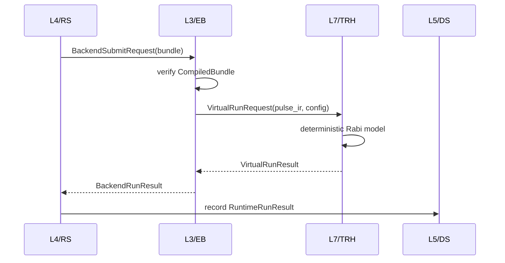
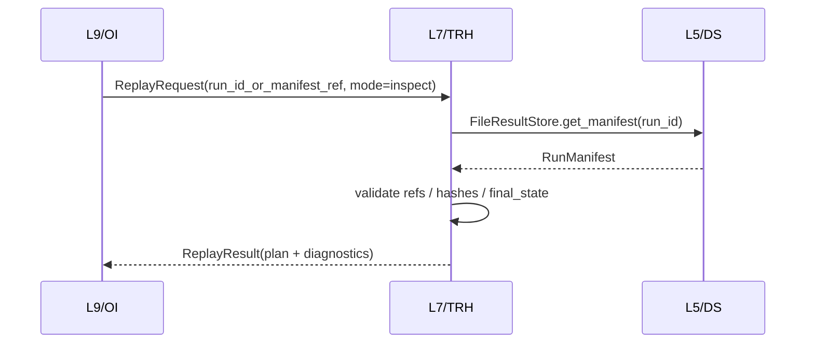

# QXtrl L7 / TRH Twin / Replay / HIL 设计

**版本**: v0.1  
**日期**: 2026-06-22  
**状态**: 当前权威开发草案，供 L7 / TRH MVP 实现和评审使用  
**层级命名**: L7 / TRH / Twin / Replay / HIL（短码 TRH，包 `qxtrl/trh`）  
**Schema 前缀**: `qxtrl.trh.*`  
**关联文档**:
- [QXtrl_架构层号与文档索引.md](QXtrl_架构层号与文档索引.md)
- [QXtrl_MVP最薄垂直切片定义.md](QXtrl_MVP最薄垂直切片定义.md)
- [QXtrl_L2_CPIR_Compiler_PulseIR_设计.md](QXtrl_L2_CPIR_Compiler_PulseIR_设计.md)
- [QXtrl_L3_EB_ExecutionBackend_设计.md](QXtrl_L3_EB_ExecutionBackend_设计.md)
- [QXtrl_L5_DS_DataState_设计.md](QXtrl_L5_DS_DataState_设计.md)
- [QXtrl_L9_OI_OperatorInterfaces_设计.md](QXtrl_L9_OI_OperatorInterfaces_设计.md)

## 0. 文档目的与范围

L7 / TRH 负责 QXtrl 的虚拟量子处理器、回放和硬件在环能力。它的核心作用不是替代 L3 后端，而是为 L3 提供可验证、可复现、可回放的执行环境：

```text
CompiledBundle / PulseIR
  -> L3 ExecutionBackend
  -> L7 VirtualQPU / Replay / HIL engine
  -> typed virtual output / replay result
  -> L3 BackendRunResult
  -> L4/L5 manifest
```

L7 的长期目标包括三类能力：

1. **Twin**：基于显式模型参数的虚拟 QPU / VirtualInstrument，用于开发、测试、dry run 和自动校准预演。
2. **Replay**：基于 L5 `RunManifest` 和数据 refs 重建一次运行的输入、输出和分析证据链。
3. **HIL**：硬件在环，用真实仪器或仿真仪器混合运行，验证后端适配和现场流程。

**MVP 聚焦**：只做 Rabi virtual + manifest replay 的最小可测切片。Stage 2/3 高保真数字孪生、正式 ReplayBackend、HIL 真实仪器链路不进入 v0.1 完成定义。

## 1. 背景与当前状态

当前 `qxtrl/trh/` 已有最小原型：

```text
qxtrl/trh/virtual.py
  run_rabi_virtual(compiled, noise=0.015, seed=42) -> dict
```

该原型已被 L3 `VirtualExecutionBackend` 包装，用于生成 Rabi virtual IQ 数据。它证明了 TRH 能支撑 MVP 正向链路，但还不是稳定 L7 契约。

当前差距：

| 差距 | 当前状态 | 风险 |
| --- | --- | --- |
| 输出未类型化 | 返回普通 dict | L3/L5 难以稳定记录模型版本、seed、诊断 |
| `seed` 未真正控制随机源 | 当前使用 Python `hash()` 生成噪声 | Python hash 跨进程可能不同，违反 MVP 可复现要求 |
| 输入过宽 | 支持 `PulseIR` / `ExperimentSpec` / dict | L7 边界容易被绕过，L3-facing API 应优先 PulseIR |
| Replay 缺失 | 无 `ReplayRequest` / `ReplayPlan` / `ReplayResult` | L9 manifest show 之后无法证明“可回放审计” |
| 错误模型缺失 | 异常或隐式 fallback | 上层无法区分模型错误、manifest 缺失、数据缺失 |
| 模型谱系缺失 | hidden pi_amp、noise、seed 未被契约记录 | 后续结果不可解释、不可复现 |

因此 L7 v0.1 的重点是把现有函数收束为可测试契约，而不是增加复杂物理模型。

## 2. 所属架构层与边界

| 项 | 内容 |
| --- | --- |
| 层号 | L7 |
| 短码 | TRH |
| 稳定英文名 | Twin / Replay / HIL |
| 建议代码包 | `qxtrl/trh` |
| 上游 | L3 / EB 已验证的 `PulseIR` 或 `CompiledBundle` 派生输入；L5 `RunManifest` |
| 下游 | L3 `BackendRunResult`、L5 replay evidence、L9 replay/report view |
| 核心产出 | `VirtualRunResult`、`ReplayPlan`、`ReplayResult`、`TRHDiagnostic` |
| MVP 入口 | Rabi `VirtualQPU` + manifest replay planner |
| 明确后置 | 高保真数字孪生、真实仪器 HIL、正式 ReplayBackend、多实验模型库 |

### 2.1 L7 负责

| 责任 | 说明 |
| --- | --- |
| VirtualQPU | 根据 PulseIR sweep 和模型参数生成 deterministic virtual response |
| VirtualInstrument | 后续模拟 AWG/ADC/LO 等仪器行为，MVP 不做 |
| Replay planner | 从 L5 `RunManifest` 构建可回放计划，检查输入/输出 refs |
| Replay execution | MVP 支持 manifest inspect + virtual rerun；正式 ReplayBackend 后置 |
| 模型谱系 | 记录 `model_id`、`model_version`、`seed`、hidden parameters、noise profile |
| 故障注入 | MVP 可支持简单 fault injection 占位，用于 L3/L4 失败路径测试 |
| 可复现保证 | 固定 seed、固定模型版本、固定输入 hash 下输出稳定 |

### 2.2 L7 不负责

| 不负责 | 归属 |
| --- | --- |
| 执行后端统一接口 | L3 / EB |
| `BackendRunResult` 最终结构 | L3 / EB |
| run lifecycle、资源锁和事件总线 | L4 / RS |
| 长期事实源和 manifest finalize | L5 / DS |
| 实验语义和 scan schema | L1 / EL |
| PulseIR 编译和 frame consistency | L2 / CPIR |
| 拟合、Observation 和 patch proposal | L6 / CO |
| UI 命令和报告展示 | L9 / OI |
| 真实硬件安全策略决策 | L0 / CC + L3/L4 safety gate |

## 3. MVP 范围

### 3.1 必做能力

| 编号 | 能力 | 说明 |
| --- | --- | --- |
| TRH-MVP-001 | Typed Rabi virtual request/result | `VirtualRunRequest` -> `VirtualRunResult` |
| TRH-MVP-002 | 确定性噪声 | 固定 seed 下跨进程结果一致 |
| TRH-MVP-003 | PulseIR 优先输入 | L3-facing API 消费已验证 `PulseIR`，不鼓励 raw dict |
| TRH-MVP-004 | 模型谱系 | 输出记录 `model_id/version/seed/noise/hidden_params_hash` |
| TRH-MVP-005 | Manifest replay plan | 从 L5 `RunManifest` 生成 `ReplayPlan` |
| TRH-MVP-006 | Replay inspect | 可验证 manifest refs、final_state、输入/输出 refs 是否齐全 |
| TRH-MVP-007 | 失败可见 | 无效 sweep、缺失 manifest、缺失 dataset 都返回 `TRHDiagnostic` |
| TRH-MVP-008 | 与 L3 保持边界 | L3 调 TRH，TRH 不直接返回 `BackendRunResult` |

### 3.2 明确 OUT

1. Stage 2/3 高保真数字孪生。
2. 真实仪器 HIL。
3. 完整 ReplayBackend 数据集和回放执行后端。
4. 多 qubit、多门、串扰、退相干物理模型。
5. 仪器级采样波形和 ADC 原始 trace 仿真。
6. AI 生成模型参数。
7. Web replay UI。
8. 用 replay 结果自动修改 active `ConfigStore`。

## 4. 核心对象建议

### 4.1 `TRHDiagnostic`

```python
class TRHDiagnostic(BaseModel):
    schema_version: Literal["qxtrl.trh.TRHDiagnostic/v0.1"]
    severity: Literal["info", "warning", "error"]
    code: str
    message: str
    stage: str | None = None
    path: str | None = None
    hint: str | None = None
```

建议错误码：

| Code | 含义 |
| --- | --- |
| `TRH-INPUT-SCHEMA` | 输入 schema 不合法 |
| `TRH-UNSUPPORTED-ATOM` | 当前 virtual model 不支持该 atom |
| `TRH-SWEEP-SCHEMA` | sweep 缺失、为空或参数不支持 |
| `TRH-NON-DETERMINISTIC` | 固定 seed 下无法复现 |
| `TRH-MANIFEST-NOT-FOUND` | L5 找不到 manifest |
| `TRH-MANIFEST-INCOMPLETE` | manifest 缺少 replay 必需 refs |
| `TRH-DATASET-NOT-FOUND` | manifest 指向的数据集缺失 |
| `TRH-HASH-MISMATCH` | manifest/dataset hash 不匹配 |
| `TRH-HIL-UNAVAILABLE` | HIL 模式不可用 |

### 4.2 `TwinModelRef`

```python
class TwinModelRef(BaseModel):
    schema_version: Literal["qxtrl.trh.TwinModelRef/v0.1"]
    model_id: str
    model_version: str
    model_kind: Literal["rabi_virtual_mvp", "instrument_virtual", "replay", "hil"]
    content_hash: str | None = None
    source: Literal["built_in", "config_snapshot", "fit_result", "external"] = "built_in"
```

MVP 默认：

```yaml
model_id: trh.model.rabi_mvp
model_version: v0.1
model_kind: rabi_virtual_mvp
source: built_in
```

### 4.3 `VirtualQPUConfig`

```python
class VirtualQPUConfig(BaseModel):
    schema_version: Literal["qxtrl.trh.VirtualQPUConfig/v0.1"]
    model_ref: TwinModelRef
    seed: int = 42
    noise_sigma: float = 0.015
    hidden_parameters: dict[str, float] = Field(default_factory=dict)
    fault_injection: dict[str, object] = Field(default_factory=dict)
```

MVP hidden parameters 可以包含：

```yaml
hidden_parameters:
  pi_amp: 0.175
```

规则：

1. `seed` 必须显式记录。
2. `noise_sigma` 必须是有限非负数。
3. 不得使用 Python `hash()` 作为随机源。
4. 不得使用全局 random 状态。
5. `hidden_parameters` 可以进入测试和 manifest 证据，但商业版本需考虑对操作员隐藏或脱敏。

### 4.4 `VirtualRunRequest`

```python
class VirtualRunRequest(BaseModel):
    schema_version: Literal["qxtrl.trh.VirtualRunRequest/v0.1"]
    request_id: str
    run_id: str
    pulse_ir: PulseIR
    config: VirtualQPUConfig
    result_level: Literal["integrated_iq"] = "integrated_iq"
```

规则：

1. L3-facing API 只接受 `PulseIR` 或 L3 已验证后传入的 `pulse_ir`。
2. 兼容旧 `ExperimentSpec` / dict 的 helper 可以保留，但应标注 legacy，不作为新 public contract。
3. `PulseIR.sweep.axes` 必须存在且 MVP 只支持 `parameter_ref == "pulse.drive.amplitude"`。

### 4.5 `VirtualRunResult`

```python
class VirtualRunResult(BaseModel):
    schema_version: Literal["qxtrl.trh.VirtualRunResult/v0.1"]
    run_id: str
    final_state: Literal["succeeded", "failed", "rejected"]
    model_ref: TwinModelRef
    seed: int
    result_level: str
    data: dict[str, object] = Field(default_factory=dict)
    diagnostics: tuple[TRHDiagnostic, ...] = ()
    metrics: dict[str, float] = Field(default_factory=dict)
```

MVP data 结构：

```json
{
  "iq": [
    {"amp": 0.0, "i": 1.0, "q": 0.0},
    {"amp": 0.05, "i": 0.61, "q": 0.001}
  ],
  "scan_points": 5
}
```

### 4.6 `ReplayRequest`

```python
class ReplayRequest(BaseModel):
    schema_version: Literal["qxtrl.trh.ReplayRequest/v0.1"]
    replay_id: str
    run_id_or_manifest_ref: str
    result_dir: str = "runs"
    mode: Literal["inspect", "replay_virtual", "replay_recorded", "compare"] = "inspect"
    require_hash_check: bool = True
```

MVP 推荐先实现：

1. `inspect`：读取 manifest，检查 refs 和状态。
2. `replay_virtual`：如果 manifest 中有足够 spec/bundle 证据，重新运行 virtual model。

`replay_recorded` 和 `compare` 可先定义 schema，后续实现。

### 4.7 `ReplayPlan`

```python
class ReplayPlan(BaseModel):
    schema_version: Literal["qxtrl.trh.ReplayPlan/v0.1"]
    replay_id: str
    source_run_id: str
    source_manifest_ref: str
    mode: str
    required_input_refs: dict[str, str] = Field(default_factory=dict)
    required_output_refs: dict[str, list[str]] = Field(default_factory=dict)
    expected_hashes: dict[str, str] = Field(default_factory=dict)
    diagnostics: tuple[TRHDiagnostic, ...] = ()
```

### 4.8 `ReplayResult`

```python
class ReplayResult(BaseModel):
    schema_version: Literal["qxtrl.trh.ReplayResult/v0.1"]
    replay_id: str
    source_run_id: str
    final_state: Literal["succeeded", "failed", "rejected"]
    mode: str
    plan: ReplayPlan
    output_summary: dict[str, object] = Field(default_factory=dict)
    diagnostics: tuple[TRHDiagnostic, ...] = ()
```

## 5. 生命周期与调用链

### 5.1 Virtual run



要求：

1. TRH 不返回 `BackendRunResult`，由 L3 负责映射。
2. TRH 不写 ResultStore，持久化由 L4/L5 完成。
3. TRH 输出必须包含模型谱系，供 L3/L5 记录。

### 5.2 Replay inspect



要求：

1. `run_id_or_manifest_ref` 只能是 run_id 或 `qxtrl://runs/<run_id>/manifest.json`。
2. 不允许任意本机绝对路径。
3. manifest 缺失、dataset 缺失、hash 不匹配必须变成 `ReplayResult(final_state="rejected"|"failed")`。

## 6. 确定性与随机源规则

MVP 必须满足固定输入可复现：

```text
same PulseIR hash
+ same TwinModelRef
+ same VirtualQPUConfig(seed, noise_sigma, hidden_parameters)
= same VirtualRunResult.data
```

实现要求：

1. 使用局部 RNG，例如 `random.Random(seed)` 或后续 `numpy.random.default_rng(seed)`。
2. 禁止使用 Python 内置 `hash()` 生成噪声或数据，因为其跨进程默认带随机 salt。
3. 禁止使用全局 `random` 状态。
4. 所有 fault injection 必须由 seed 和显式配置控制。
5. 测试必须包含同进程和子进程复现。

当前 `qxtrl/trh/virtual.py` 使用 `hash(str(...))`，需要在 L7 v0.1 实现中替换。

## 7. 与其他层的接口约束

### 7.1 与 L3 / EB

1. L3 负责后端 admission、bundle verify、capability gate 和 `BackendRunResult`。
2. L7 只提供 virtual/replay engine。
3. L3 调用 TRH 时应传入已验证 `PulseIR` 和显式 `VirtualQPUConfig`。
4. L7 异常不得直接冒泡到 L4；L3 应把它映射成 EB diagnostic。

### 7.2 与 L5 / DS

1. Replay 只通过 L5 ResultStore API 读取 manifest 和 datasets。
2. L7 不 finalize manifest。
3. L7 不把绝对路径写入 replay plan/result。
4. hash 检查失败必须结构化返回。

### 7.3 与 L9 / OI

1. L9 的 `manifest show` 可以先只读 L5。
2. 当 L7 `ReplayRequest` 稳定后，L9 增加 `replay inspect` / `replay run` 命令。
3. L9 不直接读取 replay dataset，本层通过 TRH service 提供 view model。

### 7.4 与 L6 / CO

1. L7 生成 virtual data，不生成 Observation。
2. L6 负责分析 virtual data 并生成 candidate。
3. Replay 对比可以为 L6 分析复现提供输入，但不决定参数是否晋升。

### 7.5 与 L0 / CC

1. HIL 未来必须经过 L0 safety policy。
2. Virtual/replay 不能被当作真实硬件发布验收。
3. Twin model 的来源和质量等级应在后续纳入 L0/DS 数据治理。

## 8. 安全与数据治理

1. Replay 不读取任意本机路径，只接受 L5 logical ref。
2. Virtual model 不得写 active `ConfigStore`。
3. HIL 模式必须默认关闭，且需要独立 safety gate。
4. Twin model 参数如果来自真实芯片标定，必须记录 source、quality、approval 状态。
5. Replay result 是衍生证据，不替代原始 RunManifest。
6. 对外演示报告必须标明结果来自 virtual/replay，不得混淆为真实硬件结果。

## 9. 包结构建议

```text
qxtrl/trh/
  __init__.py
  models.py          # TRHDiagnostic, TwinModelRef, VirtualRunRequest, ReplayRequest...
  virtual.py         # RabiVirtualQPU / run_rabi_virtual wrapper
  replay.py          # build_replay_plan(), replay_manifest()
  deterministic.py   # RNG/noise helpers
  tests/
    test_trh_virtual.py
    test_trh_replay.py
    test_trh_determinism.py
```

公开导出建议：

```python
from .models import (
    TRHDiagnostic,
    TwinModelRef,
    VirtualQPUConfig,
    VirtualRunRequest,
    VirtualRunResult,
    ReplayRequest,
    ReplayPlan,
    ReplayResult,
)
from .virtual import run_rabi_virtual, RabiVirtualQPU
from .replay import build_replay_plan, replay_manifest
```

## 10. 测试计划

### 10.1 Virtual tests

| 测试 | 目标 |
| --- | --- |
| `test_virtual_rabi_from_pulseir_succeeds` | PulseIR 输入生成 typed `VirtualRunResult` |
| `test_virtual_rabi_fixed_seed_reproducible` | 同一 seed 同一输入结果完全一致 |
| `test_virtual_rabi_fixed_seed_reproducible_across_process` | 子进程复现一致，防止 Python `hash()` 漂移 |
| `test_virtual_rabi_different_seed_changes_noise` | 不同 seed 可改变噪声 |
| `test_virtual_rabi_rejects_empty_sweep` | 空 sweep 返回 `TRH-SWEEP-SCHEMA` |
| `test_virtual_rabi_rejects_unsupported_parameter_ref` | 非 amplitude sweep 被拒绝 |
| `test_virtual_result_records_model_lineage` | 结果包含 model_id/version/seed/noise |

### 10.2 Replay tests

| 测试 | 目标 |
| --- | --- |
| `test_build_replay_plan_from_manifest_ref` | 从 `qxtrl://runs/.../manifest.json` 构建 ReplayPlan |
| `test_replay_rejects_absolute_path` | 拒绝任意本机路径 |
| `test_replay_missing_manifest_returns_diagnostic` | 缺失 manifest 返回 `TRH-MANIFEST-NOT-FOUND` |
| `test_replay_incomplete_manifest_returns_diagnostic` | 缺少 refs 返回 `TRH-MANIFEST-INCOMPLETE` |
| `test_replay_hash_mismatch_returns_diagnostic` | hash 不匹配返回 `TRH-HASH-MISMATCH` |
| `test_replay_result_has_no_absolute_paths` | ReplayResult 不暴露绝对路径 |

### 10.3 Integration tests

| 测试 | 目标 |
| --- | --- |
| `test_l3_virtual_backend_uses_trh_typed_result` | L3 virtual backend 消费 TRH typed result |
| `test_l9_replay_inspect_after_run` | OI run 后可执行 replay inspect |
| `test_virtual_failure_maps_to_eb_diagnostic` | TRH failure 被 L3 映射为 EB diagnostic |

## 11. MVP 验收标准

| 编号 | 验收项 | 通过标准 |
| --- | --- | --- |
| TRH-AC-001 | 确定性 virtual | 固定 seed、固定 PulseIR 跨进程输出一致 |
| TRH-AC-002 | Typed result | Rabi virtual 返回 `VirtualRunResult`，不只是 dict |
| TRH-AC-003 | L3 边界清晰 | L3 负责 `BackendRunResult`，TRH 不越权 |
| TRH-AC-004 | Manifest replay inspect | 可从 L5 manifest ref 构建 `ReplayPlan` |
| TRH-AC-005 | Replay 安全输入 | 拒绝绝对路径和非法 logical ref |
| TRH-AC-006 | 失败可见 | 无效输入、缺失 manifest、hash mismatch 均有 TRH diagnostic |
| TRH-AC-007 | 不污染配置 | TRH 不写 active `ConfigStore` |
| TRH-AC-008 | 测试覆盖 | virtual、replay、integration tests 通过 |

## 12. 开发计划

### P0: 收紧 VirtualQPU 契约

1. 新建 `qxtrl/trh/models.py`。
2. 定义 `TRHDiagnostic`、`TwinModelRef`、`VirtualQPUConfig`、`VirtualRunRequest`、`VirtualRunResult`。
3. 将 `run_rabi_virtual()` 改为使用局部 seed RNG，不再使用 Python `hash()`。
4. 保留旧函数名作为 wrapper，但内部走 typed request/result。
5. L3 `VirtualExecutionBackend` 适配 typed `VirtualRunResult`。
6. 补 deterministic 和负向测试。

### P1: Manifest replay inspect

1. 新建 `qxtrl/trh/replay.py`。
2. 定义 `ReplayRequest`、`ReplayPlan`、`ReplayResult`。
3. 实现 `build_replay_plan()` 和 `replay_manifest(mode="inspect")`。
4. 只通过 L5 `FileResultStore.get_manifest()` 读取 manifest。
5. 补 manifest 缺失、路径拒绝、hash mismatch 测试。
6. L9 增加 `replay inspect` 命令前，先通过 SDK/helper 验收。

### P2: Replay virtual rerun

1. 从 manifest 重新定位 L1/L2 输入证据。
2. 在证据足够时重新构建 PulseIR 或读取 bundle ref。
3. 使用原始 `VirtualQPUConfig` 重新运行。
4. 输出 replay diff summary。

### P3: HIL 和高保真 twin

1. HIL session model。
2. VirtualInstrument。
3. 噪声谱、漂移、串扰模型。
4. 与真实硬件后端的 shadow run 对比。
5. 安全策略和权限系统。

## 13. 需讨论或拍板事项

| 决策编号 | 问题 | 推荐结论 | 影响 |
| --- | --- | --- | --- |
| TRH-D-001 | MVP RNG 选择 | 用 `random.Random(seed)`，暂不引入 numpy 依赖 | 简化环境，满足确定性 |
| TRH-D-002 | L7 public input | L3-facing public API 只接受 `PulseIR`；旧 dict/ExperimentSpec helper 标注 legacy | 收紧边界 |
| TRH-D-003 | 首个 replay 模式 | 先做 `inspect`，再做 `replay_virtual` | 降低返工 |
| TRH-D-004 | 模型参数记录 | `VirtualQPUConfig` 必须记录 seed/noise/model_version；hidden params 可 hash 或明文按环境决定 | 支撑复现 |
| TRH-D-005 | ReplayBackend 归属 | 正式 backend 仍归 L3/EB；L7 提供 replay engine | 保持层级清晰 |
| TRH-D-006 | HIL 启动时间 | 真实硬件后端和 safety gate 稳定后再启动 | 避免早期复杂化 |
| TRH-D-007 | `RunManifest` 是否需增加 twin refs | 推荐 L5 v0.3 增加 optional `simulation` / `twin_model` refs | 提高审计质量 |

## 14. 当前实现差距清单

| 差距编号 | 当前实现 | 需要调整 |
| --- | --- | --- |
| TRH-GAP-001 | `run_rabi_virtual()` 返回 dict | 增加 typed result，再由 L3 映射 |
| TRH-GAP-002 | `seed` 参数未控制随机源 | 使用局部 seeded RNG |
| TRH-GAP-003 | 使用 Python `hash()` 生成噪声 | 替换为 deterministic RNG |
| TRH-GAP-004 | 输入接受 `PulseIR` / `ExperimentSpec` / dict | L3-facing API 收紧到 PulseIR |
| TRH-GAP-005 | 无 replay 模型 | 增加 ReplayRequest/Plan/Result |
| TRH-GAP-006 | 测试只覆盖正向 | 补跨进程复现、负向和 replay tests |

## 15. 后续升版条件

L7 v0.2 启动条件：

1. TRH v0.1 P0/P1 tests 通过。
2. L3 virtual backend 已适配 typed `VirtualRunResult`。
3. L5 manifest 能稳定提供 replay 所需 refs。
4. L9 已修复 `result_dir` 和 manifest parser 问题。
5. 至少一次 Rabi run 可完成 `run -> manifest -> replay inspect`。

L7 v0.3 再讨论 ReplayBackend、HIL 和高保真数字孪生模型。
