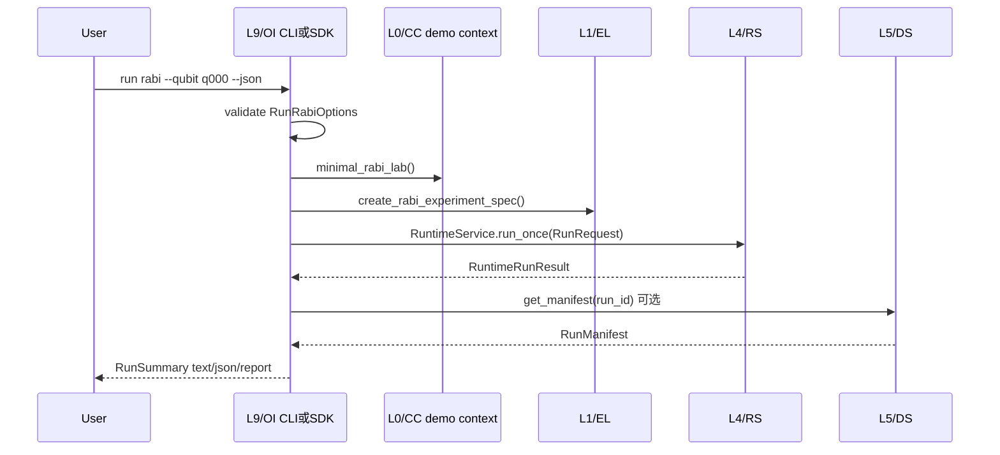

# QXtrl L9 / OI 操作员接口设计

**版本**: v0.1  
**日期**: 2026-06-22  
**状态**: 当前权威开发草案，供 L9 / OI MVP 薄 SDK + CLI 实现和评审使用  
**层级命名**: L9 / OI / Operator Interfaces（短码 OI，包 `qxtrl/oi`）  
**Schema 前缀**: `qxtrl.oi.*`  
**关联文档**:
- [QXtrl_架构层号与文档索引.md](QXtrl_架构层号与文档索引.md)
- [QXtrl_MVP最薄垂直切片定义.md](QXtrl_MVP最薄垂直切片定义.md)
- [QXtrl_L1_Experiment_Language_设计.md](QXtrl_L1_Experiment_Language_设计.md)
- [QXtrl_L2_CPIR_Compiler_PulseIR_设计.md](QXtrl_L2_CPIR_Compiler_PulseIR_设计.md)
- [QXtrl_L3_EB_ExecutionBackend_设计.md](QXtrl_L3_EB_ExecutionBackend_设计.md)
- [QXtrl_L4_RS_RuntimeScheduler_设计.md](QXtrl_L4_RS_RuntimeScheduler_设计.md)
- [QXtrl_L5_DS_DataState_设计.md](QXtrl_L5_DS_DataState_设计.md)

## 0. 文档目的与范围

L9 / OI 是 QXtrl 面向操作员、实验开发者和交付工程师的入口层。它负责把已经存在的 L0-L8 能力组织成**可理解、可复现、可演示、可交付**的用户接口，包括 CLI、Python SDK、Web Console、诊断包和交付工具。

当前阶段 L9 的首要目标不是构建完整 Web 平台，而是把 MVP Rabi 闭环收口成稳定的一键入口：

```text
CLI / Python SDK
  -> L1 ExperimentSpec
  -> L4 RuntimeService.run_once()
  -> L2 Compile
  -> L3 VirtualExecutionBackend
  -> L6 Rabi analysis
  -> L5 RunManifest / ResultStore
  -> text / json / report summary
```

L9 的核心职责：

1. 提供 Python SDK 和 CLI，让用户不用直接拼 L1-L5 内部对象也能运行 MVP demo。
2. 将用户输入转换为受控的 `RunRequest`，并在提交 L4 前做 L9 级参数校验。
3. 将 L4/L5 返回的结构化结果转换成文本、JSON、报告或后续 UI 所需的展示模型。
4. 支持 `RunManifest` 查询、运行摘要、诊断可见和演示报告导出。
5. 为后续 Web Console、参数 review、波形 review、数据可视化预留 API 边界。

L9 **不负责**：实验语义定义、编译、资源调度、设备执行、数据事实源、拟合事实源、参数晋升、AI 决策、硬件直连命令。

## 1. 设计原则

| 原则 | 要求 |
| --- | --- |
| 薄入口 | L9 只编排公开 API，不复制 L1-L6 内部逻辑 |
| 契约优先 | 所有用户输入都落到 `qxtrl.oi.*` / L1-L5 typed model 后再执行 |
| 可演示优先 | MVP 必须能一条命令跑通 Rabi virtual 并生成 manifest |
| 可机器消费 | CLI 默认可读文本，必须提供 `--json` 稳定输出 |
| 失败可见 | 运行失败必须保留 L4/L5 diagnostic code，不只输出自然语言 |
| 不污染状态 | OI 不直接写 active `ConfigStore`，校准结果只展示 candidate |
| 不绕过后端 | OI 不直接调用硬件驱动，不直接提交 `CompiledBundle` 给设备 |
| 可替换前端 | CLI/SDK/Web 共用同一组 OI service 与 view model |

## 2. 所属架构层与边界

| 项 | 内容 |
| --- | --- |
| 层号 | L9 |
| 短码 | OI |
| 稳定英文名 | Operator Interfaces |
| 建议代码包 | `qxtrl/oi` |
| 上游用户 | 操作员、实验开发者、交付工程师、自动化脚本 |
| 下游依赖 | L1 / EL、L4 / RS、L5 / DS；间接依赖 L0 / CC、L2 / CPIR、L3 / EB、L6 / CO |
| 核心产出 | `RunSummary`、`RunReport`、CLI JSON/text、manifest view、诊断摘要 |
| MVP 入口 | Python SDK + CLI |
| 明确后置 | Web Console、参数审核工作流、波形图形 review、多用户权限、AI assistant UI |

### 2.1 L9 负责

| 责任 | 说明 |
| --- | --- |
| CLI | `qxtrl run rabi`、`qxtrl run show`、`qxtrl manifest show` 等命令 |
| Python SDK | 面向 notebook / 脚本的薄封装，如 `run_rabi_virtual()` |
| 输入人体工程学 | 将 `--qubit q000 --points 21` 等参数转成 L1/L4 typed object |
| 输出格式 | text、JSON、最小 Markdown/HTML 报告 |
| 结果导航 | 基于 `manifest_ref` / `run_id` 查询 L5 `ResultStore` |
| 诊断呈现 | 汇总 L4/L5 diagnostics，同时保留 code、stage、source_layer |
| 演示脚手架 | 提供 MVP demo 默认 lab/context、结果目录和报告命令 |
| 后续 UI API | 为 Web Console 复用的 service/view model 打底 |

### 2.2 L9 不负责

| 不负责 | 归属 |
| --- | --- |
| 定义 `ExperimentSpec` schema | L1 / EL |
| 编译 PulseIR / bundle | L2 / CPIR |
| 后端 capability gate | L3 / EB |
| run lifecycle、资源锁、取消 | L4 / RS |
| `RunManifest` 持久化和数据事实源 | L5 / DS |
| 拟合与 candidate proposal 生成 | L6 / CO |
| 数字孪生模型和 replay engine | L7 / TRH |
| AI 行动建议和策略门 | L8 / ADG |
| active 参数晋升审批 | L6 + L5 + 组织审批流程 |

## 3. MVP 范围

### 3.1 必做能力

| 编号 | 能力 | 说明 |
| --- | --- | --- |
| OI-MVP-001 | Python SDK 一键 Rabi virtual | `run_rabi_virtual(qubit_id="q000")` 返回 `RunSummary` |
| OI-MVP-002 | CLI 一键 Rabi virtual | `qxtrl run rabi --qubit q000 --mode virtual` |
| OI-MVP-003 | JSON 输出 | `--json` 输出稳定字段，供脚本/CI/演示工具消费 |
| OI-MVP-004 | manifest 查询 | `qxtrl manifest show <run_id>` 或 `<manifest_ref>` |
| OI-MVP-005 | 失败诊断输出 | schema/runtime/backend/persist 失败均显示 code 和 hint |
| OI-MVP-006 | 最小报告导出 | 可从 `RunSummary` / `RunManifest` 导出 Markdown 报告 |
| OI-MVP-007 | 契约测试 | CLI/SDK 正向、负向、JSON 字段、状态不污染测试 |

### 3.2 明确 OUT

1. Web Console / Dashboard。
2. 多用户权限、登录和审计门户。
3. 参数晋升审批 UI。
4. 波形图形化 review。
5. 实时曲线图和 DataSink streaming UI。
6. AI 对话式助手和行动建议。
7. 真实硬件模式的一键运行。
8. 完整 `ReplayBackend` 命令。
9. Notebook widget。
10. 多实验 Task/Session 编排器 UI。

这些能力属于 L9 的长期产品方向，但不能阻塞 MVP demo 收口。

## 4. 用户入口设计

### 4.1 Python SDK

建议 MVP 暴露以下稳定入口：

```python
from qxtrl.oi import run_rabi_virtual

summary = run_rabi_virtual(
    qubit_id="q000",
    points=21,
    shots=1024,
    result_dir="runs",
    output_format="object",
)

print(summary.run_id)
print(summary.final_state)
print(summary.manifest_ref)
print(summary.analysis_summary)
```

等价的底层对象入口：

```python
from qxtrl.oi import RunRabiOptions, OperatorSession

session = OperatorSession(result_dir="runs")
options = RunRabiOptions(qubit_id="q000", points=21, shots=1024, mode="virtual")
summary = session.run_rabi(options)
```

### 4.2 CLI

MVP CLI 建议命令：

```bash
qxtrl run rabi --qubit q000 --mode virtual
qxtrl run rabi --qubit q000 --points 21 --shots 1024 --json
qxtrl manifest show run.req_xxx.abcd1234
qxtrl manifest show qxtrl://runs/run.req_xxx.abcd1234/manifest.json --json
qxtrl report export run.req_xxx.abcd1234 --format md --output reports/rabi.md
```

实现上可以先支持：

```bash
python -m qxtrl.oi.cli run rabi --qubit q000 --json
```

等 `pyproject.toml` 或包装脚本确定后，再注册 `qxtrl` console script。

### 4.3 CLI 框架建议

MVP 建议优先使用 Python 标准库 `argparse`：

1. 避免新增 `click` / `typer` 依赖，降低环境不确定性。
2. 当前命令数量少，`argparse` 足够覆盖。
3. 后续如果 Web/CLI 人体工程学要求提高，再迁移到 Typer；迁移不应影响 SDK service。

CLI 不应承载业务逻辑。命令处理函数只做：

```text
parse args -> OI options model -> OI service -> formatter -> exit code
```

## 5. 核心对象建议

### 5.1 `RunRabiOptions`

```python
class RunRabiOptions(BaseModel):
    schema_version: Literal["qxtrl.oi.RunRabiOptions/v0.1"] = "qxtrl.oi.RunRabiOptions/v0.1"
    qubit_id: str
    points: int = 21
    shots: int = 1024
    mode: Literal["virtual", "dry_run"] = "virtual"
    backend_id: str = "backend.virtual.rabi_mvp"
    result_dir: str = "runs"
    request_id: str | None = None
    submitted_by: str | None = None
    output_format: Literal["object", "text", "json"] = "object"
    tags: dict[str, str] = Field(default_factory=dict)
```

校验规则：

1. `qubit_id` 必须通过 L0 / CC element id 语义校验，MVP demo 默认只允许 `q000`。
2. `points >= 2`，拒绝 bool、NaN、Inf 和非整数。
3. `shots >= 1`，拒绝 bool 和非整数。
4. `mode` MVP 只允许 `virtual` / `dry_run`；`hardware` 必须在 OI 层早拒绝。
5. `tags` 必须是严格 JSON-like，不接受对象、callable、set。
6. `result_dir` 是本地运行参数，不应写入 manifest 的持久化事实字段；manifest 只持 logical ref。

### 5.2 `RunSummary`

```python
class RunSummary(BaseModel):
    schema_version: Literal["qxtrl.oi.RunSummary/v0.1"] = "qxtrl.oi.RunSummary/v0.1"
    run_id: str
    request_id: str
    final_state: Literal["succeeded", "failed", "cancelled", "rejected"]
    backend_id: str | None = None
    bundle_id: str | None = None
    manifest_ref: str | None = None
    total_duration_ms: float | None = None
    analysis_summary: dict[str, Any] = Field(default_factory=dict)
    diagnostics: tuple[OperatorDiagnostic, ...] = ()
    event_count: int = 0
```

`RunSummary` 是 L9 的展示模型，不是事实源。事实源仍是 L5 `RunManifest`。

### 5.3 `OperatorDiagnostic`

```python
class OperatorDiagnostic(BaseModel):
    schema_version: Literal["qxtrl.oi.OperatorDiagnostic/v0.1"] = "qxtrl.oi.OperatorDiagnostic/v0.1"
    severity: Literal["info", "warning", "error"]
    code: str
    message: str
    source_layer: str | None = None
    stage: str | None = None
    path: str | None = None
    hint: str | None = None
```

L9 可以包装诊断，但必须保留下游原始 `code`。如果需要新增 L9 自己的错误，使用 `OI-*` 前缀。

### 5.4 `ManifestView`

```python
class ManifestView(BaseModel):
    schema_version: Literal["qxtrl.oi.ManifestView/v0.1"] = "qxtrl.oi.ManifestView/v0.1"
    run_id: str
    final_state: str
    manifest_ref: str
    input_refs: dict[str, Any] = Field(default_factory=dict)
    output_refs: dict[str, Any] = Field(default_factory=dict)
    timings: dict[str, float] = Field(default_factory=dict)
    diagnostics: tuple[OperatorDiagnostic, ...] = ()
```

`ManifestView` 用于 CLI/Web 统一显示。它从 L5 `RunManifest` 派生，不反向写入 L5。

## 6. 调用链与生命周期

### 6.1 Rabi 一键运行



### 6.2 L9 service 伪代码

```python
def run_rabi_virtual(options: RunRabiOptions | dict) -> RunSummary:
    options = RunRabiOptions.model_validate(options)

    lab = minimal_rabi_lab()
    spec = create_rabi_experiment_spec(
        qubit_id=options.qubit_id,
        l0_chip_model_ref=lab["chip"],
        l0_wiring_ref=lab["wiring"],
        l0_hw_ref=lab["hardware"],
        l0_safety_ref=lab["safety"],
        shots=options.shots,
        amplitudes=build_rabi_amplitudes(options.points),
    )

    request = RunRequest(
        request_id=options.request_id or f"req.{spec.spec_id}",
        submitted_by=options.submitted_by,
        experiment_spec=spec,
        backend_id=options.backend_id,
        mode=options.mode,
        tags=options.tags,
    )

    runtime = RuntimeService()
    result = runtime.run_once(request)
    return RunSummary.from_runtime_result(result)
```

说明：

1. `minimal_rabi_lab()` 只是 MVP demo 默认上下文；商业交付时应替换为 L5 `ConfigStore` 发布快照。
2. `build_rabi_amplitudes(points)` 是 L9 人体工程学 helper，用于把 CLI 的点数参数转成 L1 当前支持的 `amplitudes` 列表；它不能绕过 L1 `ScanAxisSpec` 校验。
3. OI 可调用 L0 gate 做更友好的错误提示，但不能弱化 L1/L4 自身校验。
4. `RunSummary.from_runtime_result()` 只做结构转换，不修改 `RuntimeRunResult`。

### 6.3 manifest 查询

```python
def show_manifest(run_id_or_ref: str, result_dir: str = "runs") -> ManifestView:
    run_id = parse_run_id(run_id_or_ref)
    manifest = FileResultStore(base_dir=result_dir).get_manifest(run_id)
    return ManifestView.from_manifest(manifest)
```

`parse_run_id()` MVP 只接受：

1. 直接 `run_id`。
2. `qxtrl://runs/<run_id>/manifest.json`。

不接受任意本机绝对路径，避免把 L9 变成绕过 L5 的文件浏览器。

## 7. 输出格式

### 7.1 默认文本输出

```text
QXtrl Rabi run completed
run_id: run.req.atom.rabi.q000.xxxxxxxx
state: succeeded
backend: backend.virtual.rabi_mvp
bundle: bundle.atom.rabi.q000.xxxxxxxx
manifest: qxtrl://runs/run.req.atom.rabi.q000.xxxxxxxx/manifest.json
duration_ms: 123.4
analysis:
  pi_amp: 0.502
  quality: pass
diagnostics: 0 error, 0 warning
```

### 7.2 JSON 输出

```json
{
  "schema_version": "qxtrl.oi.RunSummary/v0.1",
  "run_id": "run.req.atom.rabi.q000.xxxxxxxx",
  "request_id": "req.atom.rabi.q000",
  "final_state": "succeeded",
  "backend_id": "backend.virtual.rabi_mvp",
  "bundle_id": "bundle.atom.rabi.q000.xxxxxxxx",
  "manifest_ref": "qxtrl://runs/run.req.atom.rabi.q000.xxxxxxxx/manifest.json",
  "total_duration_ms": 123.4,
  "analysis_summary": {
    "pi_amp": 0.502,
    "quality": "pass"
  },
  "event_count": 8,
  "diagnostics": []
}
```

JSON 输出规则：

1. 字段名稳定，未知新增字段必须向后兼容。
2. 时间、hash、ref 以字符串或 number 输出，不输出 Python repr。
3. `diagnostics` 即使为空也输出空数组。
4. 失败时也输出 `run_id`、`final_state`、`diagnostics`；如 L5 成功记录失败 manifest，也输出 `manifest_ref`。

## 8. 错误模型与退出码

### 8.1 L9 错误码

| Code | 触发条件 | CLI exit |
| --- | --- | --- |
| `OI-ARGUMENT-SCHEMA` | CLI 参数或 SDK options 校验失败 | 2 |
| `OI-UNSUPPORTED-COMMAND` | 命令存在但 MVP 不支持 | 2 |
| `OI-UNSUPPORTED-MODE` | 请求 `hardware` / `replay` 等 MVP 外模式 | 2 |
| `OI-RUNTIME-REJECTED` | L4 admission / validation rejected | 3 |
| `OI-RUNTIME-FAILED` | L4 run 返回 failed | 3 |
| `OI-MANIFEST-NOT-FOUND` | L5 找不到 manifest | 4 |
| `OI-EXPORT-FAILED` | 报告导出失败 | 5 |
| `OI-INTERNAL` | 未预期内部错误 | 5 |

### 8.2 下游诊断保留

L9 输出可以增加摘要错误，但不得吞掉下游 code：

```json
{
  "code": "OI-RUNTIME-FAILED",
  "message": "run failed",
  "source_layer": "oi",
  "downstream": [
    {
      "code": "RS-COMPILE-FAILED",
      "source_layer": "rs",
      "stage": "compiling"
    }
  ]
}
```

### 8.3 CLI 退出码

| Exit | 含义 |
| --- | --- |
| 0 | 成功 |
| 2 | 用户输入、命令或模式错误 |
| 3 | run 被 L4/L3 拒绝或执行失败 |
| 4 | 查询对象不存在 |
| 5 | L9 内部错误或报告导出错误 |

## 9. 包结构建议

```text
qxtrl/oi/
  __init__.py
  models.py          # RunRabiOptions, RunSummary, OperatorDiagnostic, ManifestView
  sdk.py             # run_rabi_virtual(), OperatorSession
  cli.py             # argparse CLI
  formatters.py      # text/json formatting
  reports.py         # minimal markdown report export
  manifest.py        # parse_run_id/ref, manifest view helpers
  tests/
    __init__.py
    test_oi_sdk.py
    test_oi_cli.py
    test_oi_manifest.py
```

公开导出建议：

```python
from .models import RunRabiOptions, RunSummary, OperatorDiagnostic, ManifestView
from .sdk import OperatorSession, run_rabi_virtual
from .manifest import show_manifest
```

## 10. 与其他层的接口约束

### 10.1 与 L0 / CC

1. OI 用户输入中的 `qubit_id`、`line_id`、`backend_id` 等必须复用 L0 命名规则或下游 typed model 校验。
2. OI 可以显示 L0 gate 失败原因，但不能覆盖 `require_usable_for_control()`。
3. MVP demo 使用 `minimal_rabi_lab()`，后续版本应从 L5 `ConfigStore` 发布快照读取。

### 10.2 与 L1 / EL

1. OI 不直接构造 raw dict 作为长期接口，优先使用 L1 factory 或 typed model。
2. 高层用户参数必须转换成明确的 `ExperimentSpec`。
3. OI 不允许把 waveform ndarray、任意 Python callable 或隐藏脚本塞入 L1。

### 10.3 与 L4 / RS

1. OI 正式执行只调用 `RuntimeService.run_once()` 或后续异步 `submit()` / `watch()` API。
2. OI 不直接调用 L2 compiler、L3 backend 和 L6 analyzer 来拼主链路。
3. OI 必须将 L4 `RuntimeRunResult` 转换为 `RunSummary`，并保留 diagnostics。

### 10.4 与 L5 / DS

1. OI 只通过 `FileResultStore.get_manifest()` / 后续 ResultStore API 查询事实源。
2. OI 不读取任意本机路径作为 manifest，除非路径先映射为受控 L5 ref。
3. OI 报告导出是衍生产物，不是事实源。

### 10.5 与 L6 / CO

1. OI 可展示 `ParameterPatchProposal` / `CalibrationRecord` candidate。
2. OI MVP 不提供 active 参数写回按钮或命令。
3. 后续参数 review UI 必须走 L6 + L5 审批 API，不直接改配置文件。

### 10.6 与 L7 / TRH

1. MVP 可预留 `manifest replay` 命令入口，但不实现完整 replay engine。
2. 当 L7 最小 replay 文档和实现稳定后，再增加 `qxtrl replay run <manifest_ref>`。

### 10.7 与 L8 / ADG

1. MVP 不接入 AI。
2. 后续 AI 只能读取 OI view model / manifest / diagnostics，并提交 `ActionProposal`，不能通过 OI 直接触发硬件命令。

## 11. 测试计划

### 11.1 SDK contract tests

| 测试 | 目标 |
| --- | --- |
| `test_run_rabi_virtual_sdk_succeeds` | SDK 一键 Rabi virtual 返回 succeeded |
| `test_sdk_returns_manifest_ref` | 成功结果包含 L5 `manifest_ref` |
| `test_sdk_invalid_qubit_fails_before_runtime` | 非法 qubit 在 OI/L1 前置校验失败 |
| `test_sdk_hardware_mode_rejected_in_mvp` | `hardware` 模式被 OI 早拒绝 |
| `test_sdk_summary_preserves_runtime_diagnostics` | L4 diagnostic 不被吞掉 |
| `test_sdk_does_not_write_active_configstore` | SDK 不污染 active config |

### 11.2 CLI contract tests

| 测试 | 目标 |
| --- | --- |
| `test_cli_run_rabi_text_succeeds` | 文本输出包含 run_id、state、manifest |
| `test_cli_run_rabi_json_succeeds` | `--json` 可解析且字段稳定 |
| `test_cli_invalid_args_exit_2` | 非法参数返回 exit 2 和 `OI-ARGUMENT-SCHEMA` |
| `test_cli_hardware_mode_exit_2` | `--mode hardware` 返回 `OI-UNSUPPORTED-MODE` |
| `test_cli_runtime_failure_exit_3` | 运行失败返回 exit 3，并显示下游 code |
| `test_cli_manifest_show_reads_resultstore` | manifest 查询从 L5 读取 |
| `test_cli_manifest_missing_exit_4` | 缺失 manifest 返回 exit 4 |
| `test_cli_report_export_md` | Markdown 报告导出成功 |

### 11.3 输出与安全测试

| 测试 | 目标 |
| --- | --- |
| `test_json_output_has_no_python_repr` | JSON 不出现 Python repr |
| `test_summary_does_not_expose_absolute_manifest_path` | summary 只暴露 logical ref |
| `test_cli_no_arbitrary_manifest_path_read` | 不允许任意绝对路径 manifest 读取 |
| `test_report_marks_candidate_not_active` | 报告明确 candidate 不是 active 参数 |
| `test_oi_options_reject_non_json_tags` | tags/options 拒绝对象、set、NaN/Inf |

## 12. MVP 验收标准

| 编号 | 验收项 | 通过标准 |
| --- | --- | --- |
| OI-AC-001 | 一键 Rabi virtual | `qxtrl run rabi --qubit q000` 完成并返回 succeeded |
| OI-AC-002 | SDK 可用 | `run_rabi_virtual(qubit_id="q000")` 返回 `RunSummary` |
| OI-AC-003 | JSON 稳定 | `--json` 输出包含 `schema_version/run_id/final_state/manifest_ref/diagnostics` |
| OI-AC-004 | manifest 可查 | `manifest show` 能读取 L5 manifest 并输出 summary |
| OI-AC-005 | 失败可见 | schema/runtime/backend/persist 失败均有结构化 code |
| OI-AC-006 | 不污染配置 | 所有 OI 命令不得写 active `ConfigStore` |
| OI-AC-007 | 不绕过层级 | 主链路必须通过 L4 `RuntimeService`，不得 OI 直调 L3 执行 |
| OI-AC-008 | 测试覆盖 | SDK/CLI/manifest/negative tests 通过 |

## 13. 开发计划

### P0: MVP demo 收口

1. 新建 `qxtrl/oi/` 包。
2. 实现 `RunRabiOptions`、`RunSummary`、`OperatorDiagnostic`。
3. 实现 `run_rabi_virtual()` 和 `OperatorSession.run_rabi()`。
4. 实现 `python -m qxtrl.oi.cli run rabi --qubit q000 --json`。
5. 实现 `manifest show`。
6. 实现 text/json formatter。
7. 补 SDK/CLI contract tests。

### P1: 报告与 replay 入口

1. 增加 Markdown 报告导出。
2. 增加 `report export`。
3. 在 L7 最小 replay 稳定后，增加 `replay run <manifest_ref>`。
4. 增加 manifest / report 的简单图形资源引用，但不做实时 dashboard。

### P2: Web Console 前置准备

1. 提取 Web 可复用 view model。
2. 定义参数 review / waveform review 的只读视图。
3. 与 DataSink 对接实时曲线订阅。
4. 与 L6 审批 API 对接 candidate review。
5. 引入权限和操作审计。

## 14. 需讨论或拍板事项

| 决策编号 | 问题 | 推荐结论 | 影响 |
| --- | --- | --- | --- |
| OI-D-001 | CLI 框架 | MVP 用 `argparse`，后续再评估 Typer | 降低依赖风险 |
| OI-D-002 | console script 名称 | 先支持 `python -m qxtrl.oi.cli`，再注册 `qxtrl` | 避免与现有命令冲突 |
| OI-D-003 | MVP 默认 lab 来源 | 使用 `minimal_rabi_lab()`；商业版本改为 L5 ConfigStore snapshot | 保持 demo 可跑 |
| OI-D-004 | 默认结果目录 | `runs/`，可由 `--result-dir` 覆盖 | 与当前 L5 实现一致 |
| OI-D-005 | `hardware` 模式 | OI 层早拒绝，直到 L3/L4 硬件安全门完成 | 避免误触真实设备 |
| OI-D-006 | Web UI 启动时间 | CLI/SDK 验收后再启动 | 避免 UI 先行掩盖契约问题 |
| OI-D-007 | 报告格式 | MVP 先 Markdown，HTML/PDF 后置 | 便于版本控制和审查 |
| OI-D-008 | manifest 入参 | MVP 接受 run_id 或 `qxtrl://runs/.../manifest.json`，拒绝任意绝对路径 | 强化 L5 边界 |

## 15. 后续升版条件

L9 v0.2 建议在以下条件满足后启动：

1. L9 P0 CLI/SDK tests 通过。
2. L5 manifest 查询和 failure manifest 语义稳定。
3. L7 / TRH 最小 replay 设计和实现完成。
4. 至少一个 Rabi demo 报告可由 `manifest_ref` 复现生成。
5. 参数 candidate 展示模型与 L6 / CO 对齐。

L9 v0.3 再讨论 Web Console、实时 DataSink、参数 review、波形 review 和商业交付界面。
