# QXtrl MVP 最薄垂直切片定义

**版本**: v0.1  
**日期**: 2026-06-02  
**状态**: 草案，供第一次规划讨论会拍板  
**目的**: 将 QXtrl 长期产品路线压缩为 1-2 个月内可实现、可演示、可回放的最薄 Demo 范围，避免在首轮开发中过早背负长期架构复杂度。  

## 1. MVP Demo 目标

MVP Demo 的目标不是展示完整商业系统，而是证明 QXtrl 新架构可以独立跑通一个受控实验闭环：

```text
ExperimentSpec
  -> typed PulseIR v1
  -> VirtualQPU / VirtualInstrument
  -> Observation
  -> ParameterPatchProposal
  -> CalibrationRecord
  -> RunManifest replay
```

Demo 必须证明四件事：

1. **实验意图可结构化**：Rabi 必须用 `ExperimentSpec` 描述，而不是脚本里隐式拼参数。
2. **编译边界存在**：最终波形和执行包在编译边界生成，输入快照和诊断可追溯。
3. **执行后端可替换**：同一实验主流程可以跑在 `VirtualQPU` / `VirtualInstrument` 上。
4. **结果可回放审计**：每次运行生成 `RunManifest`，可重放输入、输出、分析版本和关键耗时。

## 2. 必做实验范围

| 实验 | Demo 状态 | 目的 | 验收方式 |
| --- | --- | --- | --- |
| Rabi | 必做 | 覆盖扫描、波形生成、虚拟响应、拟合、候选参数 | 从 `ExperimentSpec` 一键跑通并生成 pi_amp 候选 |
| S21 | 可选增强 | 覆盖频率扫描和谐振峰拟合 | 若工期允许，作为第二个 Atom 验证泛化 |
| Ramsey | 明确 OUT | 涉及 detuning、相位 convention 和漂移，留到下一阶段 | 不进入 Demo 完成定义 |
| Readout optimization | 明确 OUT | 涉及 IQ 分类和多状态校准，留到下一阶段 | 不进入 Demo 完成定义 |

## 3. MVP 系统边界

### 3.1 必做链路

```mermaid
flowchart LR
    A["ExperimentSpec: Rabi"] --> B["schema validation"]
    B --> C["bind ConfigSnapshot"]
    C --> D["compile to typed PulseIR v1"]
    D --> E["VirtualQPU / VirtualInstrument"]
    E --> F["raw result"]
    F --> G["Rabi analyzer"]
    G --> H["Observation"]
    H --> I["ParameterPatchProposal"]
    I --> J["CalibrationRecord: candidate only"]
    J --> K["RunManifest + replay"]
```



### 3.2 必做模块

| 模块 | MVP 最小要求 | 不做内容 |
| --- | --- | --- |
| L0 Core Contracts | 最小 qubit、line、channel、units、schema version、SafetyPolicy | 完整站点资产管理 |
| L1 Experiment Language | `ExperimentSpec`、`AtomSpec`、Rabi 参数、扫描轴、shots | 完整 Task/Session 编排器 |
| L2 Compiler / PulseIR | 单一 typed `PulseIR v1`，含 frame event、pulse、acquire、timing、snapshot hash | 独立 QX-WIS IR、双层 verifier |
| L3 Execution Backend | `VirtualQPU` / `VirtualInstrument` 实现 `ExecutionBackend` 子集 | 真实硬件、Edge Agent、多后端插件 |
| L4 Runtime | 单 run 生命周期、取消占位、错误可见、分段计时 | 多队列、复杂资源锁、Run Factory 完整实现 |
| L5 Data & State | 最小 `RunManifest`、`ResultStore` 文件/轻量存储、`ConfigSnapshot` | 正式数据库、权限系统、分布式存储 |
| L6 Calibration | Rabi `Observation`、`ParameterPatchProposal`、候选 `CalibrationRecord` | 黑板优化器、自动晋升、回滚策略全量实现 |
| L7 Twin | 确定性 `VirtualQPU`，可配置噪声种子 | Stage 2/3 高保真数字孪生 |
| L8 AI | 不做 | AI 网关、知识库、自动建议 |
| L9 Interface | CLI 或 Python SDK 一键运行，输出文本/简单图表 | Web UI、复杂 dashboard |

## 4. 明确 OUT 清单

以下能力保留在长期路线，但不得进入 Demo 完成定义：

1. 独立双层 IR：`QX-WIS + PulseIR`。
2. Stage 2/3 数字孪生。
3. AI Action Gateway 与诊断知识库。
4. ReplayBackend 正式数据集。
5. Edge Agent 与远端设备代理。
6. Web UI / 多用户控制台。
7. 黑板优化器完整实现。
8. 自动并行图着色。
9. 多真实后端插件。
10. ManagedCloudBackend。
11. 自动参数晋升到在线 `ConfigStore`。
12. 完整 Run Factory 产线化调度。

## 5. MVP 输入输出契约

### 5.1 输入

MVP 必须至少支持以下输入：

```yaml
experiment_spec:
  schema_version: qxtrl.experiment.v0.1
  atom_type: rabi
  target:
    qubit: q01
  scan:
    parameter: pulse.amplitude
    points: [0.0, 0.1, 0.2, 0.3]
  shots: 1024
  config_snapshot_ref: cfg_demo_001
  backend: virtual_qpu
```

### 5.2 输出

MVP 必须至少输出：

| 对象 | 最小字段 |
| --- | --- |
| `CompileDiagnostic` | schema version、snapshot hash、compile duration、warnings/errors |
| `PulseIR v1` | pulses、frame events、acquire window、timing、resource usage |
| `BackendRunResult` | run id、backend id、raw data ref、status、duration |
| `Observation` | fit result、quality metric、confidence、anomaly tag |
| `ParameterPatchProposal` | target parameter、candidate value、evidence、risk level |
| `CalibrationRecord` | candidate status、source run id、operator/reviewer 占位 |
| `RunManifest` | all input refs、output refs、timing metrics、code/schema versions |

## 6. 验收标准

| 编号 | 验收项 | 通过标准 |
| --- | --- | --- |
| AC-MVP-001 | Rabi 一键运行 | 从 CLI/SDK 提交 `ExperimentSpec` 后完成编译、虚拟执行、分析和结果持久化 |
| AC-MVP-002 | schema 拒绝非法输入 | 缺失 qubit、单位不合法、扫描点为空时必须失败可见 |
| AC-MVP-003 | PulseIR 可审查 | 可导出 JSON 或文本视图，包含 pulse、frame event、acquire 和 snapshot hash |
| AC-MVP-004 | 虚拟后端可复现 | 固定 seed 下两次运行结果一致 |
| AC-MVP-005 | 分析输出候选参数 | Rabi 分析生成 `Observation` 和 `ParameterPatchProposal` |
| AC-MVP-006 | 不污染在线配置 | Demo 只生成候选 `CalibrationRecord`，不得直接修改 active `ConfigStore` |
| AC-MVP-007 | RunManifest 可回放 | 使用 manifest 能重新定位输入、输出和分析版本 |
| AC-MVP-008 | DataSink 可断开 | 关闭实时展示消费者不影响运行完成和结果持久化 |
| AC-MVP-009 | 分段计时存在 | manifest 中记录 parse、bind、compile、render、serialize、execute、analyze、persist 耗时 |
| AC-MVP-010 | 失败可见 | 后端异常、schema 错误、分析失败必须进入 `RunEvent` / diagnostic，并使测试失败 |

## 7. Demo 开发包建议

| 工作包 | 内容 | 依赖 | 完成信号 |
| --- | --- | --- | --- |
| MVP-01 Contracts | 最小 L0/L1 schema、错误模型、单位规则 | 无 | schema tests 通过 |
| MVP-02 PulseIR v1 | typed PulseIR、frame event、acquire、导出视图 | MVP-01 | Rabi spec 可编译 |
| MVP-03 VirtualQPU | Rabi 虚拟响应、seed、故障注入占位 | MVP-01 | 固定 seed 可复现 |
| MVP-04 Runtime | run lifecycle、分段计时、错误可见 | MVP-01/02/03 | 一键运行 |
| MVP-05 Analysis | Rabi analyzer、Observation、候选参数 | MVP-03/04 | 生成 patch proposal |
| MVP-06 Manifest | ResultStore 最小实现、RunManifest、replay | MVP-04/05 | manifest 可回放 |
| MVP-07 CLI/SDK | Demo 入口、示例配置、导出报告 | 全部 | 可现场演示 |

## 8. Demo 禁止事项

1. 不得为了未来真实硬件提前写复杂设备代理。
2. 不得让 UI 或 notebook 直接写候选参数。
3. 不得将 Redis/DataSink 当作唯一事实源。
4. 不得在 `ExperimentSpec` 内塞最终 waveform ndarray。
5. 不得把 AI 网关作为 Demo 必需链路。
6. 不得承诺自动并行图着色。
7. 不得将 QX-WIS 作为独立稳定 IR 阻塞 Rabi 闭环。

## 9. 第一次讨论会需拍板

| 决策 | 推荐 |
| --- | --- |
| Demo 必做实验是否只锁定 Rabi | 是，S21 为可选增强 |
| MVP 是否采用单一 typed PulseIR v1 | 是 |
| 是否允许 Demo 直接写 active ConfigStore | 否 |
| UI 范围是否只做 CLI/SDK | 是 |
| 是否将分段计时列为 Demo 必做 | 是 |
| 是否将 Stage2/3 Twin、AI、Web UI 列为 OUT | 是 |

## 10. 后续升版条件

只有在 MVP Demo 通过验收后，才进入下一阶段讨论：

1. 第二个 Atom，如 S21 或 Ramsey。
2. 第一款真实硬件后端。
3. ReplayBackend。
4. Run Factory 的最小工作站/仓库实现。
5. AI ActionProposal 的离线影子模式。
