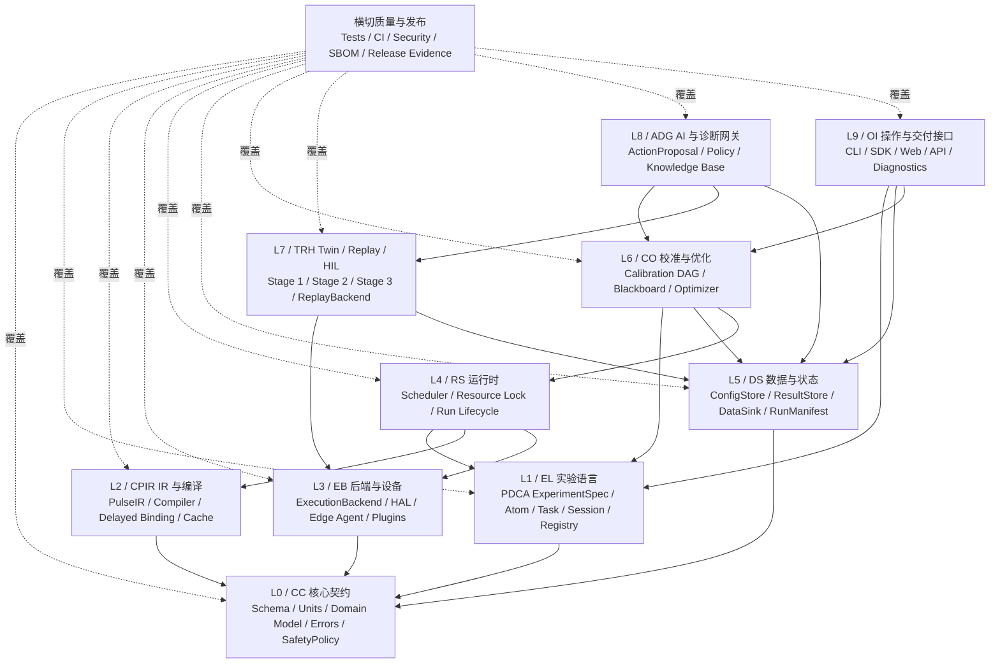

# QXtrl 模块拆解与接口责任矩阵

**版本**: v0.2（工作草案）  
**日期**: 2026-05-31  
**定位**: 按 QXtrl 需求文档 v0.4，将测控软件拆解为可并行开发、可审查、可测试、可交接的工程模块。  
**关联文档**: [QXtrl 量子测控软件产品需求文档](QXtrl量子测控软件开发需求.md)

## 0. 拆解目标

本文件把 QXtrl 从“一个大型测控软件系统”拆成边界清晰的工程模块。拆解的目的不是先设计目录树，而是让团队在开发前回答清楚：

1. 每个模块负责什么，不负责什么。
2. 模块之间通过什么 schema、API、事件或数据对象交互。
3. 哪些模块可以并行开发，哪些必须先锁定接口。
4. 哪些模块是 MVP-0 必须先做的“底盘”，哪些可以在 MVP-1/V1 推进。
5. 每个模块交接时必须交付哪些文档、测试、示例和质量证据。

v0.2 相比 v0.1 的主要变化：对齐需求文档 v0.4，新增递归 PDCA 实验语言、Atom/Task/Session 分层、延迟绑定与延迟波形生成、`ConfigStore`/`ResultStore`/`DataSink` 分离、注册表、黑板式自适应校准，以及 Stage 1/2/3 数字孪生模块责任。

**命名约定**：各层使用稳定英文名 + 短码（CC/EL/CPIR/EB/RS/DS/CO/TRH/ADG/OI）。代码子包使用小写短码（`qxtrl/cc` 等）。本文档表格已包含短码列。

## 1. 总体模块地图

核心边界：

1. `Task`/`Session` 只做决策、编排和回滚，不直接触达 QPU 或硬件后端。
2. 只有叶子 `Atom` 经运行时进入 `ExecutionBackend`。
3. `ExperimentSpec`、`DoSpec` 和 `PulseIR` 不携带最终 waveform ndarray；最终波形只在编译边界生成。
4. `ConfigStore`、`ResultStore`、`DataSink` 三者职责分离，不能互相替代。
5. AI 只提交 `ActionProposal` 或诊断建议，不获得任意命令透传能力。

## 2. 子系统责任矩阵

| 层级 | 短码 | 子系统 | 主要责任 | 明确不负责 | 对外契约 | 首要测试 |
| --- | --- | --- | --- | --- | --- | --- |
| L0 | CC | Core Contracts | 领域对象、schema、单位、时间、版本、错误模型、权限边界、安全策略 | 具体实验逻辑、硬件通信、UI 展示 | `HardwareInventory`、`WiringGraph`、`ChipModel`、`SafetyPolicy`、`DomainError` | schema 校验、迁移测试、单位换算、错误模型测试。包：`qxtrl/cc` |
| L1 | EL | Experiment Language | 递归 PDCA `ExperimentSpec`、`PlanSpec`、`DoSpec`、`CheckSpec`、`ActSpec`、`OptimizerSpec`、Atom/Task/Session 语义 | 真实设备上传、数据拟合实现、参数写回实现 | `ExperimentSpec` schema、PDCA path、`AtomSpec`、`TaskSpec`、`SessionSpec` | 实验语言契约测试、递归解析测试、非法字段拒绝。包：`qxtrl/el` |
| L1 | EL | Registry System | 实验、分析器、优化器、后端、存储适配器的注册发现 | 在执行内核写具体业务分支 | `RegistryEntry`、`能力名称`、`版本`、`兼容范围` | 注册/卸载测试、命名冲突测试、能力发现测试 |
| L2 | CPIR | Pulse IR | 硬件无关的脉冲、端口、帧、采集、扫描和时序表达 | 厂商私有上传格式、最终波形缓存策略 | `PulseIR`、`FrameState`、`FrameUpdate`、`资源占用描述` | IR 校验、frame/相位一致性、非法时序拒绝。包：`qxtrl/cpir` |
| L2 | CPIR | Compiler | 将 `ExperimentSpec`、`PulseIR`、`配置快照`和后端能力编译成执行包；负责延迟绑定和内容哈希 | 任务排队、硬件会话、安全审批 | `CompiledBundle`、`CompileDiagnostic`、`cache key`、`资源图` | 编译快照测试、缓存一致性测试、越界拒绝测试 |
| L3 | EB | ExecutionBackend / HAL | 统一真实后端、虚拟后端、回放和 Twin 的提交、状态、采集、取消语义 | 上层校准决策、AI 诊断、配置晋升 | `ExecutionBackend`、`BackendCapability`、`BackendRunResult` | 后端契约测试、故障注入、取消恢复测试。包：`qxtrl/eb` |
| L3 | EB | Edge Agent & Plugins | 靠近设备的会话、安全边界、设备锁、低权限硬件访问、固件/驱动适配 | 实验科学逻辑、全局调度、参数晋升 | 设备代理协议、插件能力清单、审计日志 | 通信安全、断连恢复、设备锁、固件版本兼容测试 |
| L4 | RS | Runtime & Scheduler | run 生命周期、队列、资源锁、取消、重试、安全停机、事件流 | 拟合算法、UI 绘图、参数是否晋升 | `RunRequest`、`RunState`、`RunEvent`、`RunControl` | 并发冲突、取消/失败恢复、状态机测试。包：`qxtrl/rs` |
| L5 | DS | ConfigStore | 芯片、站点、仪器、实验默认值和在线参数状态；版本化和快照 | 保存不可变实验结果、实时图形推送 | `ConfigSnapshot`、`配置 path`、`配置 diff`、`版本 hash` | 快照一致性、权限写入、回滚和迁移测试。包：`qxtrl/ds` |
| L5 | DS | ResultStore | 不可变实验案例库，保存 raw/processed data、Observation、RunManifest、分析结果 | 当前在线参数状态、实时 dashboard 缓存 | `RunManifest`、`Observation`、`查询 API`、`数据引用` | 可重放、谱系完整性、数据完整性测试 |
| L5 | DS | DataSink | 实时 per-step 数据流、运行状态流、dashboard/SSE/pub-sub 数据 | 主持久化事实源、拟合和参数写回 | `RunEventStream`、`实时曲线数据`、`订阅接口` | UI 断开不阻塞执行、吞吐和重连测试 |
| L6 | CO | Experiment Library | S21、Qubit Spectroscopy、Rabi、Ramsey、读出等 Atom 模板和 Check 规格 | 设备私有协议、全局校准策略 | 标准 Atom 输入、输出、质量指标 | 虚拟 QPU 确定性实验测试。包：`qxtrl/co` |
| L6 | CO | Calibration Engine | 校准 DAG、Task/Session 编排、候选/激活/拒绝/回滚、有效期和漂移维护 | 直接硬件操作、AI 越权动作 | `CalibrationNode`、`CalibrationPlan`、`CalibrationRecord` | DAG 依赖传播、晋升/回滚、失败恢复 |
| L6 | CO | Blackboard & Optimizer | Task 黑板、自适应重扫、typed patch、搜索期写回隔离、最佳候选重跑 | 绕过 schema 修改任意对象、直接写在线配置 | `CalibrationBlackboard`、`ParameterPatchProposal`、`OptimizerResult` | 搜索期隔离、patch 白名单、候选比较测试 |
| L7 | TRH | VirtualInstrument / VirtualQPU | 虚拟设备状态机、虚拟基础实验响应、噪声/漂移/故障注入 | 替代真实芯片验收、真实厂商协议适配 | `VirtualInstrumentModel`、`VirtualQPUModel`、`FaultScenario` | 确定性、故障覆盖、契约一致性。包：`qxtrl/trh` |
| L7 | TRH | ReplayBackend | 授权/去敏实机数据回放、算法回归、版本比较 | 生成新物理结论、替代 HIL | `ReplayDataset`、`数据授权记录`、`回放 run 结果` | 固定数据集回归、授权检查、版本对比 |
| L7 | TRH | Twin Model Stages | Stage 1 快速模型、Stage 2 门序列/矩阵演化、Stage 3 高保真诊断模型 | 用快模型替代高保真验收、无边界推广模型结论 | `TwinModel`、`TwinValidationReport`、`适用范围`、`速度/误差指标` | 模型有效性、实机对比、过期拒绝测试 |
| L8 | ADG | AI Action Gateway | 只读状态暴露、AI 建议接收、策略校验、审批、影子评估 | 任意命令透传、跳过 Twin/Replay 评估、直接操作设备 | `ActionProposal`、`策略验证报告`、`审批记录` | schema 拒绝、权限、越界参数测试。包：`qxtrl/adg` |
| L8 | ADG | Diagnostics Knowledge Base | 症状库、假设库、鉴别实验库、诊断标签和证据链 | 替代传统数值判定、独立决定实机动作 | `SymptomRecord`、`Hypothesis`、`DiscriminatingExperiment` | 证据链完整性、标签回放、AI 建议可解释性 |
| L9 | OI | Operator Interfaces | CLI、SDK、Web 控制台、运行浏览、实时状态、诊断导出、交付工具 | 绕过核心 API 操作硬件、在 UI 内执行拟合和写回 | REST/SDK API、WebSocket/SSE、诊断包格式 | 端到端模拟、权限、导出包测试。包：`qxtrl/oi` |
| 横切 | — | Quality & Release | CI、测试矩阵、代码审查、SBOM、签名发布、安装升级和交付证据 | 业务逻辑实现 | 质量门、发布清单、审查模板、交付验收包 | 全量流水线、发布演练、安全扫描 |

## 3. 关键接口责任边界

### 3.1 实验语言到运行时

| 接口 | 提供方 | 使用方 | 职责边界 | 禁止事项 |
| --- | --- | --- | --- | --- |
| `ExperimentSpec` | L1 Experiment Language | L4 Runtime、L6 Calibration、L9 SDK | 描述 Atom/Task/Session 的 PDCA 结构、路径、版本和安全约束 | 不携带最终 waveform ndarray，不隐式判断商业关键层级 |
| `RunRequest` | L4 Runtime | L2 Compiler、L3 Backend、L5 Data | 绑定操作者、目标后端、配置快照和运行模式 | 不允许绕过 `SafetyPolicy` |
| `RunEvent` | L4 Runtime | L5 DataSink、L9 UI、L6 Calibration | 记录排队、编译、上传、执行、采集、分析、取消和失败状态 | 不作为唯一持久化事实源 |

### 3.2 编译与后端

| 接口 | 提供方 | 使用方 | 职责边界 | 禁止事项 |
| --- | --- | --- | --- | --- |
| `PulseIR` | L2 Pulse IR | L2 Compiler、L7 Twin | 表达硬件无关脉冲、帧、采集和时序 | 不引用厂商私有通道地址作为唯一语义 |
| `CompiledBundle` | L2 Compiler | L3 Backend、L4 Runtime、L5 ResultStore | 绑定配置快照、后端能力、固件版本和编译诊断 | 不在缺少能力校验时下发 |
| `ExecutionBackend` | L3 Backend | L4 Runtime、L7 Twin/Replay | 统一提交、状态、采集、取消、健康检查语义 | 不承载校准晋升和 AI 决策 |

### 3.3 数据与状态

| 接口 | 提供方 | 使用方 | 职责边界 | 禁止事项 |
| --- | --- | --- | --- | --- |
| `ConfigStore` | L5 Data | L1/L2/L4/L6 | 当前芯片、站点、仪器和实验默认状态，支持快照和受控写回 | 不保存不可变 raw 结果，不被搜索期直接污染 |
| `ResultStore` | L5 Data | L6 Calibration、L7 Twin、L8 AI、L9 UI | 不可变运行案例库和可回放谱系 | 不作为在线配置来源 |
| `DataSink` | L5 Data | L9 Web、监控系统 | 实时数据流和运行状态流 | 不做拟合、不写参数、不作为唯一事实源 |

### 3.4 校准、优化和 AI

| 接口 | 提供方 | 使用方 | 职责边界 | 禁止事项 |
| --- | --- | --- | --- | --- |
| `Observation` | L6 Experiment Library / Check | L6 Calibration、L8 AI、L7 Twin | 结构化拟合结果、质量指标、置信度和异常标签 | 不直接修改配置 |
| `ParameterPatchProposal` | L6 Optimizer / L8 AI | L6 Calibration、Policy Gateway | 描述候选参数改动、依据、风险和预期收益 | 不允许越过白名单路径和安全边界 |
| `CalibrationRecord` | L6 Calibration Engine | L5 ConfigStore、L9 UI | 候选、激活、拒绝、回滚和失效传播 | 不覆盖历史记录 |
| `ActionProposal` | L8 AI Action Gateway | L6 Calibration、L7 Twin、审批流 | AI 建议的结构化入口 | 不直接调用设备命令 |

## 4. 模块交接卡模板

每个模块在进入多人开发前，都应填写一张“模块交接卡”：

| 项目 | 说明 |
| --- | --- |
| 模块名称 | 例如 `ExperimentSpec`、`Compiler`、`ConfigStore`、`Stage1Twin` |
| 所属层级 | L0 至 L9 或横切模块 |
| 业务目的 | 该模块解决什么问题 |
| 明确不做 | 防止模块边界膨胀 |
| 输入 | 接收哪些对象、事件或 API 请求 |
| 输出 | 产生哪些对象、事件、数据或副作用 |
| 核心接口 | public API、schema、事件类型、错误类型 |
| 依赖模块 | 编译时依赖和运行时依赖 |
| 可替换实现 | 虚拟实现、真实实现、mock 实现、插件实现 |
| 风险点 | 安全、性能、IP、数据、硬件风险 |
| 最小验收 | 第一版做到什么才算完成 |
| 必须测试 | 单元、契约、集成、回归、HIL 或性能测试 |
| 交接物 | README、接口文档、示例、测试数据、故障说明 |

## 5. 接口优先开发顺序

第一阶段不建议从 Web UI 或真实驱动开始，而应先锁定“底盘”和“实验语言”：

1. **L0 / CC Core Contracts**：统一单位、schema、领域对象、错误模型和 `SafetyPolicy`。（包 `qxtrl/cc`）
2. **L1 / EL Experiment Language**：定义 PDCA `ExperimentSpec`、Atom/Task/Session、路径、版本和注册表。对应需求工作包 `WP-01`。（包 `qxtrl/el`）
3. **L2 / CPIR Pulse IR 与 Compiler**：实现延迟绑定、延迟波形生成、编译诊断和缓存键。对应 `WP-02`。（包 `qxtrl/cpir`）
4. **L7 / TRH VirtualInstrument / VirtualQPU Stage 1**：让测试团队和算法团队不等真实设备即可开发。对应 `WP-03`。（包 `qxtrl/trh`）
5. **L6 / CO 首批 Atom 与 Check**：S21、Qubit Spectroscopy、Rabi、Ramsey、读出。对应 `WP-04`。（包 `qxtrl/co`）
6. **L5 / DS 数据三分层**：`RunManifest`、`Observation`、`ConfigStore`、`ResultStore`、`DataSink`。对应 `WP-05`。（包 `qxtrl/ds`）
7. **L4 / RS Runtime**：基于虚拟后端跑通任务生命周期、资源锁、取消和失败恢复。（包 `qxtrl/rs`）
8. **L6 / CO Task 编排、黑板与优化器**：实现搜索期写回隔离和最佳候选重跑。对应 `WP-06`。
9. **L3 / EB 首批真实后端与 HIL**：在授权硬件上跑通基础闭环。对应 `WP-09`。（包 `qxtrl/eb`）
10. **L7 / TRH Stage 2/3 Twin 与 L8 / ADG AI 诊断**：在有回放和实机对照后推进。对应 `WP-10`、`WP-11`。（包 `qxtrl/adg`）

## 6. 模块完成定义

一个模块不能只以“代码写完”作为完成标准。建议采用以下完成定义：

1. 公共接口已文档化，示例可运行。
2. 输入、输出、错误、单位、版本和权限行为都有测试。
3. 至少有一个虚拟或 mock 实现供其他团队并行开发。
4. 与相邻模块完成契约测试。
5. 关键失败模式有明确错误码、日志字段和恢复建议。
6. 不依赖未经批准的历史代码或不清楚来源的二进制。
7. 搜索期、影子模式和 AI 离线评估不会污染在线 `ConfigStore`。
8. 代码审查记录、测试结果和变更说明可归档。

## 7. 近期拆解重点

下一轮应优先展开以下 6 张“接口设计卡”，因为它们决定后续模块能否并行：

1. `ExperimentSpec` v1：PDCA 字段、Atom/Task/Session、路径、版本、最小合法示例。
2. `PulseIR` v1：端口、帧、采集、扫描、时序、资源占用和安全约束。
3. `ExecutionBackend` v1：提交、状态、采集、取消、健康检查、故障语义。
4. `ConfigStore` / `ResultStore` / `DataSink` v1：数据边界、写入权限、持久化和热数据方案。
5. `CalibrationBlackboard` / `ParameterPatchProposal` v1：搜索、重扫、候选比较和写回隔离。
6. `TwinModel` Stage 1/2/3：模型用途、速度、误差指标、禁止用途和验证报告。

这些接口确定后，再进入目录结构、开发任务和人员分工，会少很多返工。
