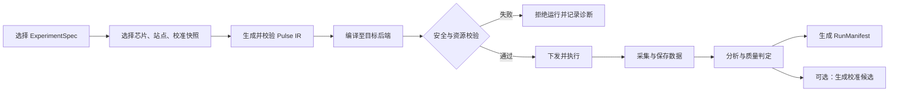
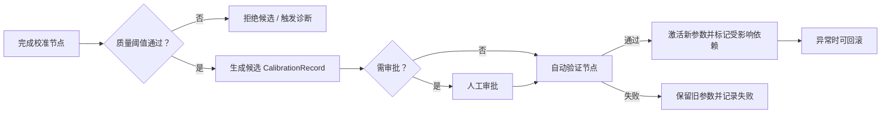
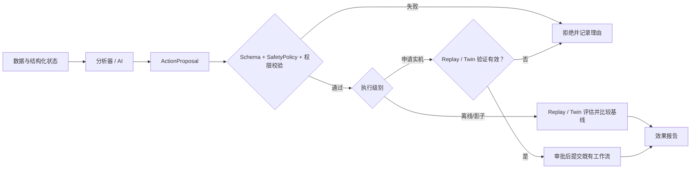
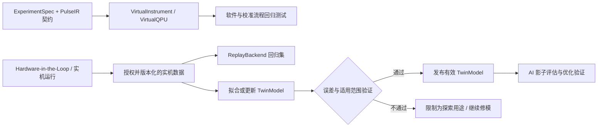
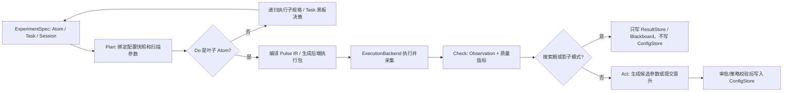

# QXtrl 量子测控软件产品需求文档

**文档版本**: v0.4（讨论稿）  
**更新日期**: 2026-05-31  
**文档状态**: 用于产品立项、架构评审和 MVP 范围确认  
**关联文档**: [QCLab 超导量子测控系统架构审查与重构建议](../../ARCHITECTURE_AUDIT_AND_REFACTOR_CN.md)；[测控软件架构讨论会纪要](测控软件架构讨论会-纪要20260531.txt)；[labctrl 架构讨论 PPT](labctrl_architecture_v9.pptx)

## 0. 文档目的

本文档将 QXtrl 从愿景目标细化为可开发、可验收、可商业交付的产品需求。本文档重点回答以下问题：

1. QXtrl 在首个产品版本中解决什么问题，不解决什么问题。
2. 如何实现公司独立可控的软件资产，并控制历史代码、第三方组件和设备协议带来的权利及安全风险。
3. 测控、表征、校准、维护、数据、数字孪生和 AI 能力应以什么顺序落地。
4. 每个阶段如何判断“已经完成”，避免以展示原型替代可运行产品。
5. 如何将实验执行内核抽象为可复用、可回放、可优化的统一实验语言。

本文档描述产品需求和约束，详细模块实现设计、协议 schema 和具体技术选型应在后续设计文档中给出。

## 1. 产品定义

### 1.1 产品愿景

QXtrl 是面向量子处理器研发、测试和运行维护的测控软件平台。首要服务对象为超导量子计算系统，长期通过设备插件、脉冲后端和实验模型扩展到其他量子技术路线。

QXtrl 应成为量子处理器表征、校准和稳定运行的核心生产工具，统一管理：

1. 测控电子学设备与外围设备。
2. 量子比特、耦合器、读取腔、控制线和共享硬件资源。
3. 实验定义、脉冲编译、硬件执行和数据采集处理。
4. 数据分析、校准参数版本、健康状态和长期维护工作流。
5. 在明确安全边界内运行的自动优化与 AI 辅助操作。
6. 用于软件回归、自动校准验证和 AI 影子运行的虚拟量子实验站与数字孪生。

### 1.2 产品定位

| 项目 | 定义 |
| --- | --- |
| 产品类别 | 实验室及产业级量子处理器测控与自动校准平台 |
| 首发对象 | 超导量子芯片测控团队、表征/校准工程师、实验站运维人员 |
| 首发部署 | 单实验站本地部署，可离线运行；为后续多实验站管理预留接口 |
| 首发核心价值 | 让单比特基础表征和校准从分散脚本变为可重放、可审计、可在虚拟站点充分测试后执行的工作流 |
| 长期价值 | 经实机数据更新的数字孪生、多比特并行校准、后台维护、受控 AI 优化以及跨硬件平台扩展 |

### 1.3 原始目标的可交付化表达

| 原始目标 | 产品化表达 | 首个可验证成果 |
| --- | --- | --- |
| 公司自有知识产权、可扩展至其他路线 | 建立独立产品主干、版本化公共接口和插件后端；历史代码仅按合规决定处理 | 新仓库中模拟后端与首批授权硬件插件可独立运行并具备权利记录 |
| 打通测控全链条 | 统一实验、脉冲、执行、数据、分析、校准记录和可视化流程 | 在一个实验站完成 S21、Qubit Spectroscopy、Rabi、Ramsey 的运行与参数晋升 |
| 并行测控并压缩实验时间 | 将硬件资源冲突、编译缓存、批量执行和并行校准纳入调度器 | 在支持的多比特任务中，相对串行基线获得可复核的时长下降 |
| Agentic 测控和自动校准 | AI 输出受 schema 和安全策略约束的建议/任务计划，校准引擎负责受控执行 | AI 在离线/影子模式先验证，随后仅对低风险已批准节点闭环 |
| 长时间后台维护 | 以健康指标、有效期和漂移规则驱动周期性重校准与异常响应 | 系统可持续监测并触发指定校准节点，完整记录运行原因与结果 |
| 接近生产环境的自动化测试 | 建设与真实执行共享契约的虚拟量子实验站，并逐步演进为数据校验的数字孪生 | 基础实验可在虚拟 QPU 上运行，故障可注入，实机数据可回放验证 |

## 2. 产品目标与非目标

### 2.1 目标

#### G1. 独立可交付的软件资产

建立名称、代码库、接口、构建发布和文档均独立的新产品体系。发货范围内的源代码、二进制、依赖和数据模板必须有明确来源及商业使用依据。

#### G2. 统一而可追溯的实验闭环

同一次实验的设备配置、芯片信息、校准参数、脉冲编译产物、软件/固件版本、原始/处理数据和分析结论必须形成关联记录，并支持重放与回溯。

#### G3. 面向实机效率的调度与执行

系统必须能够识别硬件资源、复用编译/波形产物、进行安全的并行化，并以分阶段性能基线证明改善效果。

#### G4. 自动化校准与长期维护

校准不再由散落脚本人工串联，而是以具备依赖、有效性、质量阈值、回滚能力的工作流执行。

#### G5. 受控的 AI 增强能力

AI 可帮助分析数据、提出实验计划和候选参数，但不得绕过能力边界、风险规则、审批和审计机制直接任意操作设备。

#### G6. 可验证的虚拟量子实验站与数字孪生

为软件测试、校准策略和 AI 决策提供与真实执行接口一致的验证环境。MVP 首先覆盖设备行为和基础校准实验响应；商业试点阶段逐步建立绑定具体站点、芯片、固件与校准快照的物理信息数字孪生，并以实机数据持续评价其适用范围和准确度。

### 2.2 非目标

以下事项不属于首个商业可用版本的承诺：

1. 一次性迁移或支持现有目录中的全部历史设备驱动。
2. 首发即支持离子阱、光量子、自旋等非超导路线的完整实验库；首发只保证架构可扩展。
3. 首发即实现无需监督、可修改全部参数或执行高风险设备动作的通用 AI Agent。
4. 替代固件、FPGA 实时 sequencer 或仪器厂商已有的底层实时执行能力。
5. 在权利审查未完成前，将历史代码、二进制或真实实验数据打包至对外交付版本。
6. 在 MVP 阶段精确模拟任意规模、多体开放量子系统，或将数字孪生等同于真实 QPU。
7. 以数字孪生测试替代真实仪器、硬件在环和最终芯片验收。

## 3. 硬约束与产品原则

### 3.1 知识产权与来源隔离

| 编号 | 约束 |
| --- | --- |
| IP-01 | QXtrl 产品主干应在独立仓库和独立名称空间中开发。 |
| IP-02 | 历史项目代码仅作为获准的需求提取、黑盒对照或迁移输入；是否可复用须逐项形成书面处置决定。 |
| IP-03 | 任何第三方包、厂商 SDK、驱动二进制、图片、文档和数据样例进入交付包前必须进入权利台账及 SBOM。 |
| IP-04 | 若采用洁净实现路线，查看历史实现的人员与新实现人员的职责、可访问材料和产出规格必须记录。 |
| IP-05 | 产品发布前设置法律/合规审核门；本文档本身不替代法律意见。 |

### 3.2 安全与实验保护

| 编号 | 约束 |
| --- | --- |
| SEC-01 | 生产通信入口不得反序列化来自不可信边界的任意代码对象，例如 `pickle` 载荷。 |
| SEC-02 | 控制平面不应直接访问仪器裸端口；由靠近设备的受控代理承担会话、鉴权、限流和日志。 |
| SEC-03 | 固件升级、设备重启、大幅偏置/功率改变等高风险动作应具备权限和审批机制。 |
| SEC-04 | 每个设备/通道必须有安全边界，包括幅度、频率、功率、偏置、持续时间和占空比约束。 |
| SEC-05 | AI 仅能调用已声明能力与已批准工作流，不获得任意命令透传能力。 |

### 3.3 架构原则

1. **契约先行**：以版本化 schema 定义设备、线路、实验、数据、校准和动作建议。
2. **硬件无关表达，硬件特定编译**：实验和脉冲层不绑定某一厂商设备命名。
3. **实时与近实时分离**：纳秒/微秒时序由设备或 FPGA 执行；扫描编排、分析与校准决策由软件控制平面完成。
4. **运行不可变、校准可晋升**：实验记录不得被覆盖；新校准参数先作为候选，经质量判断或批准后才激活。
5. **先模拟、再实机、后自主**：所有新实验和优化策略先在模拟/回放环境验证，再进入实机受控执行。
6. **优先支持明确硬件矩阵**：仅对获得支持和验证的硬件插件承诺产品级质量。
7. **同一执行契约、多种验证后端**：虚拟设备、虚拟 QPU、回放、物理信息数字孪生和真实硬件应尽量消费同一实验与 Pulse IR 接口。
8. **孪生有版本和适用范围**：任何数字孪生输出均绑定模型版本、拟合数据、有效范围、误差指标和失效条件，不作为未经验证的真实结论。
9. **递归 PDCA 实验语言**：基础实验、校准任务和芯片级会话均应以 `Plan`、`Do`、`Check`、`Act` 和可选优化器表达，避免每类实验各自发明流程。
10. **延迟绑定与延迟生成**：实验规格保持语义化和轻量化；qubit、扫描点、校准快照、目标后端和最终波形在运行或编译边界绑定。
11. **配置状态、实验结果和实时流分离**：芯片/站点状态、不可变实验记录和实时展示数据应分属不同职责面，避免配置表、结果和 UI 缓存混杂。
12. **策略层与机制层分离**：Task/Session 负责决策和编排，Atom 才触达 QPU 或后端；编译、执行、分析、写回和实时展示各守边界。

### 3.4 数字孪生定义与边界

QXtrl 所称的数字孪生不是一次性建立的“完美虚拟量子处理器”，而是一套随产品阶段逐步提升真实度的测试和预测后端：

| 层级 | 定义 | 主要覆盖内容 | 主要用途 | 计划阶段 |
| --- | --- | --- | --- | --- |
| `VirtualInstrument` | 遵循驱动能力契约的虚拟仪器 | AWG/ADC/触发/微波源状态机、通信时延、超时和错误 | 执行链路、资源锁、安全停机和插件契约测试 | MVP-0 |
| `VirtualQPU` | 可参数化生成量子表征数据的虚拟处理器 | S21、Qubit Spectroscopy、Rabi、Ramsey、读出 IQ 响应，噪声与漂移 | 实验、分析、校准 DAG 和维护逻辑测试 | MVP-0 至 MVP-1 |
| `ReplayBackend` | 用经授权的历史/验收数据重放实验输出 | 正常数据、边界数据和故障样例 | 算法回归、版本比较和 AI 离线评估 | MVP-1 |
| `PhysicsInformedTwin` | 用实机数据标定的物理信息数字孪生 | 脉冲响应、传输函数、弛豫/退相干、读出误差、串扰和慢漂移的选定子集 | 自适应扫描、参数优化和 AI 影子评估 | V1 起 |
| `HardwareInLoop` | 真实控制电子学或 QPU 的验证后端 | 设备协议、触发、固件、传输链路和真实物理响应 | 发布、安全、性能和科学结果验收 | MVP-1 起 |

所有后端均应尽可能使用相同的 `ExperimentSpec`、`PulseIR`、执行状态和数据/运行记录格式。数字孪生可减少实机占用、扩大异常测试覆盖面，但不能替代硬件在环或真实芯片上的发布验收。

物理信息数字孪生可按真实度和计算成本分为三类模型能力，产品中允许并存：

| 阶段 | 模型形态 | 速度目标 | 主要用途 | 不适合作为 |
| --- | --- | --- | --- | --- |
| Stage 1 | 经验公式或解析响应曲线 | 微秒至毫秒级生成基础曲线 | CI、PDCA 联调、AI 预筛、基础校准仿真 | 新物理机制或脉冲细节结论 |
| Stage 2 | 门序列或矩阵演化模型 | 毫秒至秒级 | coherent error、脉冲形状、门序列级误差评估 | 完整耗散和强驱动精确诊断 |
| Stage 3 | 主方程、Kraus 或更高保真物理模型 | 秒至分钟级 | 标定 Stage 2 系数、新机制诊断、复杂异常证伪 | 在线快速调度或高频闭环 |

### 3.5 统一实验语言与执行分层

QXtrl 应将实验、校准和维护流程抽象为递归的 PDCA 规格。该规格是需求层约束，不要求照搬任何既有实现：

| 组成 | 职责 | 典型内容 |
| --- | --- | --- |
| `PlanSpec` | 定义如何准备一次运行 | 扫描轴、固定参数、shots、资源需求、绑定规则、模式 |
| `DoSpec` | 定义执行体 | Gate/Pulse 序列、Pulse IR 模板、或子 `ExperimentSpec` 字典 |
| `CheckSpec` | 定义如何解释结果 | 分析模型、拟合器、质量指标、阈值、异常标签 |
| `ActSpec` | 定义允许的状态变更 | 候选参数、写回映射、审批策略、回滚规则 |
| `OptimizerSpec` | 定义可选的搜索策略 | 参数搜索空间、目标函数、停止条件、候选比较方式 |

执行层级分为三类，同一规格形态在不同尺度递归使用：

| 层级 | 定义 | 边界 |
| --- | --- | --- |
| `Atom` | 一次直接触达 QPU/后端的物理实验或扫描 | 唯一允许进入执行后端的叶子节点 |
| `Task` | 多个 Atom 组合成一个校准或诊断目标 | 负责自适应决策、优化器、黑板状态和局部回滚 |
| `Session` | 多个 Task 组成芯片级或实验站级流程 | 负责 checkpoint、全局回滚、诊断报告和维护计划 |

产品 schema 应显式包含 `kind`、`schema_version`、稳定 id 和父子路径。可以借鉴“单一实验语言”的思想，但商业交付版本不应依赖隐式字典形态判断层级。

## 4. 用户角色与核心场景

### 4.1 用户角色

| 角色 | 主要任务 | 核心需求 |
| --- | --- | --- |
| 表征/校准工程师 | 运行实验、分析参数、维护芯片状态 | 快速建立实验、实时查看数据、可靠晋升/回滚参数 |
| 测控/设备工程师 | 接入硬件、定位通信和时序故障 | 清晰的设备能力、健康状态、日志、模拟与硬件在环工具 |
| 算法/研究人员 | 设计脉冲、门和优化算法 | 硬件无关 IR、数据访问、可复现实验、开放 SDK |
| 实验站管理员 | 配置站点、分配权限、处理异常 | 资源管理、权限、安全规则、升级和审计 |
| 产品交付/支持人员 | 安装、验收、升级和远程支持 | 部署包、兼容矩阵、诊断导出、版本追踪和回滚 |
| AI Agent / 优化器 | 在许可范围内提出分析和执行建议 | 自描述能力接口、受控动作、可观测反馈、审计记录 |

### 4.2 首批核心用户场景

| 场景编号 | 场景 | 首版优先级 | 结果 |
| --- | --- | --- | --- |
| UC-01 | 管理员创建实验站，登记硬件、线路与芯片拓扑 | P0 | 可验证的站点配置版本 |
| UC-02 | 工程师在模拟环境运行 S21/Qubit Spectroscopy/Rabi/Ramsey/读出流程 | P0 | 可重放数据与候选校准 |
| UC-03 | 工程师在首批支持硬件上完成单比特基础校准 | P0 | S21、Qubit Spectroscopy、Rabi、Ramsey 等节点的参数版本与质量报告 |
| UC-04 | 工程师观察实时数据并对异常任务安全停止/回滚 | P0 | 无危险残留状态、完整日志 |
| UC-05 | 系统在多个无冲突 qubit 上并行运行表征节点 | P1 | 较串行基线显著缩短用时 |
| UC-06 | 系统按有效性和漂移规则触发维护校准 | P1 | 健康状态和维护历史 |
| UC-07 | AI 基于历史数据提出扫描/参数建议，经审批执行 | P1 | 可审计的建议、判断与效果 |
| UC-08 | 多实验站集中管理与更广硬件/技术路线扩展 | P2 | 扩展产品形态 |
| UC-09 | 开发人员在虚拟站点、数据回放和数字孪生上回归实验及故障流程 | P0/P1 | 不占用实机即可验证大部分软件与策略变更 |

## 5. 产品范围与版本划分

### 5.1 MVP-0：模拟闭环验证版

**目的**：验证新内核的产品边界和数据闭环，不连接真实仪器。

必须包含：

1. 版本化核心数据模型：站点、芯片、线路、实验、运行、校准和安全策略。
2. 递归 PDCA `ExperimentSpec` 最小规格，支持 Atom 级基础实验。
3. Pulse IR 与虚拟后端编译执行链，且遵守延迟绑定和延迟波形生成原则。
4. `VirtualInstrument` 后端，覆盖虚拟 AWG、ADC、微波源和触发的能力接口、状态机与故障注入。
5. `VirtualQPU` 后端，支持 S21、Qubit Spectroscopy（量子比特能谱）、Rabi、Ramsey 与读出校准的参数化响应、确定性分析和质量判定。
6. `ConfigStore`、`ResultStore` 和实时 `DataSink` 的最小分离实现。
7. 候选校准、激活、拒绝和回滚流程。
8. CLI 或 Python SDK；此阶段无需完整 Web 产品界面。
9. 能真实失败的自动测试和持续集成。

### 5.2 MVP-1：单实验站硬件闭环试用版

**目的**：在一套明确支持且权利清晰的真实硬件组合上完成日常基础校准。

必须包含：

1. 一套实验站和第一批支持硬件插件。
2. 安全 edge agent、设备锁、健康检查、超时和安全停机。
3. S21、Qubit Spectroscopy、Rabi、Ramsey 与读出基础校准节点。
4. 原始/处理数据存储、运行浏览、校准参数晋升和回滚。
5. Task 级校准编排、搜索期禁止写回、最佳候选重跑后再提交候选参数。
6. 基础操作界面或足够可用的 SDK + 运行查看界面。
7. 性能基线和硬件在环验收报告。
8. `ReplayBackend`，能够使用已获授权或去敏后的实机数据对分析、校准状态机和异常处理进行回归验证。

### 5.3 V1：商业试点交付版

**目的**：供受控客户现场安装并形成可支持的交付闭环。

在 MVP-1 基础上增加：

1. 多 qubit 无冲突并行调度、资源锁和编译/波形缓存。
2. 校准 DAG、有效期、漂移检查、后台维护任务和告警。
3. Session 级 checkpoint、批量任务报告、局部失败隔离和回滚策略。
4. Web 控制台、权限管理、审计、部署和诊断导出。
5. 面向指定芯片和实验站的 `PhysicsInformedTwin`，至少用于批准实验子集的扫描优化或漂移评估。
6. AI 建议器的回放/数字孪生影子评估和受监督执行模式。
7. 安全发布、签名构建、SBOM、许可证声明、升级与回滚包。

### 5.4 V2 及以后

可选方向包括更高保真的多比特数字孪生、双比特门自动校准增强、跨芯片/多站点调度、有限自主 AI、更多硬件和其他技术路线插件。V2 范围须由 V1 现场数据决定。

## 6. 核心领域对象

系统必须定义以下稳定且版本化的领域对象，具体字段在 schema 设计中确定：

| 对象 | 定义 | 关键要求 |
| --- | --- | --- |
| `HardwareInventory` | 仪器、板卡、固件和能力清单 | 不将敏感凭据写入普通配置文件；记录支持状态 |
| `WiringGraph` | 逻辑控制/读出资源到物理端口和共享资源的连接图 | 支持编译冲突与并行校验 |
| `ChipModel` | qubit、coupler、resonator 与拓扑静态信息 | 与校准参数分离，可版本更新 |
| `CalibrationRecord` | 可追溯的参数记录 | 包含单位、来源 run、置信度、状态、依赖和回滚关系 |
| `ExperimentSpec` | 可运行实验的递归 PDCA 定义 | 显式包含 `kind`、`schema_version`、路径、Plan/Do/Check/Act 和可选优化器 |
| `AtomSpec` | 直接触达后端的叶子实验规格 | 只描述一次物理实验或扫描，不负责上层编排 |
| `TaskSpec` | 多个 Atom 组成的校准、诊断或优化目标 | 管理局部决策、黑板状态、候选比较和局部回滚 |
| `SessionSpec` | 多个 Task 组成的芯片级或实验站级流程 | 管理 checkpoint、批量报告、全局失败策略和维护计划 |
| `PlanSpec` | 实验准备和参数绑定规格 | 定义扫描轴、固定参数、shots、资源需求和绑定规则 |
| `DoSpec` | 实际执行体规格 | 指向 Gate/Pulse 模板、Pulse IR 或子规格；不得携带最终 waveform ndarray |
| `CheckSpec` | 分析和质量判断规格 | 指定分析器、模型、阈值、质量评分和异常标签 |
| `ActSpec` | 状态变更规格 | 定义候选参数、写回目标、审批、回滚和禁止写回条件 |
| `Observation` | Check 阶段输出的结构化观测 | 包含拟合参数、质量指标、置信度、异常标签和可视化引用 |
| `PulseIR` | 硬件无关的脉冲及时序中间表示 | 可编译、可验证、可哈希缓存 |
| `CompiledBundle` | 面向指定后端的执行产物 | 绑定后端/固件/校准快照及校验结果 |
| `RunManifest` | 一次运行的不可变记录 | 绑定全部输入、结果、日志、操作者和分析版本 |
| `CalibrationNode` | 一个可执行校准步骤 | 定义依赖、输入、成功条件和输出候选参数 |
| `CalibrationBlackboard` | Task/Session 决策共享状态 | 记录事实、假设、动作日志、候选结果和失败原因 |
| `Registry` | 实验、分析器、优化器、后端和存储适配注册表 | 新能力通过注册扩展，不修改执行内核分支 |
| `ConfigStore` | 芯片、站点、仪器和实验默认状态 | 版本化、可快照、可审计；不同于实验结果主存储 |
| `ResultStore` | 不可变实验案例库 | 每个 run/atom/task 记录输入快照、原始/处理数据、分析和质量结果 |
| `DataSink` | 实时状态和曲线流通道 | 面向监控和 UI；不得作为唯一持久化事实源 |
| `ActionProposal` | 优化器或 AI 的结构化建议 | 必须经过策略验证/审批才能执行 |
| `SafetyPolicy` | 实验与设备安全边界 | 由管理员发布并记录版本 |
| `ExecutionBackend` | 统一的执行后端契约 | 虚拟、回放、数字孪生和真实硬件遵循一致的提交/采集/状态语义 |
| `TwinModel` | 某芯片/站点的数字孪生模型资产 | 包含模型参数、训练/拟合数据引用、有效范围、版本和失效规则 |
| `TwinValidationReport` | 数字孪生对实机数据的验证记录 | 包含各实验误差指标、验证日期、适用场景及是否允许支持 AI 影子运行 |
| `FaultScenario` | 可重复注入的异常与漂移场景 | 用于验证安全停止、重试、校准失效和告警流程 |

## 7. 功能需求

优先级定义：

| 优先级 | 含义 |
| --- | --- |
| P0 | MVP-0 或 MVP-1 不可缺失；缺失则不能声明完成 |
| P1 | V1 商业试点必须具备 |
| P2 | 后续扩展，可在 V1 后立项 |

### 7.1 产品治理与合规

| 编号 | 优先级 | 需求 | 验收方式 |
| --- | --- | --- | --- |
| FR-GOV-001 | P0 | 建立 QXtrl 独立代码仓库、包名称和发布命名体系 | 新主干不依赖未经批准的历史内部模块；发布物可单独构建 |
| FR-GOV-002 | P0 | 建立资产来源和许可台账 | MVP-1 使用的每一依赖/插件/二进制均有来源、许可和处置状态 |
| FR-GOV-003 | P1 | 自动生成交付组件 SBOM 和许可证清单 | 每个发布版本随包输出机器可读 SBOM 与人工可读声明 |
| FR-GOV-004 | P1 | 构建物可追踪至源码、依赖和构建流程 | 可从发布号查询构建来源、测试结果与签名状态 |

### 7.2 实验站、硬件与资源管理

| 编号 | 优先级 | 需求 | 验收方式 |
| --- | --- | --- | --- |
| FR-HW-001 | P0 | 管理设备库存、固件版本、可用能力和连接状态 | 可创建/验证一个虚拟站点及一个真实试用站点配置 |
| FR-HW-002 | P0 | 管理逻辑线路、物理通道、LO、触发和采集共享资源映射 | 编译前能检测不存在的映射和资源冲突 |
| FR-HW-003 | P0 | 驱动通过能力接口声明支持的操作与限制 | 虚拟及首个实机插件能够返回可机读能力清单 |
| FR-HW-004 | P0 | 运行期间对设备和资源实施互斥占用 | 两个冲突任务不得同时获得相同独占资源 |
| FR-HW-005 | P1 | 展示设备健康、错误、固件与最近任务影响 | 控制台可定位故障设备及关联运行记录 |
| FR-HW-006 | P2 | 支持多个实验站和远程集中资源视图 | 跨站点权限与任务边界通过验收 |
| FR-HW-007 | P1 | 支持芯片拓扑生成、默认配置生成和并行分组校验 | 对选定芯片规模可输出 qubit/coupler 分组，并证明组内任务不共享冲突资源 |

### 7.3 实验、脉冲和编译

| 编号 | 优先级 | 需求 | 验收方式 |
| --- | --- | --- | --- |
| FR-EXP-001 | P0 | 定义可参数化、可版本化的 `ExperimentSpec` | 基础单 qubit 校准链实验可由模板实例化并记录版本 |
| FR-EXP-002 | P0 | 以 Pulse IR 表达波形、帧、端口、采集、扫描与时序 | 虚拟后端可编译并执行 Pulse IR；非法时序/参数被拒绝 |
| FR-EXP-003 | P0 | 后端编译器依据硬件能力、线路图和校准快照生成执行包 | 同一运行可追踪使用的编译包和全部输入快照 |
| FR-EXP-004 | P0 | 编译阶段验证采样率、时间量化、幅度、功率、内存和资源约束 | 越界用例在触达设备前明确失败 |
| FR-EXP-005 | P0 | 运行可取消；失败/取消后执行安全停机策略 | 注入超时或取消后设备回到定义的安全状态 |
| FR-EXP-006 | P1 | 支持编译产物与波形内容寻址缓存 | 重复任务缓存命中可观测且减少重复下发 |
| FR-EXP-007 | P1 | 按线路、串扰和共享资源约束进行安全并行调度 | 选定并行基准任务产生可验证时长提升，无冲突执行 |
| FR-EXP-008 | P2 | 提供标准脉冲/电路格式的导入导出适配 | 在明确格式子集上完成互操作测试 |
| FR-EXP-009 | P0 | `ExperimentSpec` 采用显式 PDCA 结构，并支持 Atom/Task/Session 递归组合 | 同一基础实验可作为 Atom 运行，也可嵌入 Task 和 Session，运行记录保留完整路径 |
| FR-EXP-010 | P0 | 只有 Atom 可触达 QPU/后端，Task/Session 只能编排、决策和回滚 | 审计执行链路时可证明非叶子节点未直接下发硬件动作 |
| FR-EXP-011 | P0 | 实验规格延迟绑定 qubit、扫描点、配置快照和后端，最终 waveform 只在编译边界生成 | `ExperimentSpec` 和 `PulseIR` 中不得携带最终 ndarray；运行记录可追踪绑定输入 |
| FR-EXP-012 | P1 | 实验、分析器、优化器、后端和存储适配通过注册表扩展 | 新增一个 Atom 或分析器无需修改执行内核分支即可被发现和运行 |
| FR-EXP-013 | P1 | 优化器通过受控参数 patch 作用于规格副本 | 搜索期 patch 不污染主规格和配置；越界 patch 被 schema 与安全策略拒绝 |

### 7.4 数据采集、分析与可视化

| 编号 | 优先级 | 需求 | 验收方式 |
| --- | --- | --- | --- |
| FR-DATA-001 | P0 | 保存运行元数据、原始数据、处理数据和分析结果 | 任一基础校准 run 可从记录恢复输入并查看结果 |
| FR-DATA-002 | P0 | 支持带单位、维度、坐标和数据来源的数据模型 | 扫描轴和 IQ/拟合输出不依赖脚本隐式约定 |
| FR-DATA-003 | P0 | 分析算法版本化，输出质量指标和候选参数 | S21、Qubit Spectroscopy、Rabi、Ramsey 与读出分析对固定模拟数据输出确定性结果 |
| FR-DATA-004 | P0 | 提供运行实时状态和基本曲线查看 | 操作者可判断任务正在进行、失败、取消或完成 |
| FR-DATA-005 | P1 | 支持按芯片、实验、时间、参数版本检索历史运行 | 可检索一项校准值对应的原始数据与分析过程 |
| FR-DATA-006 | P1 | 按保存策略处理 raw trace、IQ 和汇总结果 | 可配置成本与可重分析需求之间的保存策略 |
| FR-DATA-007 | P2 | 支持跨站点统计、趋势与质量报表 | 对授权数据提供汇总分析能力 |
| FR-DATA-008 | P0 | 分离 `ConfigStore`、`ResultStore` 和实时 `DataSink` | 写回参数、不可变结果和实时图形流分别走独立接口，任一接口职责混用会导致契约测试失败 |
| FR-DATA-009 | P0 | 每次运行绑定配置快照和结果记录 | `RunManifest` 可查询运行时的配置 hash、PDCA path、输入参数和输出 Observation |
| FR-DATA-010 | P1 | 实时数据流不得阻塞执行和分析主链路 | 关闭或重启 dashboard 不影响正在执行的校准任务和持久化结果 |

### 7.5 自动表征、校准与维护

| 编号 | 优先级 | 需求 | 验收方式 |
| --- | --- | --- | --- |
| FR-CAL-001 | P0 | 校准结果以候选、激活、拒绝、回滚状态管理 | 可从新候选激活后回滚到上一稳定版本 |
| FR-CAL-002 | P0 | 参数晋升必须依据质量判据或人工审批 | 未通过阈值的模拟结果不能成为激活校准 |
| FR-CAL-003 | P0 | 实现基础单 qubit 校准流程 | MVP-1 可完成 S21 -> Qubit Spectroscopy -> Rabi -> Ramsey/读出节点的约定子集 |
| FR-CAL-004 | P1 | 以有向依赖图组织校准节点并传播失效状态 | 更新上游参数可标记下游节点需复核 |
| FR-CAL-005 | P1 | 支持健康检查、有效期和漂移驱动的后台维护 | 可按规则触发任务、告警或暂停并记录原因 |
| FR-CAL-006 | P1 | 支持无冲突 qubit 分组和批量校准 | 并行执行符合资源策略且输出独立校准记录 |
| FR-CAL-007 | P2 | 支持双比特门和更高级调优节点 | 另行制定门质量与实验验收标准 |
| FR-CAL-008 | P1 | Task/Session 支持黑板式自适应决策 | 可根据 Atom 的 Observation 记录事实、触发重扫、停止、降级或提交候选 |
| FR-CAL-009 | P1 | 搜索期默认禁止直接写回 `ConfigStore`，最佳候选需重跑或验证后才进入候选参数 | 优化器搜索产生的中间结果不会改变在线校准状态 |
| FR-CAL-010 | P2 | 支持基于假设和鉴别实验的异常诊断流程 | 异常案例可形成症状、假设、鉴别实验和结论标签的结构化记录 |

### 7.6 虚拟实验站、数字孪生与硬件在环

| 编号 | 优先级 | 需求 | 验收方式 |
| --- | --- | --- | --- |
| FR-TWIN-001 | P0 | 所有执行后端实现共同的实验提交、状态、采集、取消和运行记录契约 | 同一基础 `ExperimentSpec` 无需改写主流程即可在虚拟后端和后续真实后端运行 |
| FR-TWIN-002 | P0 | 实现 `VirtualInstrument`，覆盖首批设备能力、资源状态与故障注入 | 可注入超时、掉线、触发错误、越界拒绝和资源冲突并验证系统处理 |
| FR-TWIN-003 | P0 | 实现 `VirtualQPU` 的基础校准响应模型 | S21、Qubit Spectroscopy、Rabi、Ramsey 和读出校准能生成参数化、带单位且可确定性分析的数据；支持配置噪声和慢漂移 |
| FR-TWIN-004 | P0 | 虚拟运行与故障场景必须版本化和可复现 | `RunManifest` 记录模型版本、随机种子、模型参数和故障场景版本 |
| FR-TWIN-005 | P1 | 实现 `ReplayBackend`，对授权/去敏实机数据进行回放 | 新分析或校准代码可在固定数据集上回归比较，且记录数据来源和授权状态 |
| FR-TWIN-006 | P1 | 建立硬件在环验证流程并与虚拟/回放结果关联 | 首批支持硬件的基础实验可形成模拟、回放与实机结果对照报告 |
| FR-TWIN-007 | P1 | 建立面向指定芯片、站点和实验子集的 `PhysicsInformedTwin` | 模型绑定实机拟合数据、固件/线路/校准快照、准确度报告、适用范围和失效规则 |
| FR-TWIN-008 | P1 | AI 或自适应优化策略进入受监督实机执行前，必须先在回放或有效数字孪生上评估 | 每项进入实机队列的 AI 建议可查询对应验证结果或明确获批的豁免理由 |
| FR-TWIN-009 | P2 | 扩展数字孪生至多比特串扰、双比特门、时间漂移或控制链传输函数模型 | 依据后续实验目标单独定义误差指标和验收数据集 |
| FR-TWIN-010 | P0 | 建立 Stage 1 快速响应模型用于 CI、基础校准联调和 AI 预筛 | 基础单 qubit 实验可在 Stage 1 模型上快速生成确定性曲线，并通过固定测试集 |
| FR-TWIN-011 | P1 | 建立 Stage 2 门序列或矩阵演化模型，用于评估 coherent error 和脉冲形状影响 | 对批准的门序列测试集输出与实机/回放可比较的误差指标 |
| FR-TWIN-012 | P2 | 建立 Stage 3 高保真物理模型用于新机制诊断和低频复杂问题证伪 | 每个 Stage 3 结论需记录适用范围、计算成本和与实机数据的差异 |

### 7.7 AI 与优化器

| 编号 | 优先级 | 需求 | 验收方式 |
| --- | --- | --- | --- |
| FR-AI-001 | P1 | 向优化器/AI 提供只读的结构化状态、历史数据和能力描述 | 调用方无需解析任意日志或非结构化配置即可提出建议 |
| FR-AI-002 | P1 | AI 输出必须为结构化 `ActionProposal`，包含依据、风险、范围和预期收益 | 非 schema 输出或越界参数无法进入执行队列 |
| FR-AI-003 | P1 | 支持回放/数字孪生上的离线评估和影子模式，与规则/传统拟合基线比较 | 在固定评估集或有效 `TwinModel` 上生成比较报告，不改变在线参数 |
| FR-AI-004 | P1 | 低风险受监督执行需经策略检查和可配置审批 | 每次动作均可追溯模型版本、审批、执行与结果 |
| FR-AI-005 | P2 | 在已验证节点范围实现有限自主维护 | 达到约定安全与效果指标后另行批准上线 |
| FR-AI-006 | P2 | AI 诊断采用规则、策略手册、LLM 推理的分层模式，且数值判定由传统分析或 Twin 把关 | 每条 AI 诊断建议都能追踪症状、假设、证据、推荐鉴别实验和安全判定 |

### 7.8 界面、API 与客户交付

| 编号 | 优先级 | 需求 | 验收方式 |
| --- | --- | --- | --- |
| FR-UI-001 | P0 | 提供 SDK 或 CLI 完成 MVP 操作链路 | 无需修改内核代码即可创建站点、运行实验、查看并晋升校准 |
| FR-UI-002 | P1 | 提供 Web 控制台浏览芯片拓扑、设备、运行和校准健康 | 现场用户可完成日常操作与故障定位 |
| FR-UI-003 | P1 | 提供基于角色的权限与审计视图 | 普通操作者不能执行管理员或高风险动作 |
| FR-UI-004 | P1 | 提供安装、升级、备份、恢复和诊断导出能力 | 客户环境可在文档流程下完成验收和回滚 |
| FR-UI-005 | P2 | 提供多站点、远程支持和外部系统集成 API | 依据商业模式另行确定访问边界 |
| FR-UI-006 | P1 | 控制台实时图形只消费 `DataSink` 或只读结果接口，不执行拟合和写回 | 关闭控制台或绘图服务不会影响任务执行、分析和参数晋升 |

## 8. 非功能需求

### 8.1 性能与效率

性能目标必须在确定的首批硬件、芯片规模、实验参数和质量阈值下测量；在基线未建立前不得宣传绝对加速结论。

| 编号 | 优先级 | 指标 | 目标/验收方法 |
| --- | --- | --- | --- |
| NFR-PERF-001 | P0 | 时延分解可观测 | 每个 run 记录排队、编译、上传、执行、采集传输、分析耗时 |
| NFR-PERF-002 | P1 | 缓存收益 | 对重复编译/波形基准任务，第二次运行的编译加上传耗时较无缓存基线下降不少于 50%，或给出未达成原因 |
| NFR-PERF-003 | P1 | 并行校准收益 | 在选定 4 个以上可并行 qubit 的基准中，总时长较串行流程下降不少于 30%，且质量判据不下降 |
| NFR-PERF-004 | P1 | 数据传输和存储成本 | 明确 raw/IQ/汇总的保存策略并给出单日容量评估 |
| NFR-PERF-005 | P1 | 波形生成链路分段基线 | 分别记录规格解析、参数绑定、编译、波形生成、序列化、上传和采集返回耗时 |
| NFR-PERF-006 | P1 | 实时展示隔离 | 高并发绘图、SSE 或 dashboard 刷新不得显著拖慢执行和分析链路；需给出压力测试 |

### 8.2 可靠性与可恢复性

| 编号 | 优先级 | 指标 | 验收方法 |
| --- | --- | --- | --- |
| NFR-REL-001 | P0 | 确定性模拟执行 | 固定输入、虚拟 QPU/仪器模型版本、软件版本和随机种子的模拟 run 输出可重现 |
| NFR-REL-002 | P0 | 安全失败 | 通信断开、任务取消、分析失败和参数越界均不能遗留危险设备状态 |
| NFR-REL-003 | P0 | 校准回滚 | 参数激活错误或验证失败后可恢复上一激活版本，并保留审计记录 |
| NFR-REL-004 | P1 | 长时间运行 | 在约定的试点连续运行测试窗口内，不出现未恢复的任务队列或设备锁死问题 |
| NFR-REL-005 | P1 | 搜索期状态隔离 | 优化器中间候选、失败重扫和异常诊断不得直接污染已激活校准参数 |

### 8.3 安全、隐私与供应链

| 编号 | 优先级 | 指标 | 验收方法 |
| --- | --- | --- | --- |
| NFR-SEC-001 | P0 | 不可信反序列化 | 生产设备通信和外部 API 的不可信 `pickle`/任意代码反序列化数量为零 |
| NFR-SEC-002 | P0 | 最小权限 | 设备代理、操作者、管理员、AI 具备分离权限；高风险动作有拦截测试 |
| NFR-SEC-003 | P1 | 发布透明性 | 发布包具备 SBOM、许可证清单、版本签名、漏洞处置联系人和升级/回滚说明 |
| NFR-SEC-004 | P1 | 数据保护 | 真实芯片参数、站点地址、凭据和客户数据具备访问控制、导出规则和备份策略 |

### 8.4 可维护性与质量

| 编号 | 优先级 | 指标 | 验收方法 |
| --- | --- | --- | --- |
| NFR-QLT-001 | P0 | 测试可信 | 测试中的断言失败或异常必须使流水线失败，不允许吞错计为成功 |
| NFR-QLT-002 | P0 | 核心测试覆盖 | schema、编译 pass、虚拟设备/QPU、校准状态机和安全策略必须有单元与集成测试 |
| NFR-QLT-003 | P0 | 插件契约测试 | 每个声明受支持的设备插件通过公共能力和故障模式测试 |
| NFR-QLT-004 | P1 | 发布验证 | 每个交付版本完成模拟回归、硬件在环、安装升级和安全扫描证据归档 |
| NFR-QLT-005 | P0 | 实验语言契约测试 | Atom/Task/Session、Plan/Do/Check/Act、注册表和延迟绑定规则必须有 schema 与集成测试 |

### 8.5 可扩展性

| 编号 | 优先级 | 指标 | 验收方法 |
| --- | --- | --- | --- |
| NFR-EXT-001 | P0 | 后端解耦 | 虚拟后端和第一款硬件后端实现同一 IR/能力契约，无需改动实验节点主流程 |
| NFR-EXT-002 | P1 | 插件扩展 | 新设备通过独立插件注册能力，不需要修改核心领域模型 |
| NFR-EXT-003 | P2 | 技术路线扩展 | 对非超导路线形成独立可行性评审，不提前污染首发核心模型 |
| NFR-EXT-004 | P1 | 能力注册扩展 | 新增 Atom、分析器、优化器、后端和数据适配器应通过注册机制接入，避免修改执行内核 |

### 8.6 数字孪生可信度

数字孪生的精度目标不能脱离实验种类、芯片、站点状态和使用目的空泛定义。M0/M2 期间应确定准确度基线；未通过适用场景验证的模型只能用于软件功能测试或探索，不得作为 AI 实机执行的放行依据。

| 编号 | 优先级 | 指标 | 验收方法 |
| --- | --- | --- | --- |
| NFR-TWIN-001 | P0 | 后端行为一致性 | 同一实验在虚拟与真实/回放后端共享输入、状态与输出 schema，并通过契约测试 |
| NFR-TWIN-002 | P0 | 故障覆盖 | MVP-0 至少覆盖超时、掉线、越界、资源冲突、异常数据和漂移触发等场景 |
| NFR-TWIN-003 | P1 | 实机数据可比性 | 对批准实验记录孪生与实机之间的中心频率偏差、Rabi 参数偏差、拟合质量和读出分布差异等指标 |
| NFR-TWIN-004 | P1 | 模型有效性管理 | `TwinModel` 具有验证报告、有效期/失效触发条件，验证失效后不能用于批准 AI 实机动作 |
| NFR-TWIN-005 | P1 | 更新可审计 | 用新实机数据更新模型时，保留旧版本、训练/拟合数据引用和性能比较结果 |
| NFR-TWIN-006 | P1 | 分阶段模型治理 | Stage 1/2/3 模型分别声明用途、速度、误差指标和禁止用途，不能用快模型替代高保真验收 |

## 9. 关键业务流程

### 9.1 实验运行流程

### 9.2 校准晋升流程

### 9.3 AI 建议执行流程

### 9.4 数字孪生构建与验证流程

数字孪生必须通过实机数据验证才能获得“可支持 AI 影子评估”的状态；验证不通过或超出适用范围时，系统应降级为回放/模拟用途，并阻止其作为实机动作依据。

### 9.5 PDCA 递归执行与状态隔离流程

PDCA 执行路径必须记录到 `RunManifest`。搜索期、影子模式和 AI 离线评估默认不得写入在线 `ConfigStore`；只有通过质量门、策略门和必要审批后，`ActSpec` 才能生成候选或激活参数。

## 10. MVP 验收场景

### 10.1 MVP-0 验收

| 验收编号 | 场景 | 通过标准 |
| --- | --- | --- |
| AC-SIM-001 | 创建虚拟实验站和虚拟单 qubit 芯片 | 配置通过 schema 校验并生成版本 |
| AC-SIM-002 | 在虚拟后端运行 S21 | 输出确定性 resonator 频率候选、数据和完整运行记录 |
| AC-SIM-003 | 在虚拟后端运行 Qubit Spectroscopy | 输出确定性 qubit 频率候选、数据和质量指标 |
| AC-SIM-004 | 在虚拟后端运行 Rabi | 使用已有频率候选输出确定性脉冲参数和质量指标 |
| AC-SIM-005 | 在虚拟后端运行 Ramsey | 输出确定性频率修正和 `T2*` 质量指标 |
| AC-SIM-006 | 在虚拟后端运行读出校准 | 输出可配置 IQ 簇、判别候选和混淆指标 |
| AC-SIM-007 | 提交越过安全幅度的实验 | 在执行前被拒绝并记录明确原因 |
| AC-SIM-008 | 晋升并回滚一个校准参数 | 激活/回滚链路完整可查询，运行记录不被覆盖 |
| AC-SIM-009 | 故意破坏一个测试断言 | 持续集成明确失败，不能生成成功发布结果 |
| AC-SIM-010 | 向虚拟设备注入超时、掉线、触发错位或异常采集数据 | 系统按定义状态失败、记录原因并触发安全处理 |
| AC-SIM-011 | 仅切换执行后端运行相同基础实验 | 实验主流程不修改，虚拟后端输出遵循统一数据和运行记录契约 |
| AC-SIM-012 | 以 Atom/Task/Session 递归规格运行基础校准链 | `RunManifest` 记录完整 PDCA path、配置快照和每个 Atom 的 Observation |
| AC-SIM-013 | 在优化搜索期运行 Rabi 或 Ramsey 参数扫描 | 中间候选只写入 ResultStore/Blackboard，不改变已激活 ConfigStore |
| AC-SIM-014 | 关闭实时绘图或 DataSink 消费端后继续执行虚拟校准 | 执行、分析和持久化结果不受 dashboard 状态影响 |

### 10.2 MVP-1 验收

| 验收编号 | 场景 | 通过标准 |
| --- | --- | --- |
| AC-HW-001 | 登记第一套真实硬件站点 | 插件能力、版本、线路和安全边界完整且通过验证 |
| AC-HW-002 | 运行单 qubit S21 -> Qubit Spectroscopy -> Rabi -> Ramsey/读出子流程 | 获得可追溯数据、质量判定和可激活候选参数 |
| AC-HW-003 | 任务中断或设备掉线 | 系统停止运行、释放资源并执行安全恢复动作 |
| AC-HW-004 | 比较旧流程或人工流程基线 | 报告每阶段耗时、数据质量和操作步骤变化 |
| AC-HW-005 | 导出诊断和交付验收材料 | 支持人员可识别软件、固件、配置、数据和错误关联 |
| AC-HW-006 | 使用授权/去敏实机数据重放基础实验输出 | 新分析/校准版本可输出可比较回归结果并关联数据版本 |
| AC-HW-007 | 对同一基础实验关联虚拟、回放和实机结果 | 输出后端契约验证与差异报告，识别当前模型不覆盖的现象 |
| AC-HW-008 | 对真实站点运行波形生成和上传分段计时 | 报告规格解析、编译、波形生成、序列化、上传、采集和分析的分段耗时 |

### 10.3 V1 验收

| 验收编号 | 场景 | 通过标准 |
| --- | --- | --- |
| AC-V1-001 | 执行受资源约束的多 qubit 并行表征 | 无冲突、无越界且达到约定效率目标 |
| AC-V1-002 | 运行后台健康检查与维护工作流 | 过期/漂移校准能被识别并执行规定动作 |
| AC-V1-003 | AI 在影子模式提出实验建议 | 形成可复核效果报告且不改变在线状态 |
| AC-V1-004 | AI 受监督提交低风险建议 | 权限、策略、审批、结果与回滚均可追溯 |
| AC-V1-005 | 交付安装与升级回滚 | 在客户式环境按文档完成，发布材料齐备 |
| AC-V1-006 | 针对批准实验发布一个物理信息数字孪生版本 | 绑定芯片/站点/数据和适用范围，具有实机比较的验证报告 |
| AC-V1-007 | 使用过期或验证不合格的孪生模型支持 AI 动作 | 系统拒绝放行实机执行并记录原因 |
| AC-V1-008 | 基于芯片拓扑生成并验证并行 qubit/coupler 分组 | 组内任务无共享冲突资源，并在并行校准中达到约定效率收益 |
| AC-V1-009 | 对异常校准结果触发黑板式诊断流程 | 形成症状、假设、鉴别实验、验证结果和处理动作的结构化记录 |

## 11. 建议里程碑与交付门

里程碑工期应在人员配置、硬件可用时间和权利审查结果明确后评估；当前先定义范围和退出条件。

| 里程碑 | 目标 | 关键交付物 | 退出门 |
| --- | --- | --- | --- |
| M0 产品边界与合规就绪 | 决定做什么、可用什么 | 权利台账、洁净实现规则、首批硬件清单、基线方案、威胁模型、可使用数据规则 | 核心资产来源、实机数据使用权和开发边界经负责人确认 |
| M1 虚拟量子实验站 | 证明新体系独立且可系统测试 | schemas、递归 PDCA `ExperimentSpec`、Pulse IR、编译器骨架、`VirtualInstrument`、`VirtualQPU`、故障集、`ConfigStore`/`ResultStore`/`DataSink` 最小实现 | 通过 MVP-0 验收 |
| M2 单比特真实闭环与回放 | 在真实站点完成基础生产流程并建立回归数据 | edge agent、首批插件、S21/Qubit Spectroscopy/Rabi/Ramsey/读出节点、Task 编排、`ReplayBackend`、HIL 对照报告 | 通过 MVP-1 验收与安全检查 |
| M3 物理信息孪生、规模效率与维护 | 支持模型验证、并行、缓存和自动维护 | `TwinModel`、Stage 1/2 模型、验证报告、调度器、校准 DAG、黑板决策、拓扑分组、健康监测、性能报告、控制台 | 达到约定孪生准确度、并行及维护指标 |
| M4 AI 受控增强 | 将 AI 安全纳入生产流程 | 建议 API、回放/孪生评估集、影子模式、策略网关、审批审计、症状/假设/鉴别实验知识库 | AI 安全/效果评审批准，且依赖孪生处于有效状态 |
| M5 商业试点发布 | 可安装、可支持、可升级 | 发布包、SBOM、许可证、签名、手册、验收与支持流程 | 通过 V1 交付验收门 |

## 12. 依赖与风险

| 风险/依赖 | 影响 | 缓解措施 | 首要责任方 |
| --- | --- | --- | --- |
| 历史代码和 DLL 权利不明 | 无法商业交付或产生争议 | M0 建立台账，必要时洁净实现或排除 | 项目负责人、法务 |
| 首批硬件协议/SDK 授权不清 | 设备插件开发受阻 | 尽早确定厂商和协议获取路径 | 硬件与商务负责人 |
| 真实硬件排期不足 | 只能停留在模拟验证 | 建立专用验收机时段与回放数据 | 实验站负责人 |
| 可用于孪生拟合/回放的实机数据无授权或覆盖不足 | 无法构建可信回放集和数字孪生 | 在 M0 确认数据使用边界，按验收实验持续收集并去敏管理 | 项目负责人、实验站负责人 |
| 数字孪生模型偏差或过期 | AI/优化策略产生错误结论 | 对模型进行版本化验证、有效期和降级控制，关键结论以实机复核 | 建模与校准负责人 |
| 现有性能无基线 | 无法证明效率提升 | 在获准旧环境测量标准流程基线 | 测控负责人 |
| 过早建设复杂 UI/Agent | 内核未稳定导致返工 | 按 MVP 顺序，先 SDK/CLI 和数据闭环 | 产品与技术负责人 |
| AI 决策不可解释或越界 | 损坏设备/芯片或降低可信度 | 影子模式、策略门、审批、回滚 | AI 与安全负责人 |
| 数据泄露或配置混杂 | 客户和实验敏感信息风险 | 数据分级、权限、密钥管理和导出规则 | 安全/运维负责人 |
| 实验规格过度隐式或过度灵活 | 后续迁移、审计和多人协作困难 | schema 中显式声明 kind、version、路径和字段约束；注册表只扩展批准能力 | 架构负责人 |
| 优化器或黑板逻辑污染在线参数 | 自动化搜索造成错误写回 | 搜索期默认禁止写回，最佳候选需重跑、质量门和审批门 | 校准负责人、安全负责人 |
| 实时展示与主执行链耦合 | 高并发绘图拖慢或阻塞实验 | `DataSink` 与 ResultStore 分离，绘图服务只读且可独立重启 | 软件负责人 |

## 13. 项目启动前必须确认的决策

下列事项将直接改变 MVP 的工作量和架构细节，需在 M0 中完成确认：

| 决策编号 | 待确认问题 | 推荐起点 | 决策输出 |
| --- | --- | --- | --- |
| D-001 | 采用完全洁净实现，还是合规复用部分既有/开源组件？ | 以洁净实现作为主干假设，复用须逐项批准 | 代码使用与团队访问规则 |
| D-002 | 首批正式支持的设备组合是什么？ | 仅选择一套最容易取得协议授权且可稳定排期的 AWG/ADC/触发组合 | 硬件支持矩阵 v1 |
| D-003 | 首批芯片规模和单比特流程是什么？ | 先以单站点、1 至若干个 qubit 的 S21/Qubit Spectroscopy/Rabi/Ramsey/读出为准 | 验收实验和数据质量标准 |
| D-004 | 客户部署必须完全离线，还是允许远程管理？ | MVP-1 采用本地离线可用，远程能力后置 | 部署与安全边界 |
| D-005 | V1 AI 的最大动作权限是什么？ | 先只读分析和影子建议，再开放需审批的低风险节点 | AI 权限矩阵 |
| D-006 | 需要怎样的数据保留策略？ | 元数据和校准长期保存，raw trace 按实验与策略采样/归档 | 数据容量与保留政策 |
| D-007 | 效率提升对外承诺的基准是什么？ | 使用同硬件、同实验点数、同质量门槛的人工/旧流程基线 | 性能验收方案 |
| D-008 | 数字孪生首版需要支持哪些实验及达到何种准确度？ | 先覆盖基础单 qubit 校准链；以中心频率、拟合参数和读出分布差异定义指标 | TwinModel 验收指标与适用范围 |
| D-009 | 哪些实机数据可用于回放、模型拟合和 AI 评估？ | 仅使用已授权、可追踪且按策略去敏的数据集 | Replay/Twin 数据治理方案 |
| D-010 | PDCA `ExperimentSpec` 的最小 schema 如何定义？ | 显式包含 kind、schema_version、Plan/Do/Check/Act、路径和安全约束 | 实验语言 schema v1 |
| D-011 | `ConfigStore`、`ResultStore` 和 `DataSink` 的首版后端选型是什么？ | 允许 Redis 作为热状态/实时通道，但需明确持久化事实源 | 数据存储与运行状态方案 |
| D-012 | 优化器可修改哪些参数路径，如何限制搜索期写回？ | 只允许 typed patch 修改白名单路径，搜索期禁止写回在线配置 | 优化器权限与参数 patch 规范 |
| D-013 | Stage 1/2/3 Twin 各自覆盖哪些实验、速度和误差指标？ | Stage 1 先服务 CI 与基础曲线，Stage 2 再覆盖门序列误差，Stage 3 后置诊断 | 分阶段 Twin 路线图 |

## 14. 首轮开发需求拆分建议

完成 M0 决策后，可将 M1 拆分为以下互相解耦的开发包：

| 工作包 | 输出 | 依赖 |
| --- | --- | --- |
| WP-01 Schema 与实验语言 | 领域对象、PDCA `ExperimentSpec`、Atom/Task/Session、版本迁移、验证和示例配置 | D-003、D-006、D-010 |
| WP-02 Pulse IR 与编译器骨架 | IR、延迟绑定、约束校验、虚拟 backend 和编译诊断 | WP-01 |
| WP-03 虚拟量子实验站 | `VirtualInstrument`、`VirtualQPU`、Stage 1 快速模型、可预测实验响应与故障注入 | WP-01、WP-02 |
| WP-04 实验与分析节点 | S21、Qubit Spectroscopy、Rabi、Ramsey 与读出校准的 AtomSpec、分析与质量阈值 | WP-01、WP-03 |
| WP-05 运行/校准记录与数据分层 | RunManifest、Observation、CalibrationRecord 晋升/回滚、`ConfigStore`、`ResultStore`、`DataSink` | WP-01；D-011 |
| WP-06 Task 编排、注册表与优化器 | 注册表、Task 黑板、typed patch、搜索期写回隔离和最佳候选重跑 | WP-01、WP-04、WP-05；D-012 |
| WP-07 操作接口 | CLI/Python SDK，完成 MVP-0 全流程 | WP-02 至 WP-06 |
| WP-08 质量与安全基线 | 测试流水线、安全策略、威胁测试、实验语言契约测试和发布证据骨架 | 全程并行 |
| WP-09 回放与实机对照 | `ReplayBackend`、授权数据管理、HIL 差异报告、分段性能基线 | M2；D-002、D-009 |
| WP-10 物理信息数字孪生 | `TwinModel`、Stage 2/3 模型拟合、验证报告、有效性管理 | M3；WP-09、D-008、D-013 |
| WP-11 AI 诊断与知识库 | 症状库、假设库、鉴别实验库、影子评估和审计记录 | M4；WP-06、WP-09、WP-10 |

## 15. 文档演进记录

| 版本 | 日期 | 内容 |
| --- | --- | --- |
| v0.1 | 2026-05-26 前 | 提出自有产权、全链路、并行、Agentic 和长期维护五项目标 |
| v0.2 | 2026-05-26 | 将愿景转化为产品范围、版本、功能/非功能需求、验收场景、里程碑和待决策事项 |
| v0.3 | 2026-05-26 | 将虚拟量子实验站、回放后端、物理信息数字孪生及硬件在环验证合并为产品主线需求 |
| v0.4 | 2026-05-31 | 吸收测控软件架构研讨会和 labctrl 架构材料的可取思想：引入递归 PDCA 实验语言、Atom/Task/Session 分层、延迟绑定与延迟波形生成、ConfigStore/ResultStore/DataSink 分离、注册表和黑板式自适应校准、Stage 1/2/3 Twin 分层，并补充相应功能需求、非功能指标、验收场景、待决策事项和工作包 |
